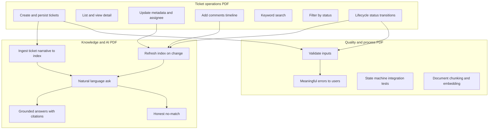
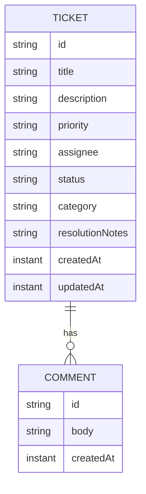
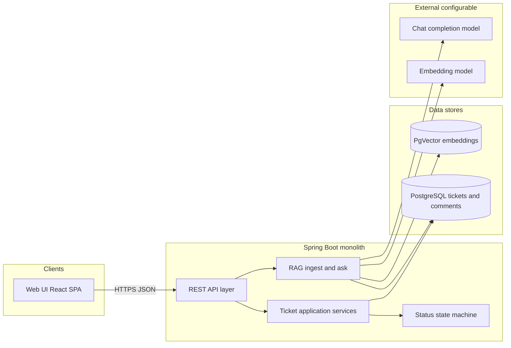
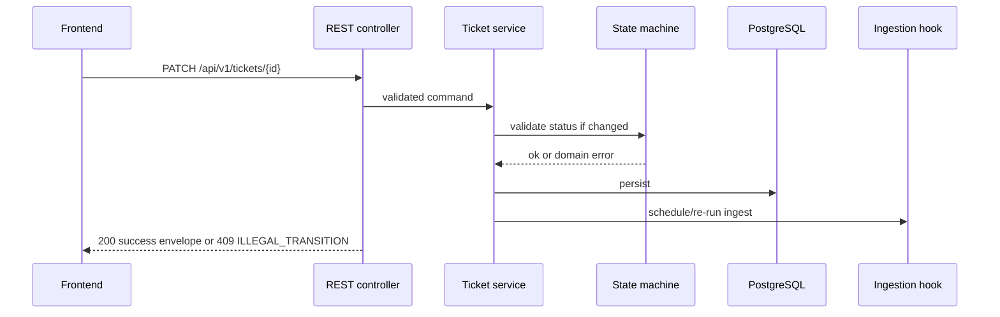
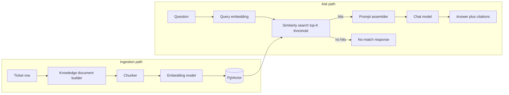

# Architecture

> **Status:** agreed (2026-10-04) — design for implementation; field-level contracts live in sibling specs. **DEC-01…19** per [`requirements.md`](requirements.md) §10.2.  
> **Requirements hub:** [`requirements.md`](requirements.md) (PDF-derived acceptance and FEAT catalogue).  
> **Assessment source:** `docs/Assessments.docx` (via [`docs/assessment-brief.md`](../docs/assessment-brief.md)).  
> **Audience:** implementers, reviewers, assessors.

**Label legend** (same as `requirements.md`)

| Label | Meaning |
|-------|---------|
| **PDF** | Required or named in the assessment PDF. |
| **Convention** | Project choice in `rules/*` or this spec; not a PDF mandate. |
| **Open** | Underspecified; resolve in a child spec after confirmation. |
| **Example** | Illustrative only (e.g. `TKT-1001`). |

This document describes **system shape**: business capabilities, ticket and RAG structure, technology layout, APIs, communication, components, and **frontend architecture** (**§12**). PDF **screen and flow detail** lives in [`ui-flow.md`](ui-flow.md). It **does not** replace [`ui-flow.md`](ui-flow.md), [`data-model.md`](data-model.md), [`api-contract.md`](api-contract.md), [`rag-api-contract.md`](rag-api-contract.md) (ask `data` semantics), [`state-machine.md`](state-machine.md), [`rag-ingestion.md`](rag-ingestion.md), [`test-strategy.md`](test-strategy.md), or [`evaluation-strategy.md`](evaluation-strategy.md).

---

## Table of contents

1. [Problem and context](#1-problem-and-context)  
2. [Scope and non-goals](#2-scope-and-non-goals)  
3. [Architectural principles](#3-architectural-principles)  
4. [Business architecture](#4-business-architecture)  
5. [Ticket structure (conceptual)](#5-ticket-structure-conceptual)  
6. [System context](#6-system-context)  
7. [Technology structure](#7-technology-structure)  
8. [Functional modules and components](#8-functional-modules-and-components)  
9. [Technical components and layering](#9-technical-components-and-layering)  
10. [Communication architecture](#10-communication-architecture)  
11. [API architecture](#11-api-architecture)  
12. [Frontend architecture](#12-frontend-architecture)  
13. [Data and persistence](#13-data-and-persistence)  
14. [Vector database architecture](#14-vector-database-architecture)  
15. [RAG architecture](#15-rag-architecture)  
16. [Knowledge, chunking, and embeddings](#16-knowledge-chunking-and-embeddings)  
17. [Status state machine (placement)](#17-status-state-machine-placement)  
18. [Configuration](#18-configuration)  
19. [Errors and cross-cutting concerns](#19-errors-and-cross-cutting-concerns)  
20. [Security and deployment](#20-security-and-deployment)  
21. [Open questions and decisions](#21-open-questions-and-decisions)  
22. [Related specifications](#22-related-specifications)  
23. [Acceptance mapping](#23-acceptance-mapping)  

---

## 0. Document guide

### 0.1 PDF coverage map (system design themes)

| **PDF** | Section |
|---------|---------|
| Stack and modules (Java 21, Boot, Spring AI, PG, vector store, REST, React) | §7, §12 |
| Ticket aggregate + CRUD capabilities | §4–§5, §8 |
| Basic RAG flow diagram (verbatim structure below) | §15.1 |
| Chunking + embedding **justification** (**AC-CORE-19**) | §16 |
| Configurable top-K / threshold | §18 |
| Non-agentic ask | §15.2 |
| `ui-flow` summary | §12 → detail [`ui-flow.md`](ui-flow.md) |

**PDF basic RAG flow (p.4 — restated verbatim):**

```text
Support Tickets
  ↓ Create Knowledge Documents
  ↓ Chunk
  ↓ Generate Embeddings
  ↓ Vector Store
  ↓ User Question
  ↓ Similarity Search
  ↓ Relevant Tickets
  ↓ LLM + Context
  ↓ Grounded Answer
  ↓ Ticket Sources
```

### 0.2 Business, functional, and implementation requirements

**Business requirements** — one deployable system where deterministic ticket ops and probabilistic ask share PostgreSQL truth and a PgVector index.

**Functional requirements (architecture-level)**

| ID | Capability | Module |
|----|------------|--------|
| FR-ARCH-01 | Ticket lifecycle + REST | Ticket module §8 |
| FR-ARCH-02 | Ingest on ticket change | RAG ingest §15.4 |
| FR-ARCH-03 | Single-shot grounded ask | RAG ask §15.5–15.6 |
| FR-ARCH-04 | SPA ticket + ask UI | §12 |

**Implementation requirements**

| ID | Requirement |
|----|-------------|
| IR-ARCH-01 | Maven Wrapper; Liquibase; Testcontainers for integration tests |
| IR-ARCH-02 | Layering: domain / service / persistence / api / rag per `rules/java-springboot.md` |
| IR-ARCH-03 | Spring AI for embed + chat; Ollama `nomic-embed-text` + local chat model via config (**DEC-09**) |

### 0.3 Independent reading units

| Unit | Section | Standalone? | Read first (this file) | Delivers | See also |
|------|---------|-------------|------------------------|----------|----------|
| **ARCH-A** | §1–§2 | Yes | — | Problem, scope, deterministic vs probabilistic | [`requirements.md`](requirements.md) §2.5 |
| **ARCH-B** | §4 Business modules | Yes | **ARCH-A** | Capability map → FEAT ids | §8 functional |
| **ARCH-C** | §5 Ticket shape | Yes | **ARCH-A** | Aggregate + RAG text sources (conceptual) | [`data-model.md`](data-model.md) |
| **ARCH-D** | §7–§8 Stack + modules | Yes | **ARCH-A** | Java/Spring/PG/React conventions | `rules/java-springboot.md` |
| **ARCH-E** | §10–§11 Communication + API map | Yes | **ARCH-C** | REST sync; PDF ask path | [`api-contract.md`](api-contract.md) |
| **ARCH-F** | §12 Frontend summary | Yes | **ARCH-E** | SPA architecture (**PDF** ui-flow themes) | [`ui-flow.md`](ui-flow.md) **UI-*** units |
| **ARCH-G** | §13–§14 Persistence + PgVector | Yes | **ARCH-C** | SoR vs vector index | [`data-model.md`](data-model.md) §8 |
| **ARCH-H** | §15 RAG pipeline | Yes | **ARCH-G** | Ingest + ask stages (**PDF** ladder §0.1) | [`rag-ingestion.md`](rag-ingestion.md) **ING-*** |
| **ARCH-I** | §16 Chunk/embed justification | Yes | **ARCH-H** | **AC-CORE-19** narrative | [`rag-ingestion.md`](rag-ingestion.md) §9 numbers |
| **ARCH-J** | §17–§18 SM + config | Yes | **ARCH-C** | Domain placement; K/threshold keys | [`state-machine.md`](state-machine.md) |

---

## 1. Problem and context · unit **ARCH-A**

The system is an **AI-powered support ticket management** application (**PDF**): conventional ticket operations (create, list, detail, update core fields, comments, keyword search, status filter, persistence, validation) plus **RAG-based** natural-language Q&A over ticket history.

Two engineering regimes coexist:

| Regime | Examples | Proof style |
|--------|----------|-------------|
| **Deterministic** | CRUD, validation, status state machine | Repeatable tests; exact outcomes |
| **Probabilistic** | Similarity ranking, answer phrasing | Retrieval eval + grounding review; not one golden LLM string |

The assistant is **retrieve-then-generate** only (**PDF**): grounded answers with **ticket ID citations**, or an **honest no-match**—not an autonomous agent.

---

## 2. Scope and non-goals · unit **ARCH-A**

### 2.1 In scope (architecture must support)

| Area | Requirement summary | Requirements trace |
|------|---------------------|-------------------|
| Tickets | CRUD, comments, keyword search, status filter, DB persistence | FEAT-01…08, FR-01…08 |
| Validation and errors | Backend validation; meaningful UI errors | FEAT-09…10, FR-09…10 |
| State machine | Backend-enforced transitions; invalid rejected | FEAT-11, FR-11…12 |
| RAG ingest | Description, comments, resolution notes → knowledge → chunk → embed → vector store | FEAT-12…14, FR-13…14 |
| RAG ask | `POST /api/ai/ask`; citations or no-match | FEAT-15…18, FR-15…18 |
| Retrieval tuning | Configurable top-K and similarity threshold | FEAT-19, FR-18 |
| Documentation | Chunking and embedding **justified** here (**PDF** NFR-07) | FEAT-20, AC-CORE-19 |

### 2.2 Non-goals

- **Autonomous agent** from the ask endpoint: no ticket creation, notifications, or tool chaining (**PDF** §2.2).
- **Authentication / authorization** — not in the PDF (**Agreed DEC-12**: no auth in assessment scope).
- Multi-tenancy, attachments, email/Slack, workflow beyond the defined status machine — unless added to agreed requirements later.

---

## 3. Architectural principles

1. **Spec-driven** — behaviour follows agreed `spec/`; ambiguous product rules are confirmed before code (see [`requirements.md`](requirements.md) §10).
2. **Thin edges, rich domain** — HTTP adapters validate and map; ticket rules and the state machine live in **domain/services**, not controllers or the UI (**PDF**).
3. **Single persistence truth for tickets** — PostgreSQL is the **system of record**; the vector index is a **derived** search/RAG index, refreshed when tickets change (**PDF** freshness).
4. **Grounded AI** — generation for support Q&A uses **retrieved ticket context only**; no silent fallback to general world knowledge (**PDF**).
5. **Monolith, simple topology** — one deployable Spring Boot backend and one React SPA over REST (**Convention**); avoid microservices unless requirements change.
6. **PDF vs convention** — document both; do not present project envelopes or `/api/v1` as PDF mandates (`rules/api-standards.md`).

---

## 4. Business architecture · unit **ARCH-B**

Business architecture describes **who** uses the system, **what** business capabilities exist, and how they group—without prescribing HTTP paths or Java packages.

### 4.1 Actors

| Actor | Role | Primary capabilities |
|-------|------|----------------------|
| **Support agent** | Day-to-day ticket work | Create/update tickets, comment, search, filter, transition status |
| **Support lead / researcher** | Historical insight | Same as agent plus **Ask** over ticket corpus |
| **Operator / engineer** | Run and configure | Deploy app, configure DB and RAG parameters (no secrets in repo) |
| **Assessor / reviewer** | Process evidence | Spec set, tests, grounding review, documented AI mistakes (**PDF** process) |

No role-based access control is required by the PDF (**Open**).

### 4.2 Business capabilities (capability map)

Capabilities align with `requirements.md` §4 feature catalogue:


```mermaid
flowchart TB
  subgraph ticket_ops [Ticket operations PDF]
    C[Create and persist tickets]
    L[List and view detail]
    U[Update metadata and assignee]
    CM[Add comments timeline]
    S[Keyword search]
    F[Filter by status]
    SM[Lifecycle status transitions]
  end

  subgraph knowledge [Knowledge and AI PDF]
    IN[Ingest ticket narrative to index]
    RF[Refresh index on change]
    ASK[Natural language ask]
    GR[Grounded answers with citations]
    NM[Honest no-match]
  end

  subgraph quality [Quality and process PDF]
    VAL[Validate inputs]
    ERR[Meaningful errors to users]
    TST[State machine integration tests]
    DOC[Document chunking and embedding]
  end

  C --> IN
  U --> RF
  CM --> RF
  SM --> RF
  IN --> ASK
  RF --> ASK
  ASK --> GR
  ASK --> NM
  SM --> VAL
  C --> VAL
  VAL --> ERR
```

### 4.3 Business modules (logical)

Business modules are **cohesive responsibility areas** for planning and traceability. They may map to one or more technical components (§9).

| Business module | Purpose | Key behaviours | Features |
|-----------------|---------|----------------|----------|
| **Ticket registry** | Authoritative record of support work | Create, read, update fields, list | FEAT-01…04, 08 |
| **Collaboration timeline** | Threaded agent notes on a ticket | Add and view comments | FEAT-05 |
| **Work discovery** | Find tickets in a queue | Keyword search, status filter | FEAT-06…07 |
| **Lifecycle governance** | Legal status progression | Allow T1–T5; reject X1–X3 | FEAT-11 |
| **Knowledge indexing** | Make ticket text searchable for AI | Build docs, chunk, embed, metadata | FEAT-12…13 |
| **Index freshness** | Avoid stale answers | Re-ingest on update/close (**PDF** p.5; **Agreed DEC-01 (B)**) | FEAT-14 |
| **Assisted research** | Q&A over history | Ask API, retrieval, generation, citations | FEAT-15…18 |
| **Operational quality** | Trust and assessability | Validation, errors, configurable retrieval, docs | FEAT-09…10, 19…23 |

**Business rule integrity** (from `requirements.md` §3.2):

- Status changes follow the published lifecycle; illegal moves are **refused** by the backend.
- The assistant does **not** invent ticket facts when retrieval does not support an answer.
- Operational knowledge in the vector index must **not go stale** when tickets change (**PDF**); ingest runs **synchronously** after successful DB commit (**DEC-18**) — see `rag-ingestion.md` §10–§10.2.

---

## 5. Ticket structure (conceptual) · unit **ARCH-C**

Field catalogs, enums, and Liquibase tables belong in [`data-model.md`](data-model.md) (agreed). This section defines the **architectural shape** of a ticket for design discussions.

### 5.1 Ticket aggregate (logical)

A **ticket** is the primary aggregate root for support work (**PDF**). Conceptually it comprises:

| Part | Description | PDF / Open |
|------|-------------|------------|
| **Identity** | Stable id used in UI, API, and RAG citations | **Agreed** — `TKT-{n}` ([`data-model.md`](data-model.md) §5.5, DEC-04) |
| **Core metadata** | Title, description, priority, assignee | **PDF** (update list) |
| **Lifecycle** | Status enum and transition history | **PDF** state machine |
| **Timeline** | Ordered comments (agent notes) | **PDF** |
| **Resolution narrative** | Text capturing how the issue was resolved | **PDF** ingestion source; `resolution_notes` ([`data-model.md`](data-model.md) §6.1, DEC-05) |
| **Taxonomy** | Category (for metadata and filters) | **PDF** metadata key; optional enum ([`data-model.md`](data-model.md) §5.3, DEC-03) |
| **Audit** | Created/updated timestamps | **Convention** for sorting (`rules/api-standards.md`) |


```mermaid
erDiagram
  TICKET ||--o{ COMMENT : has
  TICKET {
    string id
    string title
    string description
    string priority
    string assignee
    string status
    string category
    string resolutionNotes
    instant createdAt
    instant updatedAt
  }
  COMMENT {
    string id
    string body
    instant createdAt
  }
```

*Diagram is conceptual; physical columns and optionality → [`data-model.md`](data-model.md) §6.*

### 5.2 Status lifecycle (summary)

Canonical states (**PDF**): `OPEN` | `IN_PROGRESS` | `RESOLVED` | `CLOSED` | `CANCELLED`.

Allowed edges (**PDF**): T1–T5 in `requirements.md` §4.2 FEAT-11. Forbidden reopen examples: `CLOSED`/`RESOLVED`/`CANCELLED` → `OPEN`.

Full matrix, skipped hops (**DEC-02**), and transition API shape (**DEC-06**) → [`state-machine.md`](state-machine.md).

### 5.3 Text sources for RAG (ticket → knowledge)

Only these ticket-owned texts feed the knowledge pipeline (**PDF** FR-13):

| Source | When included | Notes |
|--------|---------------|-------|
| Description | Always when present | Primary problem statement |
| Comments | Each comment body | Timeline context |
| Resolution notes | Nullable `resolution_notes` on ticket | **Agreed** — [`data-model.md`](data-model.md) §6.1 (**DEC-05**); OQ-10 resolved |

Title and metadata (`status`, `priority`, `assignee`, `category`) are attached as **chunk metadata** for filtering and citation display, not necessarily embedded as standalone documents unless `rag-ingestion.md` agrees.

### 5.4 Ticket operations vs derived index

| Store | Role | Mutability |
|-------|------|------------|
| **PostgreSQL ticket rows** | System of record | Updated only via ticket services + validation + state machine |
| **Vector chunks** | Derived search index | Rebuilt/refreshed by ingestion; rebuildable from PostgreSQL if lost |

---

## 6. System context


```mermaid
flowchart LR
  subgraph clients [Clients]
    UI[Web UI React SPA]
  end

  subgraph backend [Spring Boot monolith]
    API[REST API layer]
    TM[Ticket application services]
    SM[Status state machine]
    RAG[RAG ingest and ask]
  end

  subgraph data [Data stores]
    PG[(PostgreSQL tickets and comments)]
    VS[(PgVector embeddings)]
  end

  subgraph external [External configurable]
    LLM[Chat completion model]
    EMB[Embedding model]
  end

  UI -->|HTTPS JSON| API
  API --> TM
  API --> RAG
  TM --> SM
  TM --> PG
  RAG --> PG
  RAG --> VS
  RAG --> EMB
  RAG --> LLM
```

**Runtime roles**

- **Web UI** — ticket screens, search/filter, status actions, AI ask panel; talks only to backend REST (**PDF** implied).
- **Spring Boot application** — ticket APIs, validation, state machine, ingestion hooks, `POST /api/ai/ask` (**PDF**).
- **PostgreSQL** — durable relational data (**PDF**).
- **PgVector** — embeddings and metadata in the same DB instance (**Convention**; PDF examples PGVector or Chroma).
- **Embedding and chat models** — via **Spring AI** (**PDF**); provider **Convention**: Ollama initially via config.

---

## 7. Technology structure · unit **ARCH-D**

### 7.1 Stack summary

| Layer | Choice | Label |
|-------|--------|-------|
| Language | Java 21 | **PDF** |
| Backend | Spring Boot 3 | **Convention** (PDF names Spring Boot, not major version) |
| Build | Maven Wrapper (`./mvnw`) | **Convention** |
| AI | Spring AI (embed, vector store, chat) | **PDF** |
| Ticket DB | PostgreSQL + Liquibase | **Convention** (PDF allows PostgreSQL/H2) |
| Vector search | PgVector extension, same instance | **Convention** (PDF examples PGVector/Chroma) |
| Models (initial) | Ollama via Spring AI properties | **DEC-09:** embed `nomic-embed-text`; chat model via `spring.ai.ollama.chat` (**Convention** — e.g. local LLM for demo) |
| API | REST, JSON | **PDF** |
| Frontend | React + Vite + TypeScript | **Convention** (PDF: React/Next or equivalent) |
| Tests | JUnit 5, Mockito, PostgreSQL Testcontainers | **Convention** (`rules/testing.md`) |

### 7.2 Deployment topology (logical)

```text
┌─────────────────┐     ┌──────────────────────────────┐
│  Static SPA     │     │  Spring Boot JVM (monolith)   │
│  (Vite build)   │────▶│  api / service / domain /     │
│  dev: Vite proxy│     │  persistence / rag / config   │
└─────────────────┘     └───────────┬──────────────────┘
                                    │
                    ┌───────────────┴───────────────┐
                    ▼                               ▼
            ┌───────────────┐               ┌───────────────┐
            │ PostgreSQL    │               │ Ollama (dev)  │
            │ + pgvector    │               │ or cloud APIs │
            └───────────────┘               └───────────────┘
```

**Convention:** Docker Compose may run PostgreSQL (+ optional Ollama) locally; not mandated by PDF.

### 7.3 Technology dependencies (allowed direction)

```text
Frontend  →  REST  →  api  →  service  →  domain
                              ↓           ↓
                         persistence   rag  →  Spring AI  →  models
                              ↓           ↓
                         PostgreSQL   PgVector (same DB)
```

No message broker, no separate RAG microservice, no BFF unless a future spec adds one.

---

## 8. Functional modules and components · unit **ARCH-D**

**Functional modules** are implementable slices of behaviour (often map 1:1 to application services). **Components** are the main parts inside each module.

### 8.1 Ticket management module

| Component | Responsibility |
|-----------|----------------|
| **Ticket command handler** | Create ticket, update allowed fields |
| **Ticket query handler** | Get by id, paginated list |
| **Comment handler** | Append comment to ticket |
| **State transition coordinator** | Invoke state machine on status change requests |
| **Validation adapter** | Enforce Bean Validation + domain rules at boundary |

**Triggers RAG:** successful updates and comments run **synchronous ingestion** after commit (§15.4; **DEC-18**).

### 8.2 Discovery module

| Component | Responsibility |
|-----------|----------------|
| **Keyword search** | `title` + `description` only (**Agreed** **DEC-08**; [`data-model.md`](data-model.md) §15.2) |
| **Status filter** | Restrict list by `status` query param (**Convention** `rules/api-standards.md`) |

Distinct from **vector similarity search** (RAG only).

### 8.3 RAG module

| Component | Responsibility |
|-----------|----------------|
| **Knowledge document builder** | Assemble ticket text + metadata into ingestible documents |
| **Chunking service** | Split documents per agreed strategy (§16) |
| **Embedding port** | Call Spring AI embedding model |
| **Vector index writer** | Upsert/delete chunks in PgVector |
| **Ingestion orchestrator** | Run pipeline on create/update/close triggers |
| **Retrieval service** | Embed question, top-K, threshold filter |
| **Ask orchestrator** | Build prompt, call chat model, map citations / no-match |
| **RAG configuration** | top-K, threshold, chunk limits via properties |

### 8.4 Cross-cutting functional components

| Component | Responsibility |
|-----------|----------------|
| **API error mapper** | `@ControllerAdvice` → stable error envelope (**Convention**) |
| **Transaction boundaries** | Ticket mutations atomic; ingestion after successful commit (**DEC-18**); ingest failure does not roll back ticket row |

---

## 9. Technical components and layering

Technical layout follows **`rules/java-springboot.md`** (**Convention**).

### 9.1 Package structure

```
{root}/
  Application.java
  api/            Controllers, request/response DTOs, @ControllerAdvice
  domain/         Ticket status enum, state machine, domain exceptions
  service/        Transactional application services
  persistence/    JPA entities, Spring Data repositories
  rag/            Knowledge build, chunk/embed, retrieval, ask
  config/         Spring configuration, RAG @ConfigurationProperties, Spring AI beans
```

### 9.2 Layer responsibilities

| Layer | Responsibility |
|-------|----------------|
| **api** | HTTP mapping, `@Valid`, status codes; **no** business rules |
| **domain** | State machine, illegal transition errors; **no** Spring Web/JPA |
| **service** | Use cases, transactions, orchestrate repos + domain + RAG hooks |
| **persistence** | Load/save; **no** bypass of state machine for status |
| **rag** | Ingest and ask; **no** ticket side effects on ask path |
| **config** | Beans and property binding only |

### 9.3 Mapping: business module → technical homes

| Business module (§4.3) | Primary packages |
|------------------------|------------------|
| Ticket registry | `service`, `persistence`, `api` |
| Collaboration timeline | `service`, `persistence`, `api` |
| Work discovery | `service`, `persistence`, `api` |
| Lifecycle governance | `domain`, `service` |
| Knowledge indexing / freshness | `rag`, `service` (hooks) |
| Assisted research | `rag`, `api` (`AiAskController` or equivalent) |

---

## 10. Communication architecture · unit **ARCH-E**

### 10.1 Style

| Aspect | Choice |
|--------|--------|
| Integration pattern | **Synchronous request/response** over HTTP |
| Payload format | **JSON** (`application/json`) |
| Client | React SPA → backend REST only (**Convention**: no BFF) |
| Real-time | **None** required (no WebSocket/SSE in PDF) |
| Inter-service | **N/A** (monolith) |

### 10.2 Communication flows

**Ticket mutation flow**


```mermaid
sequenceDiagram
  participant UI as Frontend
  participant API as REST controller
  participant SVC as Ticket service
  participant DOM as State machine
  participant DB as PostgreSQL
  participant RAG as Ingestion hook

  UI->>API: PATCH /api/v1/tickets/{id}
  API->>SVC: validated command
  SVC->>DOM: validate status if changed
  DOM-->>SVC: ok or domain error
  SVC->>DB: persist
  SVC->>RAG: schedule/re-run ingest
  API-->>UI: 200 success envelope or 409 ILLEGAL_TRANSITION
```

**Ask flow** — see `requirements.md` Flow B; matches §15.6.

### 10.3 Error propagation to UI

- API returns **error envelope** for failures (**Convention**); UI displays `error.message` and field `details` (**PDF** meaningful errors).
- Ask **no-match** is HTTP **200** with honest message inside success `data` (**Convention** `rules/api-standards.md`) — not an error envelope.

### 10.4 CORS and local dev

**Convention:** allow Vite dev origin for `/api/**`; not an assessment requirement.

### 10.5 What is not communicated

- Internal prompts, chunk text, embedding vectors, model names, and retrieval scores are **not** exposed on public APIs (**Convention**).
- No agent-to-agent or async event bus between ticket and RAG modules in the baseline design.

---

## 11. API architecture · unit **ARCH-E**

### 11.1 API surfaces

| Surface | Purpose | PDF / Convention |
|---------|---------|------------------|
| **Ticket REST** | CRUD, comments, search, filter, status via PATCH | Capabilities **PDF**; paths **Convention** `/api/v1/tickets` |
| **Ask REST** | Natural-language Q&A | **`POST /api/ai/ask`** **PDF**; alias **`POST /api/v1/ai/ask`** **Convention** |

Detailed paths, bodies, and field catalogs → [`api-contract.md`](api-contract.md) (tickets) and [`rag-api-contract.md`](rag-api-contract.md) (ask). Envelopes and status codes → `rules/api-standards.md`.

### 11.2 Ticket API capability map

| Capability | Method and path (Convention) | Assessment capability |
|------------|------------------------------|------------------------|
| Create | `POST /api/v1/tickets` | Create ticket |
| List + search + filter | `GET /api/v1/tickets?page&size&sort&q&status` | List, keyword search, status filter |
| Detail | `GET /api/v1/tickets/{id}` | View details (comments embedded) |
| Update fields / status | `PATCH /api/v1/tickets/{id}` | Update title, description, priority, assignee; status transitions |
| Add comment | `POST /api/v1/tickets/{id}/comments` | Add comments |

**DELETE** and **PUT** are not used unless a future spec adds them (**Convention**).

### 11.3 Ask API

**Request (**PDF**):**

```json
{
  "question": "What caused previous payment failures?"
}
```

**Behaviour:**

- Valid question → retrieve → generate → **200** + success envelope + answer and cited ticket ids (**PDF** outcomes).
- No relevant retrieval → **200** + honest no-match in `data` (**PDF**); do **not** call LLM on empty context (§15.5).
- Invalid/missing question → **400** `VALIDATION_ERROR` (**Convention**).
- **No** side effects (create ticket, notify) (**PDF**).

Response field names inside `data` → [`rag-api-contract.md`](rag-api-contract.md) / [`api-contract.md`](api-contract.md) §6 (**DEC-11** agreed no-match phrase).

### 11.4 Versioning

- Ticket APIs: URI version **`/api/v1`** (**Convention**).
- Ask: keep **`/api/ai/ask`** for assessment compatibility; mirror under v1 (**Convention**).

### 11.5 Success and error envelopes

All ticket endpoints use shared **`{ "data": ... }`** and list **`meta`** pagination (**Convention**). Errors use **`{ "error": { status, code, message, details, timestamp, path } }`**.

Illegal status transition → **409** `ILLEGAL_TRANSITION` (**Convention**, not PDF-mandated status).

---

## 12. Frontend architecture · unit **ARCH-F**

**Convention:** React + Vite + TypeScript (`rules/frontend.md`). **PDF** requires a web UI for ticket operations and ask. **§12.3–§12.6** below summarise UI architecture; **authoritative** screen catalog, CRUD flows, transition/ask UX, and **AC-UI-*** are in [`ui-flow.md`](ui-flow.md) (PDF `ui-flow` themes; see [`requirements.md`](requirements.md) child-spec table).

### 12.1 UI functional areas

| Area | APIs used |
|------|-----------|
| Ticket list | `GET /api/v1/tickets` with `q`, `status`, pagination |
| Ticket detail | `GET /api/v1/tickets/{id}` |
| Create / edit | `POST` / `PATCH` |
| Comments | `POST .../comments` |
| Status actions | `PATCH` with `status` (valid targets only; server enforces) |
| AI assistant | `POST /api/v1/ai/ask` (or PDF path) |

### 12.2 Client structure (logical)

| Module | Role |
|--------|------|
| **API client** | Base URL from `import.meta.env`; typed fetch wrappers |
| **Ticket pages** | List, detail, forms |
| **Ask panel** | Question input, answer, citation list, no-match state |
| **Error display** | Map API error envelope to user-visible messages |

No secrets in the frontend bundle; LLM credentials stay server-side (**PDF** NFR-06).

### 12.3 Screen map and flows A–E (**PDF** application + demo §8.7)

Minimum surfaces to satisfy **AC-CORE-01…11** and demo script in [`requirements.md`](requirements.md) §8.7. Exact component names **Open**; behaviours are not.

| Screen / surface | Primary APIs | Flows | AC themes |
|------------------|--------------|-------|-----------|
| **Ticket list** | `GET /api/v1/tickets` (`q`, `status`, pagination) | A1, B1–B2 | AC-CORE-02, 07, 08 |
| **Create ticket** | `POST /api/v1/tickets` | A2 | AC-CORE-01, 10, 11 |
| **Ticket detail** | `GET /api/v1/tickets/{id}` | A3–A7, C1 | AC-CORE-03, 04, 05, 06, 12, 13 |
| **Comment composer** | `POST .../comments` | A4 | AC-CORE-06 |
| **Status actions** | `PATCH` with `status` | A5, A7, C2 | AC-CORE-12, 13, 11 |
| **Ask / assistant panel** | `POST /api/v1/ai/ask` (or PDF path) | B3–B7, E | AC-CORE-16…18 |

**Navigation (logical):** List ↔ Detail; Detail → Ask panel (drawer, tab, or route — **Open**); Create from list.

### 12.4 Status transition UX (**DEC-06** agreed)

- UI offers only **legal** target statuses for the **current** state (T1–T5 from [`state-machine.md`](state-machine.md) §5.1) — e.g. from `OPEN`: `IN_PROGRESS`, `CANCELLED`.
- MUST NOT rely on UI alone: illegal choices still return **409** from API (Flow C).
- On **409** `ILLEGAL_TRANSITION`, show `error.message` (and `details` if present) — **AC-CORE-11**, **AC-FEAT-11-04**.
- **Example** illegal action: “Reopen” on `CLOSED` → `OPEN` (X1) must show readable rejection, not silent failure.

### 12.5 Ask panel UX (**PDF**)

| Element | Behaviour |
|---------|-------------|
| Question input | Single text field; submit calls ask API with `{ "question" }` only (max **2000** chars; unknown JSON keys → **400** — **DEC-17**) |
| Loading | In-flight indicator while waiting for **200** |
| Grounded answer | Render `data.answer`; show `data.citedTicketIds` as links or chips to ticket detail |
| No-match | Show `data.answer` (no-match phrase); empty citations; distinguish from HTTP errors |
| HTTP **400** | Show validation message for blank question |
| HTTP **409** on tickets | Not used for ask — transitions only |

Citations satisfy **AC-CORE-17** in UI; grounding review still uses `commands/review-rag-output.md`.

### 12.6 Process UI evidence (**PDF** p.1–2)

Not product screens — demo evidence for **FEAT-23**: SpecStory / `.specstory/history/`, [`docs/prompt-history.md`](../docs/prompt-history.md), and `docs/ai-mistakes.md` when populated (**AC-CORE-23**).

---

## 13. Data and persistence · unit **ARCH-G**

### 13.1 Relational system of record

- **Tickets** and **comments** in **PostgreSQL** via Spring Data JPA (**PDF**).
- Schema changes via **Liquibase** (**Convention**); Hibernate `ddl-auto` validate/none.
- **FR-08 / AC-CORE-09:** data survives restart.

Identifiers, required fields, resolution notes, indexes → [`data-model.md`](data-model.md) §6, §14.5, §16 (**agreed**).

### 13.2 Synchronization with vector index

After successful ticket **update**, **comment add**, or **close** (per agreed **DEC-01**), run **re-ingestion** for that ticket so ask retrieval sees current text and metadata (**PDF** FR-14).

Execution model → **`rag-ingestion.md`** §10 (**DEC-18**): **synchronous** ingest after successful DB commit; failure visibility and recovery §10.2.

### 13.3 Testing datastores

**Convention:** integration tests use PostgreSQL Testcontainers with Liquibase; not H2-by-default (`rules/testing.md`).

---

## 14. Vector database architecture · unit **ARCH-G**

### 14.1 Product choice

**Convention:** **PgVector** on the **same PostgreSQL instance** as ticket tables (`rules/rag-vector-store.md`). PDF lists PGVector or Chroma as examples—not a mandated product.

**Rationale (architecture):**

- One operational database to backup and migrate.
- Spring AI PgVector store support aligns with Spring Boot monolith.
- Ticket authority remains relational; vectors are disposable and rebuildable.

### 14.2 Logical contents

Each **indexed unit** is a **chunk** of ticket knowledge with:

| Element | Description |
|---------|-------------|
| **Embedding vector** | **768** dimensions — Ollama `nomic-embed-text` (**DEC-09**) |
| **Chunk text** | Text segment passed to LLM at ask time (or reconstructable reference) |
| **Metadata** | **PDF** keys: `ticketId`, `status`, `priority`, `assignee`, `category` |
| **Technical keys** | `chunkIndex`, `ingestedAt` — [`data-model.md`](data-model.md) §11.1; ingest version **Open** in `rag-ingestion.md` |

### 14.3 Operations

| Operation | When |
|-----------|------|
| **Insert / upsert** | After ingestion pipeline for a ticket |
| **Delete / replace** | On re-ingest: delete-all chunks for ticket then insert — [`rag-ingestion.md`](rag-ingestion.md) §11 (**Convention**) |
| **Similarity search** | On each ask: query embedding nearest neighbours with top-K |
| **Rebuild** | Optional admin/repair: re-run ingestion for all tickets from PostgreSQL |

### 14.4 Index and distance metric

Vector index: default **HNSW** name/opclass in [`data-model.md`](data-model.md) §14.5; distance metric must align with **similarity threshold** semantics in `rag-ingestion.md`.

### 14.5 Schema ownership

Vector tables and `pgvector` / `pg_trgm` extensions are versioned in **Liquibase** alongside ticket tables (**Convention**). Physical tables and index names → [`data-model.md`](data-model.md) §14–§14.6.

### 14.6 Consistency model

| Property | Guarantee |
|----------|-----------|
| Ticket read-your-writes | Relational DB transactional |
| Search index | Ticket row is committed before ingest (**DEC-18** sync); on ingest failure index may lag until retry — §13.2, `rag-ingestion.md` §10.2; converges after successful re-ingest |
| Ask after update | Acceptance expects retrieval can reflect new text after successful ingest (**AC-CORE-20**) |

---

## 15. RAG architecture · unit **ARCH-H**

### 15.1 Pipeline overview (**PDF**)

```text
Tickets → knowledge documents → chunk → embeddings → vector store
  → user question → similarity search → relevant ticket context
  → LLM + context only → grounded answer + ticket sources
```

Single **retrieve-then-generate** path—no agent loop.


```mermaid
flowchart LR
  subgraph ingest [Ingestion path]
    T[Ticket row] --> KD[Knowledge document builder]
    KD --> CH[Chunker]
    CH --> EM[Embedding model]
    EM --> VS[(PgVector)]
  end

  subgraph ask [Ask path]
    Q[Question] --> QE[Query embedding]
    QE --> SS[Similarity search top-K threshold]
    VS --> SS
    SS -->|hits| PR[Prompt assembler]
    SS -->|no hits| NM[No-match response]
    PR --> LLM[Chat model]
    LLM --> AN[Answer plus citations]
  end
```

### 15.2 Boundaries and guardrails

| Rule | Source |
|------|--------|
| Ingest description, comments, resolution notes | **PDF** |
| Metadata on chunks | **PDF** |
| Re-ingest on update/close | **PDF** p.5; **Agreed DEC-01 (B)** ([`requirements.md`](requirements.md) §11.1) |
| Configurable top-K and threshold | **PDF** |
| No LLM call when no chunk passes threshold | **Convention** + grounding |
| No tools / side effects on ask | **PDF** |
| Do not expose prompts or vectors on API | **Convention** |

### 15.3 Knowledge document construction

**Builder** (in `rag/`):

1. Load ticket + comments (+ resolution) from PostgreSQL.
2. Format human-readable sections (title, description, labeled comments, resolution).
3. Attach metadata snapshot at ingest time (`status`, `priority`, etc.).
4. Pass text to chunker.

**Open:** one composite document per ticket per ingest vs multiple documents → default recommendation: **one composite document per ticket per ingest version**, then chunk (§16).

### 15.4 Ingestion triggers

| Event | Ingest? | Notes |
|-------|---------|-------|
| Ticket created | Yes (**PDF** implied by pipeline) | Initial index |
| Field update | Yes (**PDF** updated) | |
| Comment added | Yes (ticket updated) | |
| Status → closed | Yes per p.5 (**Agreed DEC-01 (B)**) | Metadata must show `CLOSED` |

Hook placement: ticket **service** after successful commit; exact mechanism → `rag-ingestion.md`.

### 15.5 Retrieval

1. Embed **question** (same model as ingest).
2. Vector **similarity search** with **top-K** (config).
3. Drop hits below **similarity threshold** (config).
4. If none remain → return **no relevant tickets** without LLM (**PDF** grounding).
5. Else pass chunks + ticket ids into prompt.

**Optional** metadata pre-filter (e.g. high-priority only) is **not** PDF-required — **Reference** only ([`requirements.md`](requirements.md) §2.3); satisfy illustrative questions via retrieval over text/metadata in chunks, not a new ask filter API.

### 15.6 Generation

- Spring AI **chat client** with system instructions: answer only from excerpts; cite ticket ids; admit insufficiency.
- Map to response DTO per [`api-contract.md`](api-contract.md) §3.5 / §6.
- Review grounding with `commands/review-rag-output.md` (**PDF** process).

### 15.7 RAG testing and evaluation

- **Deterministic:** state machine §5; ask contract stubs §6.2 ([`test-strategy.md`](test-strategy.md)).
- **Grounding (policy + review):** `commands/review-rag-output.md` steps 0–3 — AC-CORE-17, AC-CORE-18.
- **Retrieval quality (probabilistic):** [`evaluation-strategy.md`](evaluation-strategy.md) — grounding vs retrieval §3; **Example** corpus and five **PDF** questions §5; procedure §6–§7; failure taxonomy **F-01…F-10** §8; **AC-EVAL-01…05** §10. Corpus aligned with [`requirements.md`](requirements.md) §4.3. Not single golden answer strings.

---

## 16. Knowledge, chunking, and embeddings · unit **ARCH-I**

This section satisfies **PDF** acceptance **AC-CORE-19** / **FEAT-20**: documented **justification** for chunking and embedding choices. Numeric parameters and model ids → **`rag-ingestion.md`** when agreed.

### 16.1 Knowledge representation

| Concept | Definition |
|---------|------------|
| **Knowledge document** | Intermediate text assembly for one ticket at one ingest point (**PDF** glossary) |
| **Chunk** | Embedding unit derived from that document |
| **Embedding** | Dense vector stored in PgVector |

Knowledge is **derived**; authoritative text always remains in PostgreSQL.

### 16.2 Chunking strategy (justified default)

The PDF requires documenting approach; it does **not** mandate an algorithm.

**Primary strategy:** **paragraph and comment-boundary splitting**, with secondary fixed-size splits for oversized blocks — **authoritative detail** in [`rag-ingestion.md`](rag-ingestion.md) §6–§9.

| Strategy | Fit for ticket data | Role |
|----------|---------------------|------|
| **Paragraph / comment boundaries** | Descriptions and comments are naturally block-sized | **Primary** |
| **Fixed-size** | Caps very long blocks | **Secondary** when block exceeds max chars |
| **Semantic chunking** | Long essays | **Not required** initially; cost/complexity vs short tickets |

**Proposed mechanics:**

1. Split knowledge text on blank lines and **between comments** (preserve comment attribution in text).
2. If a block exceeds configurable **max-chars** (token proxy), split on sentence boundaries.
3. Optionally merge tiny adjacent blocks up to **min-chars** to avoid noise embeddings.

**Why this fits ticket data:** support threads are short-to-medium, structured as message sequences; boundary-aware splitting improves retrieval of “one comment” facts without semantic chunker infrastructure; meets **NFR-07** narrative.

**Alternatives rejected for v1 default:**

- **Fixed-size only** — risks splitting mid-comment and mixing unrelated sentences.
- **Semantic-only** — higher cost; marginal benefit until eval shows retrieval gaps.

### 16.3 Embedding model (tradeoffs)

Integration via **Spring AI**; provider swappable in config.

| Option | Cost | Latency | Quality | CI / secrets |
|--------|------|---------|---------|--------------|
| **Local** (e.g. Ollama) | No per-token cloud bill | Hardware-dependent | Adequate for many ticket texts | No API keys (**PDF** NFR-06 friendly) |
| **Cloud** hosted API | Per-token | Often stable low | Strong general retrieval | Keys via env only |

**Architecture constraints:**

- **Same embedding model** at ingest and query (or full reindex on change).
- Vector **dimension** **768** for Ollama `nomic-embed-text` (**DEC-09**).
- **Provider:** Ollama via Spring AI (**DEC-09**).

Numeric defaults and model id → [`rag-ingestion.md`](rag-ingestion.md) §9.3, §12 (**DEC-16**).

### 16.4 Configuration slots (names illustrative)

```yaml
rag:
  retrieval:
    top-k: 8
    similarity-threshold: 0.72
    distance-metric: COSINE
  chunking:
    max-chars: 800
    min-chars: 120
    overlap-chars: 80
spring.ai:
  ollama:
    embedding:
      options:
        model: nomic-embed-text
```

Use `@ConfigurationProperties` — no magic numbers in Java (**PDF** intent for top-K/threshold).

---

## 17. Status state machine (placement) · unit **ARCH-J**

States and transitions: [`state-machine.md`](state-machine.md) + `requirements.md` FEAT-11.

**Enforcement architecture:**

- State machine module in **`domain`** — pure rules.
- Invoked only from **ticket application services** on status change.
- Repositories do not expose unguarded status updates.
- Illegal transition → domain error → **409** `ILLEGAL_TRANSITION` (**Convention**).

**Agreed:** skipped hops **DEC-02 (A)**; initial status `OPEN` on create (**DEC-07**); transition API **DEC-06** (PATCH `status`).

---

## 18. Configuration · unit **ARCH-J**

Externalized configuration (**PDF** NFR-06: no secrets in git).

| Area | Examples | Notes |
|------|----------|--------|
| Data source | JDBC URL, credentials | PostgreSQL |
| Spring AI | Base URLs, API keys, model ids | Server-side only |
| RAG retrieval | top-K, similarity threshold | **PDF** FR-18 |
| RAG chunking | max/min chunk size | §16.2 |
| Frontend | `VITE_*` API base URL | Names only in committed examples |

Profiles: `application.yml` + env; `.env.example` lists variable **names** only.

---

## 19. Errors and cross-cutting concerns

Align with `rules/api-standards.md` (**Convention**).

| Situation | HTTP (Convention) | UI |
|-----------|-------------------|-----|
| Validation | 400 `VALIDATION_ERROR` | Field messages |
| Not found | 404 `NOT_FOUND` | Clear message |
| Illegal transition | 409 `ILLEGAL_TRANSITION` | Server message (**PDF**) |
| Server fault | 500 generic | No stack trace |
| Ask no-match | 200 success `data` | Honest message (**PDF**) |

**Logging:** correlation-friendly; no secrets or full prompts by default.

---

## 20. Security and deployment

- **Auth:** **Agreed DEC-12** — no authentication for assessment scope (PDF silent).
- **Secrets:** DB and model credentials via environment only (**PDF**).
- **Deployment:** one JVM + PostgreSQL; optional Ollama on dev host; static SPA or Vite dev server.

---

## 21. Open questions and decisions

Do not implement ambiguous behaviour until resolved in specs + `requirements.md` §10.

| ID | Topic | Owning spec |
|----|-------|-------------|
| OQ-01 / DEC-04 | Ticket id format | [`data-model.md`](data-model.md) (agreed) |
| OQ-02, OQ-03, OQ-10 / DEC-03, DEC-05, DEC-13 | Fields, category, resolution notes | [`data-model.md`](data-model.md) (agreed) |
| OQ-04 / DEC-14 | REST details | [`api-contract.md`](api-contract.md) (**agreed**) |
| OQ-05 / DEC-11 | Ask response schema | [`api-contract.md`](api-contract.md) §6.3 |
| OQ-06 / DEC-12 | Authentication | This file if in scope |
| OQ-07 / DEC-09 | Store + embedding product | [`rag-ingestion.md`](rag-ingestion.md) §12 (**agreed** — PgVector + `nomic-embed-text` / 768) |
| OQ-08 / DEC-10 | DB roles in test vs prod | `test-strategy.md` |
| OQ-11, OQ-12 / DEC-02, DEC-06, DEC-07 | Transitions API and skipped hops | `state-machine.md`, `api-contract.md` |
| OQ-14 / DEC-08 | Keyword search scope | [`data-model.md`](data-model.md) §15.2 (agreed); narrative in `api-contract.md` when written |
| OQ-15 / DEC-01 | Re-ingest on close only | [`rag-ingestion.md`](rag-ingestion.md) (**agreed** (B)) |
| — / **DEC-18** | Ingest timing + failure handling | [`rag-ingestion.md`](rag-ingestion.md) §10 (**agreed** — sync after commit) |
| — / **DEC-16** | Chunk + retrieval defaults | [`rag-ingestion.md`](rag-ingestion.md) §9.3, §12 (**agreed**) |
| — / **DEC-17** | Ask request limits | [`rag-api-contract.md`](rag-api-contract.md) §6 (**agreed**) |
| — / **DEC-19** | Metadata pre-filter on ask | [`evaluation-strategy.md`](evaluation-strategy.md) (**agreed** — none in v1) |

---

## 22. Related specifications

| Spec | Contents |
|------|----------|
| [`requirements.md`](requirements.md) | PDF traceability, FEAT/AC, flows, OQ/DEC |
| [`data-model.md`](data-model.md) | Entities, fields, Liquibase, indexes §14.5 |
| [`api-contract.md`](api-contract.md) | Ticket/comment REST contracts |
| [`state-machine.md`](state-machine.md) | Transitions, errors |
| [`rag-ingestion.md`](rag-ingestion.md) | Chunk numbers, models, re-ingest execution |
| [`rag-api-contract.md`](rag-api-contract.md) | Ask `data`, grounding, no-match (**AC-RAG-API-***) |
| [`ui-flow.md`](ui-flow.md) | Screens, CRUD, flows A–E, transition + ask UX, **AC-UI-*** |
| §12.3–§12.6 (this file) | Frontend architecture summary; process evidence §12.6 |
| [`test-strategy.md`](test-strategy.md) | Layered tests |
| [`evaluation-strategy.md`](evaluation-strategy.md) | Retrieval quality |
| `rules/api-standards.md` | Envelopes, paths (**Convention**) |
| `rules/rag-vector-store.md` | RAG guardrails (**Convention**) |
| `rules/java-springboot.md` | Packages and layering (**Convention**) |

---

## 23. Acceptance mapping

Architecture supports verification of:

- [ ] **AC-CORE-09** — PostgreSQL system of record; vectors rebuildable from tickets
- [ ] **AC-CORE-12…14** — State machine in domain; integration tests
- [ ] **AC-CORE-15** — Embeddings with PDF metadata in vector store
- [ ] **AC-CORE-16…18** — Grounded ask, citations, honest no-match; no agent side effects
- [ ] **AC-CORE-19** — Chunking and embedding justification in **this document**
- [ ] **AC-CORE-20** — Re-ingestion after ticket text changes (per **DEC-01**)
- [ ] **AC-CORE-21** — Configurable top-K and threshold

---

## Revision history

| Date | Note |
|------|------|
| 2026-09-24 | Initial architecture draft from `requirements.md`, `docs/assessment-brief.md`, and project `rules/`. |
| 2026-09-24 | Review corrections: PgVector chosen; re-ingest execution deferred; HTTP details deferred to api-contract. |
| 2026-10-03 | Aligned with engineering rules: PDF vs project stack; Maven Wrapper, Liquibase, Ollama-as-provider, React+Vite+TS, Testcontainers. |
| 2026-10-03 | Backend package tree recorded as agreed convention (`rules/java-springboot.md`). |
| 2026-10-04 | Major expansion: business vs functional modules, ticket conceptual structure, tech and communication architecture, API map, vector DB and RAG depth, knowledge/chunking/embedding justification; synced with `requirements.md` (2026-10-04). |
| 2026-10-04 | Sync: resolution notes **Agreed** (DEC-05); keyword search **DEC-08**; DEC-07 agreed in §17. |
| 2026-10-04 | API detail handoff: draft [`api-contract.md`](api-contract.md) (§11 defers payloads/scenarios). |
| 2026-10-04 | §15.7 links to [`evaluation-strategy.md`](evaluation-strategy.md) (retrieval vs grounding, F-* failures, AC-EVAL). |
| 2026-10-04 | §15.7 test proof → [`test-strategy.md`](test-strategy.md) §5–§6. |
| 2026-10-04 | PDF audit: §12.3–§12.6 UI flows, transition/ask UX, process evidence (consolidated PDF `ui-flow` themes). |
| 2026-10-04 | §12 intro: screen detail in `ui-flow.md`; interim consolidation in §12.3–§12.6 (superseded by `ui-flow.md` for screen detail). |
| 2026-10-04 | Screen/flow detail → [`ui-flow.md`](ui-flow.md); §12 remains UI architecture summary. |
| 2026-10-04 | Doc sync: **DEC-06/18** agreed wording; closed ingest sync/async **Open**; §14.6 consistency model. |
| 2026-10-04 | Promoted to **agreed** with ten-file spec set (user sign-off). |
| 2026-10-04 | `improve-from-assessment-pdf`: PDF ten-name spec list on disk. |
| 2026-10-04 | UI spec filename `ui-model.md` → [`ui-flow.md`](ui-flow.md) (PDF name). |
| 2026-10-04 | Ask semantics → [`rag-api-contract.md`](rag-api-contract.md); ten-file spec set. |
| 2026-10-04 | §0 guide: verbatim PDF RAG flow diagram; PDF theme map; BRF/FRI/IRI at architecture level. |
| 2026-10-04 | §0.3 **ARCH-*** independent reading units for modular architecture review. |
| 2026-10-04 | Major `##` headings tagged with **ARCH-*** unit ids. |
