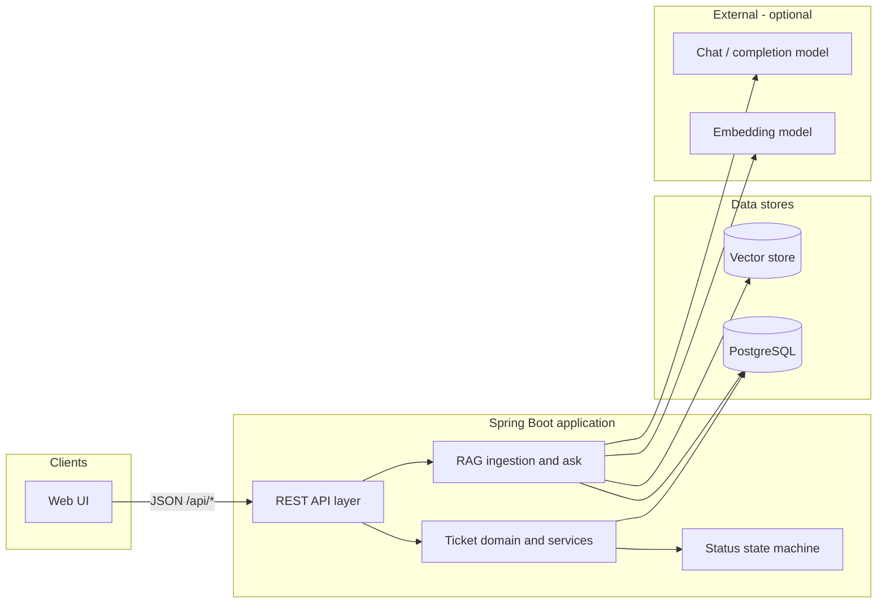

# Architecture

> **Status:** draft — design for implementation; defers contracts and field-level detail to sibling specs.  
> **Source of truth for requirements:** [`requirements.md`](requirements.md) (PDF-derived only).  
> **Audience:** implementers, reviewers, assessors.

---

## 1. Problem / context

The system is an **AI-powered support ticket management** application: conventional ticket operations (CRUD, comments, search, status filter, persistence, validation) plus a **RAG-based** natural-language Q&A capability over ticket history. Ticket logic is **deterministic** (especially the status state machine); the assistant path is **probabilistic** and must be **grounded** in retrieved ticket data with citations and honest no-match responses.

This document describes **how** the named technology stack is arranged, how data and requests flow, and where cross-cutting concerns live. It does **not** replace [`data-model.md`](data-model.md), [`api-contract.md`](api-contract.md), [`state-machine.md`](state-machine.md), [`rag-ingestion.md`](rag-ingestion.md), or [`rag-api-contract.md`](rag-api-contract.md)—those specs will nail shapes and acceptance-level detail.

---

## 2. Scope and non-goals

### In scope (architecture must support)

| Area | Requirement summary (see FR/NFR in `requirements.md`) |
|------|--------------------------------------------------------|
| Tickets | Create, list, detail, update fields, comments, keyword search, status filter, DB persistence |
| Validation & errors | Backend validation; stable API errors; UI shows meaningful messages |
| State machine | Backend-enforced transitions; invalid transitions rejected |
| RAG | Ingest description, comments, resolution notes + metadata; vector store; re-ingest on update/close |
| Ask API | `POST /api/ai/ask` — single retrieve → generate; citations or explicit no-match |
| Configuration | Configurable top-K and similarity threshold (not hardcoded) |
| Documentation | Chunking strategy and embedding tradeoffs documented here; final embedding model in `rag-ingestion.md` (NFR-07) |

### Non-goals

- **Autonomous agent** behavior from the ask endpoint (no ticket creation, notifications, or tool chaining from `/api/ai/ask`).
- **Authentication / authorization** — not stated in the assessment PDF; do not assume unless later agreed (see open questions).
- Multi-tenancy, attachments, email/notification subsystems, workflow beyond the defined status machine — not in scope unless added to requirements later.

---

## 3. Architectural principles

1. **Spec-driven** — code follows `spec/`; ambiguous product behavior is confirmed before implementation.
2. **Thin edges, rich domain** — HTTP adapters validate and map; ticket rules and the state machine live in domain/services, not in controllers or the UI.
3. **Single persistence truth for tickets** — relational DB is the system of record; the vector store is a **derived index** for search/RAG, refreshed when tickets change.
4. **Grounded AI** — generation uses only retrieved ticket context for support Q&A; no silent fallback to general world knowledge.
5. **Keep it simple** — one deployable backend (monolith) and one frontend app talking over REST; avoid microservices and extra moving parts unless requirements change.

---

## 4. System context


```mermaid
flowchart LR
  subgraph clients [Clients]
    UI[Web UI]
  end

  subgraph backend [Spring Boot application]
    API[REST API layer]
    TM[Ticket domain and services]
    SM[Status state machine]
    RAG[RAG ingestion and ask]
  end

  subgraph data [Data stores]
    PG[(PostgreSQL)]
    VS[(Vector store)]
  end

  subgraph external [External - optional]
    LLM[Chat / completion model]
    EMB[Embedding model]
  end

  UI -->|JSON /api/*| API
  API --> TM
  API --> RAG
  TM --> SM
  TM --> PG
  RAG --> PG
  RAG --> VS
  RAG --> EMB
  RAG --> LLM
```

**Runtime roles**

- **Web UI** — ticket screens, search/filter, status actions, AI ask panel; calls backend REST only.
- **Spring Boot app** — hosts ticket APIs, enforces validation and state machine, runs ingestion hooks and `POST /api/ai/ask`.
- **PostgreSQL** — durable ticket entities (and related rows such as comments).
- **Vector store** — embeddings and metadata for similarity search (see §8).
- **Embedding / chat models** — invoked via **Spring AI**; provider and hosting are configurable (see §9).

---

## 5. Technology stack

| Layer | Choice (from assessment + project steering) | Notes |
|-------|-----------------------------------------------|--------|
| Language / runtime | **Java 21** | Assessment names Java 21 |
| Backend framework | **Spring Boot 3** | **Project convention** (PDF names Spring Boot, not a major version) |
| Build | **Maven Wrapper** (`./mvnw`) | **Project convention** — do not rely on a machine-local Maven |
| AI integration | **Spring AI** | Assessment names Spring AI; embeddings, vector store, chat |
| Ticket persistence | **PostgreSQL** + **Liquibase** | PDF names PostgreSQL/H2; **this project** uses PostgreSQL and Liquibase |
| Vector search | **PgVector** (same Postgres instance) | **Project selection** (PDF examples: PGVector or Chroma) — §8 |
| Initial model host | **Ollama** (via Spring AI config) | **Project convention**; model **name** still open (`rag-ingestion.md`) |
| Tests | JUnit 5; PostgreSQL **Testcontainers** | **Project convention** — see [`test-strategy.md`](test-strategy.md) and `rules/testing.md` |
| API style | **REST**, JSON | Assessment: REST; `/api/ai/ask` is the only path the PDF names |
| Frontend | **React + Vite + TypeScript** | **Project convention** (PDF: React/Next **or equivalent**) — `rules/frontend.md` |
| Tooling | Cursor / Copilot / Kiro, SpecStory, `rules/` / `commands/` | Process, not runtime |

**Not mandated by the PDF:** Docker, Kubernetes, message brokers, or a RAG microservice. **Docker Compose** is this project’s approved **local infrastructure** convenience.

---

## 6. Logical structure (backend)

Keep HTTP adapters thin and persistence separate from ticket/RAG rules (`rules/java-springboot.md`). The following package names are an **example**, not a mandated layout:

```
api/          Controllers, request/response DTOs, validation annotations
domain/       Ticket aggregate concepts, status enum, state machine rules
service/      Application services: ticket lifecycle, comments, search/filter orchestration
persistence/  JPA entities, repositories
ai/ or rag/   Knowledge document builder, chunking, embedding writer, retrieval, ask orchestration
config/       Spring configuration, RAG properties, Spring AI beans
```

**Responsibility boundaries**

| Component | Responsibility |
|-----------|----------------|
| Controllers | HTTP mapping, `@Valid`, status codes; no business rules |
| Ticket service | Transactions, CRUD, comments, search/filter queries, **delegate status changes to state machine** |
| State machine | Pure rules: allowed transitions; reject illegal moves with a domain-level error (HTTP mapping in `api-contract.md`) |
| RAG ingestion | On relevant ticket changes: build documents → chunk → embed → upsert/delete in vector store |
| Ask service | Embed question → similarity search → filter by threshold → prompt LLM with context only → map to response DTO |
| `@ControllerAdvice` | Map validation, not-found, illegal transition, and generic failures to client-safe errors (exact JSON in `api-contract.md`) |

**Synchronization between DB and vector index**

After a successful ticket **update** or transition to **closed** (and any other events agreed in `rag-ingestion.md`), the application **re-ingests** that ticket’s knowledge so embeddings do not go stale (FR-14). The exact execution model (inline, after-commit, asynchronous, etc.) is **not** decided here; it will be defined in [`rag-ingestion.md`](rag-ingestion.md).

---

## 7. Frontend architecture

The UI is a **React + Vite + TypeScript** app (project convention) that consumes the backend REST API (no BFF). Screens and interaction detail belong in [`ui-flow.md`](ui-flow.md); this section only lists surfaces implied by the assessment.

**Functional surfaces** (mapped to requirements; detail in `ui-flow.md`):

| Surface | Backend dependency |
|---------|-------------------|
| Ticket list | List + status filter + keyword search query params (exact contract in `api-contract.md`) |
| Ticket detail | Get by id; show fields, comments, status |
| Create / edit ticket | Create and update endpoints with validation errors surfaced field-by-field |
| Comments | Add comment endpoint |
| Status actions | Endpoint(s) for valid transitions only—UI should not encode illegal transitions as primary enforcement |
| AI assistant | `POST /api/ai/ask` with question; display answer, cited ticket id(s), or no-match message |

**Error display**

- Show user-visible messages from the API (FR-10). Exact error JSON is **not** frozen here — follow `api-contract.md` once agreed (`rules/api-standards.md`, `rules/frontend.md`).
- For illegal status transitions, show the **server** message. The UI may guide valid actions; it is not the enforcer.

**Configuration**

- Frontend reads **API base URL** from Vite env (for example `import.meta.env.VITE_*`). Do not hardcode machine-specific hosts.
- No secrets in the frontend bundle; LLM keys stay server-side only.

---

## 8. Data and persistence architecture

### 8.1 Relational model (system of record)

- **Tickets** and **comments** (and any other entities agreed in `data-model.md`) live in **PostgreSQL** via Spring Data JPA.
- **FR-08:** data survives application restart—all durable state is in the database, not in-memory.
- Identifiers, required fields, and resolution-notes shape are **not** fully defined in the PDF—`data-model.md` will specify them; architecture assumes a stable **`ticketId`** usable in citations and vector metadata.

### 8.2 Vector store (derived index)

**Purpose:** similarity search over ticket text for RAG retrieval.

**Project-selected store:** **PgVector** — PostgreSQL with the **pgvector** extension in the **same database instance** as ticket tables (separate table(s) for chunks/embeddings). Schema for tickets **and** vectors is versioned with **Liquibase**.

**Rationale:** one operational datastore and Spring AI PgVector support. The assessment PDF allows PGVector **or** Chroma; this project chose PgVector (`rules/rag-vector-store.md`).

**Stored per chunk (minimum, from requirements):** metadata `ticketId`, `status`, `priority`, `assignee`, `category`, plus embedding vector and text (or reference) for prompt context.

**Lifecycle**

- Refresh derived vectors when a ticket is **updated or closed** so stale chunks are not left as the only index (FR-14).
- **How** to refresh (synchronous vs async; delete-and-replace vs versioned history) is specified in [`rag-ingestion.md`](rag-ingestion.md), not here.
- Vector data may be **rebuilt from PostgreSQL** if the index is lost (tickets remain authoritative).

### 8.3 Test and runtime databases

**Runtime:** PostgreSQL (with PgVector). **Backend integration tests:** PostgreSQL via **Testcontainers**, with Liquibase applied (`rules/testing.md`). H2 is not the default. Details belong in [`test-strategy.md`](test-strategy.md).

---

## 9. RAG architecture

### 9.1 End-to-end pipeline (assessment)

```
Tickets → knowledge documents → chunk → embeddings → vector store
    → user question → similarity search → relevant ticket context
    → LLM + context → grounded answer + ticket sources
```

This is a **single** retrieve-then-generate path—no agent loop, no side effects.

### 9.2 Knowledge document construction

**Sources (FR-13):** ticket **description**, **comments**, **resolution notes**.

**Builder behavior (to detail in `rag-ingestion.md`):**

- Assemble human-readable text per ticket with clear section labels (e.g. title, description, each comment, resolution) so the LLM can attribute content.
- Attach metadata listed in requirements for filtering and citation display.
- On **update** or **close**, rebuild documents for that ticket and refresh the vector index.

**Open:** whether each comment is a separate sub-document vs one composite document per ticket—affects chunk boundaries; default recommendation is **one composite document per ticket per ingest version**, then chunk (§9.3).

### 9.3 Chunking strategy (justification for NFR-07; sizes not frozen)

The assessment requires **documenting and justifying** a chunking approach for ticket data. It does **not** name an algorithm. Engineering rules leave sizes, overlap, and algorithm to [`rag-ingestion.md`](rag-ingestion.md).

**Proposed default (agree in `rag-ingestion.md` before implementation):** paragraph-based splitting with a configurable maximum size.

| Strategy | Fit for ticket data | Status |
|----------|---------------------|--------|
| **Paragraph-based** | Comments and descriptions are naturally paragraph- or message-sized | **Proposed primary** |
| Fixed-size only | Can split mid-sentence across unrelated comments | Secondary split only if a paragraph exceeds max size |
| Semantic splitting | Higher cost/complexity; marginal gain for short tickets | Not required for initial delivery unless evaluation shows poor retrieval |

**Proposed mechanics** (parameter names/values in `rag-ingestion.md`, not hardcoded in Java):

1. Split knowledge text on paragraph boundaries (blank lines) and on **comment boundaries**.
2. If a block exceeds max-chars (or a token proxy), split on sentence boundaries until under the limit.
3. Optionally merge tiny adjacent blocks up to a min-chars threshold.

**Why this is a reasonable default:** ticket text is structured and short-to-medium; paragraph/comment boundaries match how people read threads; it avoids a semantic chunker while still meeting NFR-07.

### 9.4 Embedding provider (tradeoffs; model selection deferred)

Spring AI should target a **swappable**, **configuration-driven** embedding provider (no hardcoded model in application code).

| Option | Cost | Latency | Quality | CI / secrets |
|--------|------|---------|---------|--------------|
| **Local** (e.g. via Ollama) | No per-token cloud cost | Depends on hardware | Adequate for many ticket texts; vector dimension fixed per model | No API keys; fits NFR-06 |
| **Cloud** (hosted embedding API) | Per-token | Usually low and stable | Often strong general retrieval | Requires API key via env |

**Architecture constraint:** the embedding model used at **ingest** and **query** time must be the **same** (or the index must be fully re-built when the model changes).

**Final embedding model** — including defaults for local dev and demo — is **selected and justified in [`rag-ingestion.md`](rag-ingestion.md)**. **Ollama** is the initial **provider** (project convention), not a frozen model id. This section documents tradeoffs only (NFR-07).

### 9.5 Retrieval

1. Embed the user **question** with the same embedding model.
2. **Similarity search** in the vector store with **top-K** (configurable).
3. Apply **similarity threshold** (configurable)—discard hits below threshold.
4. If **no chunks** pass the threshold → **no relevant tickets found** response (FR-17); **do not** call the LLM with empty context to hallucinate.
5. Otherwise, pass top chunks (and metadata ticket ids) into the **prompt** as the only factual context.

**Configuration (FR-18):** e.g. `rag.retrieval.top-k`, `rag.retrieval.similarity-threshold` in `application.yml` / environment—no magic numbers in Java.

**Optional metadata filters** (e.g. “high priority only”) are **not** required by the PDF; if added later, filter in retrieval layer using stored metadata—open question for question types like “which high-priority tickets…”.

### 9.6 Generation and grounding

- Use Spring AI **chat client** with a system prompt that instructs: answer **only** from provided ticket excerpts; cite ticket ids; if context is insufficient, say so.
- **Response mapping** (exact JSON in `rag-api-contract.md`): natural language answer + list of cited `ticketId`(s), or explicit no-match flag/message.
- **No tools** bound to the chat call for this endpoint (no create ticket, no notifications).

### 9.7 RAG testing

RAG test layers, fixtures, and CI policy (e.g. stubbed models) are defined in [`test-strategy.md`](test-strategy.md).

---

## 10. Status state machine (architectural placement)

States and transitions are defined in [`state-machine.md`](state-machine.md) (to be written) and summarized in `requirements.md`:

- `OPEN` → `IN_PROGRESS` → `RESOLVED` → `CLOSED`
- `OPEN` → `CANCELLED`
- `IN_PROGRESS` → `CANCELLED`
- All other transitions (e.g. `CLOSED` → `OPEN`) **rejected**

**Enforcement**

- The state machine is a **domain module** invoked only through ticket application services.
- Repositories must **not** expose arbitrary `status` updates that bypass rules.
- Illegal transition → **domain-level error**; HTTP status code and error body are defined in [`api-contract.md`](api-contract.md).

**Open questions** (not decided here): whether skipped steps like `OPEN` → `RESOLVED` are allowed; how the UI/API initiates a transition (dedicated endpoint vs patch status field)—see §15.

**Tests:** state-machine integration tests are an explicit acceptance item (NFR-09).

---

## 11. API and integration architecture

- **Ticket resources:** capabilities from the assessment (create, list, get, update fields, comments, search, status filter). **Paths are not named in the PDF.** `/api/tickets` (and nested comments) is a **proposal** for [`api-contract.md`](api-contract.md), not an assessment mandate (`rules/api-standards.md`).
- **AI:** `POST /api/ai/ask` — request body `{ "question": "..." }` per assessment. Response JSON is open until [`rag-api-contract.md`](rag-api-contract.md).
- **JSON** unless a later spec says otherwise.
- **CORS** for the local Vite origin during development is an implementation detail, not an assessment requirement.

**Versioning:** none required by the PDF. Prefer additive changes after a contract is agreed. Do not invent `/v1` without a decision.

---

## 12. Configuration architecture

Configuration is **externalized** (environment variables and/or `application.yml` profiles). No secrets in git—`.env.example` lists names only (NFR-06).

| Area | Examples | Notes |
|------|----------|--------|
| Data source | JDBC URL, credentials | PostgreSQL default |
| Spring AI | Base URLs, API keys, model identifiers | Server-side only; embedding model per `rag-ingestion.md` |
| RAG retrieval | `top-k`, similarity threshold | FR-18 |
| RAG chunking | max/min chunk size | §9.3 |
| Frontend | API base URL | Vite `import.meta.env` (names only in committed examples) |

Use typed `@ConfigurationProperties` for RAG settings to keep retrieval tuning out of business logic.

---

## 13. Error handling and API errors

Align with `rules/api-standards.md`. **Do not** treat the following codes or body fields as finalized — `api-contract.md` decides them.

| Situation | Guidance |
|-----------|----------|
| Validation failures | Client error; useful field-level messages when practical |
| Ticket not found | Distinct from validation (typically not-found) |
| Illegal status transition | Client-usable message; HTTP status **open** (not locked to 409 vs 400 here) |
| Unexpected server fault | Generic message; **no** stack trace, SQL, or secrets |

**Logging:** correlation-friendly messages; do not log secrets or unnecessary PII.

**UI:** show user-safe API messages (FR-10); exact keys once the contract exists.

---

## 14. Security and deployment (minimal)

- **Auth:** not in assessment requirements—architecture neither requires nor forbids Spring Security; if added later, it wraps `/api/**` consistently (open question).
- **Secrets:** LLM and DB credentials via environment only.
- **Deployment shape:** one JVM process + PostgreSQL (+ optional Ollama on dev host); frontend static build served separately or via dev server—no prescribed cloud topology.

---

## 15. Open questions / queries for later review

Carried from `requirements.md` and architecture-level gaps—**do not implement ambiguous behavior until resolved:**

1. **Ticket id format** — e.g. `TKT-1001` vs numeric UUID (PDF example only).
2. **Full field catalog** — required fields, enums for priority, `category` population.
3. **Resolution notes** — distinct column vs derived from comments/status.
4. **REST contract** — paths, PATCH vs PUT, search/filter query parameters (`api-contract.md`).
5. **`POST /api/ai/ask` response schema** — citations structure, no-match representation (`rag-api-contract.md`).
6. **Authentication / roles** — absent from PDF.
7. **Frontend stack** — **resolved as project convention:** React + Vite + TypeScript (`rules/frontend.md`). Screens still belong in `ui-flow.md`.
8. **Status transition API** — how clients request a transition.
9. **Skipped transitions** — e.g. `OPEN` → `RESOLVED` allowed or not.
10. **Re-ingestion execution** — inline, after-commit, async, failure handling (`rag-ingestion.md`).
11. **LLM for generation** — local vs cloud default for demo (embedding model in `rag-ingestion.md`).
12. **Metadata-filtered retrieval** — needed for questions about priority/category without extra keyword search?

---

## 16. Related specifications (planned)

| Spec | Contents |
|------|----------|
| [`data-model.md`](data-model.md) | Entities, fields, relationships |
| [`api-contract.md`](api-contract.md) | Ticket and comment REST contracts, error examples |
| [`state-machine.md`](state-machine.md) | States, transitions, error semantics |
| [`rag-ingestion.md`](rag-ingestion.md) | Document builder, chunk parameters, embedding model choice, re-ingest triggers and execution model |
| [`rag-api-contract.md`](rag-api-contract.md) | Ask request/response, no-match |
| [`ui-flow.md`](ui-flow.md) | Screens and user journeys |
| [`test-strategy.md`](test-strategy.md) | Layered tests tied to acceptance criteria |
| [`evaluation-strategy.md`](evaluation-strategy.md) | RAG quality checks, review-rag-output usage |

---

## 17. Acceptance criteria mapping (architecture-relevant)

Architecture supports verification of these themes from `requirements.md`:

- [ ] Persistent tickets in PostgreSQL; vector index derivable from ticket text
- [ ] State machine enforced in domain layer; integration tests
- [ ] RAG pipeline matches assessment diagram; re-ingest on update/close
- [ ] Configurable top-K and similarity threshold
- [ ] Chunking strategy and embedding tradeoffs documented in **this file** (NFR-07)
- [ ] Grounded ask flow with citations or honest no-match; no agent side effects

---

## Revision history

| Date | Note |
|------|------|
| 2026-09-24 | Initial architecture draft from `requirements.md`, `docs/assessment-brief.md`, and project `rules/` / `.cursor/rules/`. |
| 2026-09-24 | Review corrections: PgVector chosen; re-ingest execution deferred to `rag-ingestion.md`; illegal transition HTTP deferred to `api-contract.md`; embedding model selection deferred; testing and DB migrations out of scope here. |
| 2026-10-03 | Aligned with approved engineering rules: PDF vs project stack; Maven Wrapper, Liquibase, Ollama-as-provider, React+Vite+TS, Testcontainers; ticket URL and error JSON not mandated; chunking marked proposed pending `rag-ingestion.md`. |
