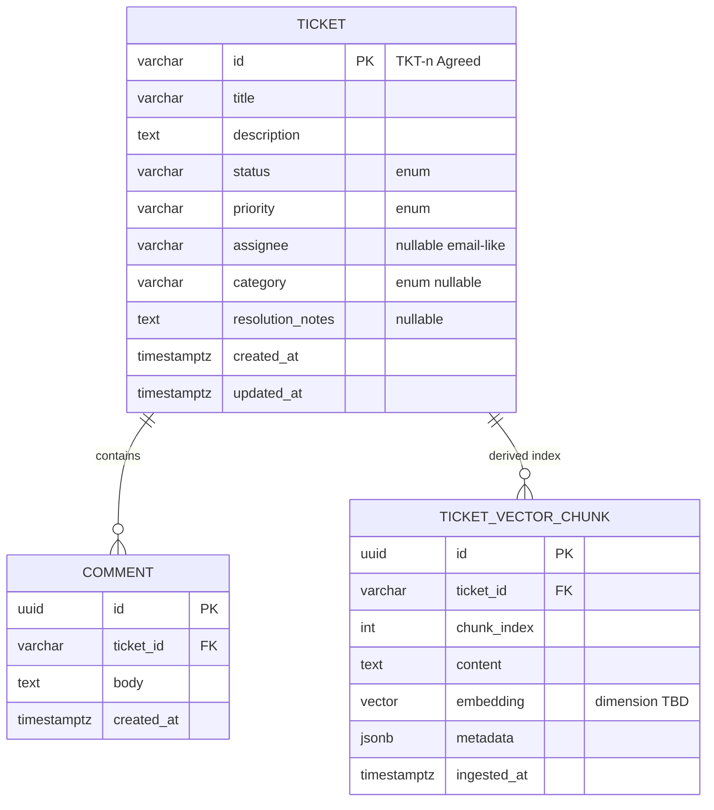
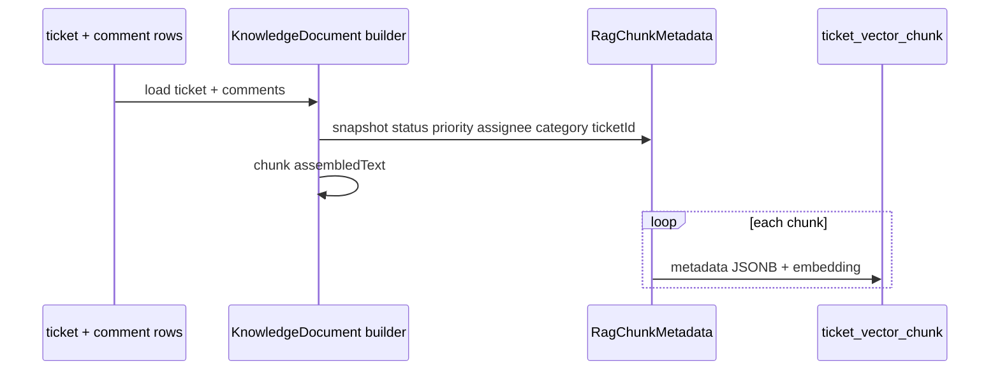
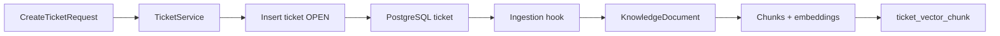

# Data model — AI-Powered Support Ticket Management System

> **Status:** agreed (2026-10-04) — **DEC-03, 04, 05, 07, 08, 13** confirmed in [`requirements.md`](requirements.md) §10.2.  
> **Primary source:** `docs/Assessments.docx` (restated in [`requirements.md`](requirements.md), [`docs/assessment-brief.md`](../docs/assessment-brief.md)).  
> **Related:** [`architecture.md`](architecture.md) (aggregate shape §5, persistence §13–14), [`rules/api-standards.md`](../rules/api-standards.md), [`rules/java-springboot.md`](../rules/java-springboot.md), [`rules/rag-vector-store.md`](../rules/rag-vector-store.md).  
> **Version:** 2026-10-04.

**Label legend**

| Label | Meaning |
|-------|---------|
| **PDF** | Required or named in the assessment PDF. |
| **Convention** | Project choice; not a PDF mandate. |
| **Agreed** | Recorded in [`requirements.md`](requirements.md) §10.2 (DEC-03, 04, 05, 07, 08, 13). |
| **Example** | Illustrative sample values (e.g. `TKT-1001`). |

---

## Table of contents

1. [Problem and context](#1-problem-and-context)  
2. [Scope and non-goals](#2-scope-and-non-goals)  
3. [Design principles](#3-design-principles)  
4. [Domain overview](#4-domain-overview)  
5. [Enumerations and value objects](#5-enumerations-and-value-objects)  
6. [Persistent entities (relational)](#6-persistent-entities-relational)  
7. [Relationships, associations, and integrity](#7-relationships-associations-and-integrity)  
8. [RAG and vector persistence](#8-rag-and-vector-persistence)  
9. [Logical and pipeline models (non-persisted)](#9-logical-and-pipeline-models-non-persisted)  
10. [API data transfer models (DTOs)](#10-api-data-transfer-models-dtos)  
11. [Ticket metadata for RAG](#11-ticket-metadata-for-rag)  
12. [Embedded models](#12-embedded-models)  
13. [Data flows](#13-data-flows)  
14. [Liquibase and physical schema](#14-liquibase-and-physical-schema) (includes [§14.5 Index catalog](#145-index-catalog))  
15. [Query and search persistence](#15-query-and-search-persistence)  
16. [Validation and constraints](#16-validation-and-constraints)  
17. [Open questions and proposed decisions](#17-open-questions-and-proposed-decisions)  
18. [Acceptance criteria](#18-acceptance-criteria)  
19. [Revision history](#19-revision-history)  

---

## 1. Problem and context

The assessment requires **database-backed** tickets that survive restart (**PDF**), with **comments**, **keyword search**, **status filter**, and a **RAG pipeline** that ingests ticket narrative and stores **embeddings with metadata** in a vector store (**PDF**).

This document is the **source of truth** for:

- Relational **entities**, columns, keys, and associations (PostgreSQL + Liquibase).
- **Enums** and closed sets used in domain, persistence, and JSON APIs.
- **Derived** vector/chunk storage aligned with PgVector (**Convention**).
- **DTO** field catalogs that mirror entities for REST (detail in [`api-contract.md`](api-contract.md) when agreed).
- **Logical** RAG structures (knowledge documents, chunk metadata) that are built in memory during ingestion.

HTTP envelopes and paths remain in `rules/api-standards.md`. Ask `data` semantics → [`rag-api-contract.md`](rag-api-contract.md). Transition **rules** → [`state-machine.md`](state-machine.md).

---

## 2. Scope and non-goals

### 2.1 In scope

| Area | This spec defines |
|------|-------------------|
| Ticket aggregate | Identity, core fields, status, priority, assignee, category, resolution notes, audit timestamps |
| Comments | Child rows linked to ticket; ordering for display |
| Vector index rows | Chunk text, embedding column, PDF metadata keys |
| DTO shapes | Request/response records aligned with entities |
| Search | Keyword `q` on `title` + `description` (**Agreed** **DEC-08**) |
| RAG metadata | Snapshot of ticket fields on each chunk at ingest time |

### 2.2 Non-goals

- Authentication principals, roles, multi-tenancy (**Open** OQ-06).
- Attachments, tags, custom fields, SLA, watchers.
- Separate **status history** table (only **current** `status` on `ticket` unless a future spec adds audit).
- Numeric chunk size, embedding model id, vector dimension, top-K — [`rag-ingestion.md`](rag-ingestion.md).
- Prompt templates and LLM response JSON field names — [`api-contract.md`](api-contract.md) §6; prompts internal only.

---

## 3. Design principles

1. **PostgreSQL is the system of record** for tickets and comments; vector rows are **derived** and rebuildable from relational data ([`architecture.md`](architecture.md) §5.4).
2. **Domain enums** (`TicketStatus`, `TicketPriority`, `TicketCategory`) are the canonical types in Java; APIs expose the same uppercase strings (**Convention** camelCase JSON keys).
3. **Stable public ticket id** used in UI, REST paths, and RAG citations (**PDF** cites ticket IDs).
4. **No JPA entity on the HTTP boundary** — controllers use DTO records; services map explicitly ([`rules/java-springboot.md`](../rules/java-springboot.md)).
5. **Metadata snapshot at ingest** — chunk metadata reflects ticket state **at ingest time**; re-ingest refreshes vectors and metadata (**PDF** freshness).
6. **Liquibase owns schema** — every table/column here maps to a changelog; Hibernate validates only.

---

## 4. Domain overview

### 4.1 Aggregate roots and boundaries

| Aggregate | Root | Children / derived |
|-----------|------|---------------------|
| **Ticket** | `Ticket` | `Comment` (1:N, owned) |
| **RAG index** | (none — not an aggregate) | `TicketVectorChunk` rows per ticket, replaced on re-ingest |

The **ticket** aggregate is the only transactional consistency boundary for CRUD and status changes. Ingestion runs **after** successful ticket commits (**Convention**; timing detail in `rag-ingestion.md`).

### 4.2 Conceptual ER diagram



### 4.3 Layer mapping (Java)

| Concept | Package / type kind |
|---------|---------------------|
| `Ticket`, `Comment` | `persistence` JPA entities |
| `TicketStatus`, `TicketPriority`, `TicketCategory` | `domain` enums |
| `TicketVectorChunk` | `persistence` (or Spring AI store adapter table) |
| `KnowledgeDocument`, `RagChunkMetadata` | `rag` records / value types (not JPA) |
| `CreateTicketRequest`, `TicketResponse`, … | `api` records |

---

## 5. Enumerations and value objects

### 5.1 `TicketStatus` (**PDF**)

Stored as `VARCHAR` in PostgreSQL; Java `enum`; JSON uppercase string.

| Constant | Meaning |
|----------|---------|
| `OPEN` | New / not yet in progress |
| `IN_PROGRESS` | Actively worked |
| `RESOLVED` | Fix documented; not yet closed |
| `CLOSED` | Terminal — completed |
| `CANCELLED` | Terminal — will not complete |

Transition legality is **not** encoded in the enum; see [`state-machine.md`](state-machine.md) / requirements FEAT-11.

**Agreed (DEC-07):** On create, `status` defaults to `OPEN` and is **not** accepted from the create request body (server-assigned).

### 5.2 `TicketPriority` (**PDF** requires priority field; values **Open** in requirements)

**Agreed (DEC-13):** Closed set:

| Constant | Sort order (for `sort=priority`) |
|----------|----------------------------------|
| `LOW` | 1 |
| `MEDIUM` | 2 |
| `HIGH` | 3 |
| `CRITICAL` | 4 |

**Agreed:** Create default `MEDIUM` if omitted.

### 5.3 `TicketCategory` (**PDF** metadata key `category`; source **Open** OQ-03)

**Agreed (DEC-03):** Optional user-selected taxonomy at create/update; stored on ticket and copied into RAG metadata.

| Constant | Typical use (**Example**) |
|----------|---------------------------|
| `PAYMENTS` | Checkout, gateway, refunds |
| `SHIPMENT` | Tracking, carriers |
| `BILLING` | Invoices, charges |
| `LOGIN` | Auth, access |
| `OTHER` | Default bucket |

`null` / omitted category is allowed; ingestion stores JSON `null` or omits key per `rag-ingestion.md` agreement.

### 5.4 `Assignee` (value object, **Convention**)

**Convention:** `assignee` is a nullable `VARCHAR(320)` holding an **email-like** identifier (e.g. `sam@example.com`). No user directory or FK.

### 5.5 `TicketId` (value object, **Agreed DEC-04**)

**Agreed:** Public identifier string `TKT-{n}` where `n` is a monotonic integer from sequence `ticket_number_seq`, minimum **1001** for demo alignment with PDF **Example** `TKT-1001`.

- Primary key `ticket.id` = this string (no separate surrogate UUID for tickets).
- Comments reference `ticket_id` (same string).
- Citations in ask responses use this id (**PDF** AC-CORE-17).

**Alternatives** (if DEC-04 changes): UUID primary key + `display_id` column — not proposed here.

---

## 6. Persistent entities (relational)

### 6.1 `Ticket` (`ticket` table)

Authoritative support record (**PDF**).

| Column | Type | Null | Default | Notes |
|--------|------|------|---------|-------|
| `id` | `VARCHAR(16)` | NO | from sequence | **Agreed** `TKT-{n}` |
| `title` | `VARCHAR(500)` | NO | — | Searchable (**Agreed** **DEC-08**) |
| `description` | `TEXT` | NO | `''` | Searchable; may be empty string |
| `status` | `VARCHAR(32)` | NO | `OPEN` | Enum §5.1 |
| `priority` | `VARCHAR(16)` | NO | `MEDIUM` | Enum §5.2 |
| `assignee` | `VARCHAR(320)` | YES | — | §5.4 |
| `category` | `VARCHAR(32)` | YES | — | Enum §5.3 |
| `resolution_notes` | `TEXT` | YES | — | **Agreed** **DEC-05**; RAG source (**PDF**) |
| `created_at` | `TIMESTAMPTZ` | NO | `now()` | UTC |
| `updated_at` | `TIMESTAMPTZ` | NO | `now()` | UTC; bump on any ticket/comment change |

**Indexes:** canonical list in [§14.5 Index catalog](#145-index-catalog) (`ticket_pkey`, list/filter/sort BTREE, optional `pg_trgm` for `q`).

**Not stored on ticket:** comment bodies (separate table); embedding vectors (vector table).

### 6.2 `Comment` (`ticket_comment` table)

Timeline notes on a ticket (**PDF** FEAT-05).

| Column | Type | Null | Notes |
|--------|------|------|-------|
| `id` | `UUID` | NO | PK, generated |
| `ticket_id` | `VARCHAR(16)` | NO | FK → `ticket.id` ON DELETE CASCADE |
| `body` | `TEXT` | NO | RAG source text (**PDF**) |
| `created_at` | `TIMESTAMPTZ` | NO | Display order **Agreed:** ascending `created_at` |

**Indexes:** [§14.5](#145-index-catalog) (`ticket_comment_pkey`, `idx_ticket_comment_ticket_created`).

**Agreed:** Adding a comment updates parent `ticket.updated_at` (same transaction).

No `author` column (**PDF** does not require agent identity).

### 6.3 Entity–DTO field correspondence (ticket)

| Entity field | JSON property (Convention) | In list row? | In create body? |
|--------------|----------------------------|--------------|-----------------|
| `id` | `id` | yes | no (response only) |
| `title` | `title` | yes | yes **required** |
| `description` | `description` | optional summary | yes optional |
| `status` | `status` | yes | no on create; PATCH for transition |
| `priority` | `priority` | yes | yes optional |
| `assignee` | `assignee` | yes | yes optional |
| `category` | `category` | yes | yes optional |
| `resolutionNotes` | `resolutionNotes` | yes on detail | PATCH optional |
| `createdAt` | `createdAt` | yes | response only |
| `updatedAt` | `updatedAt` | yes | response only |
| comments | `comments` | no (detail only) | via comment endpoint |

Exact required/optional validation → §16 and [`api-contract.md`](api-contract.md).

---

## 7. Relationships, associations, and integrity

### 7.1 Ticket ↔ Comment

| Aspect | Rule |
|--------|------|
| Cardinality | 1 ticket : N comments |
| Ownership | Comments are **owned** by ticket; no shared comments |
| FK | `ticket_comment.ticket_id` → `ticket.id` |
| Delete | **Convention:** `ON DELETE CASCADE` (assessment has no delete-ticket API; cascade simplifies test cleanup) |
| Load | **Lazy** `OneToMany` from `Ticket` to `Comment`; fetch join for detail view |

### 7.2 Ticket ↔ Vector chunks

| Aspect | Rule |
|--------|------|
| Cardinality | 1 ticket : N chunks (derived) |
| FK | `ticket_vector_chunk.ticket_id` → `ticket.id` |
| Delete | **Convention:** `ON DELETE CASCADE` + explicit delete-all-for-ticket before re-ingest |
| Consistency | Chunks may lag ticket briefly if ingest is async (**Open**); must converge after re-ingest |

### 7.3 Referential integrity summary

```text
ticket (1) ──< ticket_comment (N)
ticket (1) ──< ticket_vector_chunk (N)   [derived]
```

No many-to-many, no shared lookup tables for priority/status (enums in application layer).

### 7.4 JPA association sketch (**Convention**)

```text
Ticket
  @OneToMany(mappedBy = "ticket", cascade = ALL, orphanRemoval = true)
  List<Comment> comments

Comment
  @ManyToOne(optional = false)
  @JoinColumn(name = "ticket_id")
  Ticket ticket
```

Vector chunks may be managed by Spring AI `PgVectorStore` rather than a bidirectional JPA association — see §8.3.

---

## 8. RAG and vector persistence

### 8.1 Purpose (**PDF**)

Store **chunked**, **embedded** ticket knowledge with metadata keys: `ticketId`, `status`, `priority`, `assignee`, `category`.

### 8.2 Table `ticket_vector_chunk` (**Convention** name; align with Spring AI if adapter differs)

| Column | Type | Null | Notes |
|--------|------|------|-------|
| `id` | `UUID` | NO | Chunk row id |
| `ticket_id` | `VARCHAR(16)` | NO | FK → `ticket.id` |
| `chunk_index` | `INT` | NO | 0-based order within ticket ingest |
| `content` | `TEXT` | NO | Text segment embedded and passed to LLM |
| `embedding` | `vector(n)` | NO | `n` = agreed dimension in `rag-ingestion.md` |
| `metadata` | `JSONB` | NO | PDF keys + technical keys §11 |
| `ingested_at` | `TIMESTAMPTZ` | NO | Snapshot timestamp |

**Indexes:** [§14.5](#145-index-catalog) (`uq_ticket_vector_chunk_ticket_chunk`, `idx_ticket_vector_chunk_embedding_hnsw`; metric/dimension in `rag-ingestion.md`).

**Extension:** `vector` (and `pg_trgm` for keyword search) via Liquibase §14.6.

### 8.3 Spring AI integration note

If Spring AI PgVector auto-schema is used, **still** document the logical model here and add a Liquibase changeset that matches the store’s table/column names. Single source of truth remains Liquibase ([`rules/java-springboot.md`](../rules/java-springboot.md)).

### 8.4 Re-ingest storage strategy (**Convention**)

On re-ingest for `ticket_id`:

1. `DELETE FROM ticket_vector_chunk WHERE ticket_id = ?`
2. Insert new rows for all chunks from current knowledge document.

Versioned history of embeddings is **out of scope** unless `rag-ingestion.md` chooses otherwise.

---

## 9. Logical and pipeline models (non-persisted)

These types exist in the **`rag`** package during ingestion/ask; they are **not** JPA entities.

### 9.1 `KnowledgeDocument`

Assembled text for one ticket at one ingest point ([`architecture.md`](architecture.md) §15.3).

| Field | Type | Description |
|-------|------|-------------|
| `ticketId` | `String` | Public id |
| `title` | `String` | Included in header section |
| `assembledText` | `String` | Full text before chunking |
| `metadataSnapshot` | `RagChunkMetadata` | Ticket fields at ingest |
| `assembledAt` | `Instant` | Build time |

**Proposed assembly template (`assembledText`):**

```text
Ticket {ticketId}: {title}
Status: {status} | Priority: {priority} | Assignee: {assignee} | Category: {category}

Description:
{description}

Comments:
- [{commentCreatedAt}] {commentBody}
...

Resolution:
{resolutionNotes or (none)}
```

Title is for human context in chunks; **PDF** ingest sources are description, comments, resolution notes — title inclusion is **Convention** to help retrieval of “payment” in title.

### 9.2 `TextChunk` (in-memory)

| Field | Type | Description |
|-------|------|-------------|
| `index` | `int` | Order in document |
| `text` | `String` | Chunk body |
| `metadata` | `RagChunkMetadata` | Copied per chunk |

### 9.3 `RetrievedChunk` (ask path)

| Field | Type | Description |
|-------|------|-------------|
| `ticketId` | `String` | From metadata |
| `content` | `String` | Chunk text |
| `score` | `double` | Similarity score (internal; not API) |
| `metadata` | `RagChunkMetadata` | Full metadata |

### 9.4 `IngestionResult` (service return)

| Field | Type | Description |
|-------|------|-------------|
| `ticketId` | `String` | |
| `chunkCount` | `int` | Rows written |
| `ingestedAt` | `Instant` | |

---

## 10. API data transfer models (DTOs)

DTOs are **Java records** in `api` with Bean Validation on **requests**. Responses use the success envelope `{ "data": ... }` ([`rules/api-standards.md`](../rules/api-standards.md)).

Field names below are **Agreed** with this data model; HTTP paths, scenarios, and envelope usage → [`api-contract.md`](api-contract.md).

### 10.1 Ticket commands

**`CreateTicketRequest`**

| Field | Type | Validation **Agreed** |
|-------|------|-------------------------|
| `title` | `String` | `@NotBlank`, `@Size(max = 500)` |
| `description` | `String` | `@Size(max = 100_000)` optional |
| `priority` | `TicketPriority` | optional → default `MEDIUM` |
| `assignee` | `String` | `@Email` optional (or `@Size` if email too strict) |
| `category` | `TicketCategory` | optional |

**`UpdateTicketRequest`** (PATCH — partial)

| Field | Type | Notes |
|-------|------|-------|
| `title` | `String` | optional |
| `description` | `String` | optional |
| `priority` | `TicketPriority` | optional |
| `assignee` | `String` | optional |
| `category` | `TicketCategory` | optional |
| `resolutionNotes` | `String` | optional |
| `status` | `TicketStatus` | optional; triggers state machine |

Only non-null fields apply (**Convention** partial PATCH).

### 10.2 Ticket queries (response)

**`TicketSummaryResponse`** (list item)

| Field | Type |
|-------|------|
| `id` | `String` |
| `title` | `String` |
| `status` | `TicketStatus` |
| `priority` | `TicketPriority` |
| `assignee` | `String` |
| `category` | `TicketCategory` |
| `createdAt` | `Instant` |
| `updatedAt` | `Instant` |

**`TicketDetailResponse`** extends summary with:

| Field | Type |
|-------|------|
| `description` | `String` |
| `resolutionNotes` | `String` |
| `comments` | `List<CommentResponse>` |

**`CommentResponse`**

| Field | Type |
|-------|------|
| `id` | `UUID` |
| `body` | `String` |
| `createdAt` | `Instant` |

**`CreateCommentRequest`**

| Field | Type | Validation |
|-------|------|------------|
| `body` | `String` | `@NotBlank`, `@Size(max = 50_000)` |

### 10.3 Ask DTOs (boundary only)

| Type | Fields | Spec owner |
|------|--------|------------|
| `AskRequest` | `question` (`@NotBlank`) | **PDF** |
| `AskResponse` | `answer`, `citedTicketIds`, … | [`api-contract.md`](api-contract.md) §3.5, §6 |

This file does **not** fix ask `data` property names beyond noting citations must be **ticket ids** that exist in `ticket.id` (**PDF**).

### 10.4 Mapping rules (entity ↔ DTO)

| Direction | Rule |
|-----------|------|
| Entity → response | Service maps; never expose entity |
| Request → entity | Create sets defaults (`status`, `priority`, timestamps); PATCH merges non-null fields |
| Comments | `CreateCommentRequest` → new `Comment` entity; append to ticket collection |
| Enums | `Enum.name()` for JSON; parse case-sensitive uppercase |

---

## 11. Ticket metadata for RAG

### 11.1 `RagChunkMetadata` (record / JSON object)

**PDF-required keys** on every stored chunk (in `metadata` JSONB and Spring AI metadata map):

| Key | JSON type | Source column / rule |
|-----|-----------|----------------------|
| `ticketId` | string | `ticket.id` |
| `status` | string | `ticket.status` at ingest |
| `priority` | string | `ticket.priority` at ingest |
| `assignee` | string or null | `ticket.assignee` |
| `category` | string or null | `ticket.category` |

**Convention technical keys** (not PDF; safe for debugging and citation):

| Key | Purpose |
|-----|---------|
| `chunkIndex` | `chunk_index` column |
| `ingestedAt` | ISO-8601 instant |

Do **not** add extra business metadata fields without spec revision ([`rules/rag-vector-store.md`](../rules/rag-vector-store.md)).

### 11.2 Metadata lifecycle



When status moves to `CLOSED`, re-ingest must persist `status: "CLOSED"` in metadata (**PDF** FEAT-14-03; trigger **DEC-01**).

### 11.3 Citation integrity (**PDF**)

`citedTicketIds` in ask responses must be subset of ids that exist in `ticket` table. Retrieval metadata `ticketId` is the citation source of truth.

---

## 12. Embedded models

### 12.1 `AuditTimestamps` (`@Embeddable`, **Convention**)

Optional JPA embeddable to avoid duplicating column mappings:

| Field | Column |
|-------|--------|
| `createdAt` | `created_at` |
| `updatedAt` | `updated_at` |

**Proposed:** Use explicit columns on `Ticket` and `Comment` first (simpler Liquibase); embeddable is allowed if the team prefers one type.

### 12.2 Metadata as JSONB (not `@Embeddable`)

Vector `metadata` stays **JSONB** rather than flattened columns so Spring AI and PgVector adapters can pass a single map. Domain type `RagChunkMetadata` serializes to JSON for storage.

### 12.3 No embedded comment in ticket row

Comments are **never** stored as JSON array on `ticket` — normalized table only.

---

## 13. Data flows

### 13.1 Create ticket



**Proposed:** Ingest on create even if description empty (zero chunks or single minimal chunk — exact rule in `rag-ingestion.md`).

### 13.2 Update fields / resolution notes

1. PATCH → validate → persist `ticket` → bump `updated_at`.
2. Re-ingest (**PDF** updated): rebuild `KnowledgeDocument`, replace vector rows.

### 13.3 Add comment

1. POST comment → insert `ticket_comment` → bump ticket `updated_at`.
2. Re-ingest includes new comment body in `assembledText`.

### 13.4 Status transition

1. PATCH `status` → state machine in domain → persist new status.
2. Re-ingest updates metadata `status` on chunks.
3. **Proposed (DEC-05):** Transition to `RESOLVED` may accept `resolutionNotes` in same PATCH; not required by PDF but encouraged.

### 13.5 Ask (read-only for relational model)

1. Embed question → search `ticket_vector_chunk` → filter by threshold.
2. Build `RetrievedChunk` list → LLM → map `ticketId` from metadata to citations.
3. **No** INSERT/UPDATE on `ticket` or `ticket_comment` (**PDF** non-agentic).

### 13.6 Restart / recovery

| Store | On restart |
|-------|------------|
| PostgreSQL `ticket`, `ticket_comment` | Unchanged (**PDF** AC-CORE-09) |
| `ticket_vector_chunk` | Unchanged; if lost, full re-ingest from PostgreSQL |

---

## 14. Liquibase and physical schema

**Convention:** `src/main/resources/db/changelog/`

**Proposed changelog order:**

1. `001-ticket-tables.yaml` — `ticket`, `ticket_comment`, sequence `ticket_number_seq`
2. `002-extensions.yaml` — `pg_trgm`, `vector` extensions
3. `003-ticket-indexes.yaml` — relational BTREE + GIN (§14.5)
4. `004-vector-chunk-table.yaml` — `ticket_vector_chunk` table + unique constraint
5. `005-vector-indexes.yaml` — HNSW on `embedding` (§14.5)
6. Future changesets — additive columns only with defaults

### 14.1 Sequence for ticket ids (**Proposed DEC-04**)

```sql
CREATE SEQUENCE ticket_number_seq START WITH 1001 INCREMENT BY 1;

-- Application formats: 'TKT-' || nextval('ticket_number_seq')
```

### 14.2 DDL sketch — `ticket`

```sql
CREATE TABLE ticket (
  id              VARCHAR(16) PRIMARY KEY,
  title           VARCHAR(500) NOT NULL,
  description     TEXT NOT NULL DEFAULT '',
  status          VARCHAR(32) NOT NULL,
  priority        VARCHAR(16) NOT NULL,
  assignee        VARCHAR(320),
  category        VARCHAR(32),
  resolution_notes TEXT,
  created_at      TIMESTAMPTZ NOT NULL DEFAULT now(),
  updated_at      TIMESTAMPTZ NOT NULL DEFAULT now()
);
```

### 14.3 DDL sketch — `ticket_comment`

```sql
CREATE TABLE ticket_comment (
  id          UUID PRIMARY KEY,
  ticket_id   VARCHAR(16) NOT NULL REFERENCES ticket(id) ON DELETE CASCADE,
  body        TEXT NOT NULL,
  created_at  TIMESTAMPTZ NOT NULL DEFAULT now()
);
```

### 14.4 DDL sketch — `ticket_vector_chunk`

```sql
-- dimension n from rag-ingestion.md
CREATE TABLE ticket_vector_chunk (
  id           UUID PRIMARY KEY,
  ticket_id    VARCHAR(16) NOT NULL REFERENCES ticket(id) ON DELETE CASCADE,
  chunk_index  INT NOT NULL,
  content      TEXT NOT NULL,
  embedding    vector(n) NOT NULL,
  metadata     JSONB NOT NULL,
  ingested_at  TIMESTAMPTZ NOT NULL DEFAULT now(),
  UNIQUE (ticket_id, chunk_index)
);
```

### 14.5 Index catalog

All indexes are created in Liquibase (**Convention**); Hibernate does not auto-create them. Names below are **agreed** for this project unless a changeset explicitly renames them.

#### 14.5.1 Design rules

| Rule | Rationale |
|------|-----------|
| Index every **FK** column used in joins, cascade deletes, and re-ingest `DELETE … WHERE ticket_id = ?` | Avoid sequential scans on child tables |
| Match **list API** access paths (`status`, `sort`, combined filter+sort) | FEAT-02, FEAT-07, `rules/api-standards.md` pagination/sort |
| Keyword **`q`** uses `ILIKE '%…%'` (DEC-08) | Plain BTREE does not accelerate leading-wildcard search; use **`pg_trgm` GIN** (**Convention**) |
| **One embedding index** per chunk table | PgVector similarity search at ask time |
| Avoid redundant indexes | `UNIQUE (ticket_id, chunk_index)` already supports `WHERE ticket_id = ?` via leading column |

#### 14.5.2 `ticket`

| Index name | Type | Columns / expression | Supports |
|------------|------|----------------------|----------|
| `ticket_pkey` | PRIMARY KEY (BTREE) | `(id)` | `GET /tickets/{id}`, FK parent, citations |
| `idx_ticket_status` | BTREE | `(status)` | `GET /tickets?status=` (**PDF** filter) |
| `idx_ticket_created_at` | BTREE | `(created_at DESC)` | Default `sort=createdAt,desc` |
| `idx_ticket_updated_at` | BTREE | `(updated_at DESC)` | `sort=updatedAt,desc` |
| `idx_ticket_priority` | BTREE | `(priority)` | `sort=priority,asc\|desc` |
| `idx_ticket_status_created_at` | BTREE | `(status, created_at DESC)` | Filtered list + default chronological sort |
| `idx_ticket_title_trgm` | GIN (`pg_trgm`) | `(title gin_trgm_ops)` | `q` on **title** (DEC-08) |
| `idx_ticket_description_trgm` | GIN (`pg_trgm`) | `(description gin_trgm_ops)` | `q` on **description** (DEC-08) |

**Not indexed (v1):** `assignee`, `category`, `resolution_notes` — no list/filter API on these fields. Add BTREE later if specs add assignee/category filters.

**Status-only sort:** `sort=status` uses `idx_ticket_status` or sequential scan at assessment scale; optional `idx_ticket_status_priority` is **not** required for v1.

#### 14.5.3 `ticket_comment`

| Index name | Type | Columns | Supports |
|------------|------|---------|----------|
| `ticket_comment_pkey` | PRIMARY KEY (BTREE) | `(id)` | Comment identity |
| `idx_ticket_comment_ticket_created` | BTREE | `(ticket_id, created_at ASC)` | Detail view: comments for ticket in timeline order; FK lookups |

No separate index on `ticket_id` alone — the composite index leading column is `ticket_id`.

#### 14.5.4 `ticket_vector_chunk`

| Index name | Type | Columns | Supports |
|------------|------|---------|----------|
| `ticket_vector_chunk_pkey` | PRIMARY KEY (BTREE) | `(id)` | Chunk row identity |
| `uq_ticket_vector_chunk_ticket_chunk` | UNIQUE (BTREE) | `(ticket_id, chunk_index)` | One row per chunk slot; re-ingest delete/replace; `ticket_id` lookups |
| `idx_ticket_vector_chunk_embedding_hnsw` | **HNSW** (pgvector) | `(embedding vector_cosine_ops)` | Ask-path similarity search (**PDF** RAG) |

**Open in `rag-ingestion.md`:** HNSW build parameters (`m`, `ef_construction`), distance op class if metric is inner product instead of cosine (`vector_ip_ops`). Index **must** use the same metric as the configured similarity threshold.

**Optional (not v1):** `idx_ticket_vector_chunk_ingested_at` on `(ingested_at DESC)` for ops/debug only.

**JSONB `metadata`:** no GIN index in v1 — filter predicates use `ticket_id` column; PDF metadata keys are duplicated in JSON for Spring AI, not for SQL filters.

#### 14.5.5 Query pattern → index map

| API / job | Predicate / order | Index(es) used |
|-----------|-------------------|----------------|
| List tickets (no filter) | `ORDER BY created_at DESC` | `idx_ticket_created_at` |
| List + status filter | `status = ? ORDER BY created_at DESC` | `idx_ticket_status_created_at` (preferred) or `idx_ticket_status` + sort |
| Keyword `q` | `title ILIKE … OR description ILIKE …` | `idx_ticket_title_trgm`, `idx_ticket_description_trgm` |
| Ticket detail + comments | `ticket_id = ? ORDER BY created_at` | `idx_ticket_comment_ticket_created` |
| Re-ingest cleanup | `DELETE WHERE ticket_id = ?` | `uq_ticket_vector_chunk_ticket_chunk` (leading `ticket_id`) |
| Ask retrieval | nearest neighbours on `embedding` | `idx_ticket_vector_chunk_embedding_hnsw` |

### 14.6 Liquibase SQL — extensions and indexes

Run after tables exist. Replace `vector(n)` and HNSW opclass if `rag-ingestion.md` chooses a different dimension or metric.

```sql
-- 002-extensions.yaml
CREATE EXTENSION IF NOT EXISTS pg_trgm;
CREATE EXTENSION IF NOT EXISTS vector;

-- 003-ticket-indexes.yaml (ticket + ticket_comment; tables from 001)
CREATE INDEX idx_ticket_status ON ticket (status);
CREATE INDEX idx_ticket_created_at ON ticket (created_at DESC);
CREATE INDEX idx_ticket_updated_at ON ticket (updated_at DESC);
CREATE INDEX idx_ticket_priority ON ticket (priority);
CREATE INDEX idx_ticket_status_created_at ON ticket (status, created_at DESC);
CREATE INDEX idx_ticket_title_trgm ON ticket USING gin (title gin_trgm_ops);
CREATE INDEX idx_ticket_description_trgm ON ticket USING gin (description gin_trgm_ops);

CREATE INDEX idx_ticket_comment_ticket_created
  ON ticket_comment (ticket_id, created_at ASC);

-- 005-vector-indexes.yaml (after 004 creates ticket_vector_chunk)
CREATE INDEX idx_ticket_vector_chunk_embedding_hnsw
  ON ticket_vector_chunk
  USING hnsw (embedding vector_cosine_ops);
```

**Liquibase note:** express `DESC` and `USING gin` / `USING hnsw` in YAML per Liquibase PostgreSQL syntax; the SQL above is the logical contract.

**IVFFlat alternative:** if HNSW is unavailable on a target Postgres/pgvector build, `rag-ingestion.md` may substitute `USING ivfflat (embedding vector_cosine_ops) WITH (lists = …)` with index name `idx_ticket_vector_chunk_embedding_ivfflat` — only one active embedding index at a time.

---

## 15. Query and search persistence

### 15.1 List + filter (**PDF**)

| Param | SQL **Proposed** |
|-------|------------------|
| `status` | `WHERE ticket.status = :status` |
| `page` / `size` | Spring Data `Pageable` |

### 15.2 Keyword search `q` (**Agreed DEC-08**)

Align with [`rules/api-standards.md`](../rules/api-standards.md) default:

```sql
WHERE (
  LOWER(title) LIKE LOWER(CONCAT('%', :q, '%'))
  OR LOWER(description) LIKE LOWER(CONCAT('%', :q, '%'))
)
```

- Single phrase; no token AND/OR (**Convention**).
- Comments **not** searched unless DEC-08 is revised in `api-contract.md`.
- **Indexes:** `idx_ticket_title_trgm` and `idx_ticket_description_trgm` (§14.5); requires `pg_trgm` extension.
- **Implementation:** prefer `WHERE title ILIKE :q OR description ILIKE :q` with bound parameter; for combined `status` + `q`, planner can use status composite index plus trgm, or bitmap AND — verify with `EXPLAIN` in integration tests at scale if needed.

### 15.3 Sort whitelist

Maps to columns: `created_at`, `updated_at`, `priority`, `status` — priority sort uses enum ordinal mapping in service or `CASE` in JPQL.

---

## 16. Validation and constraints

### 16.1 Create ticket (**Agreed DEC-13**)

| Field | Rule |
|-------|------|
| `title` | Required, non-blank, max 500 |
| `description` | Optional; max 100k |
| `priority` | If present, valid enum; else `MEDIUM` |
| `assignee` | Optional; max 320 |
| `category` | Optional; valid enum |

### 16.2 Comments

| Field | Rule |
|-------|------|
| `body` | Required, non-blank, max 50k |

### 16.3 Resolution notes (**Agreed DEC-05**)

| Field | Rule |
|-------|------|
| `resolutionNotes` | Optional; max 100k; ingested when non-blank |

**Proposed:** Not required to transition to `RESOLVED` (assessment does not mandate); UI may encourage.

### 16.4 Database constraints

- CHECK constraints on `status`, `priority`, `category` optional (**Convention**); invalid enum rejected in app layer first.
- `ticket_vector_chunk.chunk_index` ≥ 0.

---

## 17. Decisions (agreed)

Authoritative register: [`requirements.md`](requirements.md) §10.2.

| DEC ID | Topic | Decision | Status |
|--------|-------|----------|--------|
| **DEC-04** | Ticket id format | `TKT-{n}` from `ticket_number_seq` starting 1001; `VARCHAR(16)` PK | Agreed 2026-10-04 |
| **DEC-03** | Category | Optional enum §5.3 on create/update | Agreed 2026-10-04 |
| **DEC-05** | Resolution notes | Dedicated nullable `resolution_notes` on `ticket` | Agreed 2026-10-04 |
| **DEC-07** | Initial status | `OPEN` server default; not in create body | Agreed 2026-10-04 |
| **DEC-08** | Search scope | `title` + `description` only | Agreed 2026-10-04 |
| **DEC-13** | Required create fields | `title` required; others optional with defaults | Agreed 2026-10-04 |

Remaining **Open** in other specs:

| ID | Owner |
|----|-------|
| DEC-01 re-ingest on close | [`rag-ingestion.md`](rag-ingestion.md) §10 |
| DEC-02 skipped transitions | `state-machine.md` |
| DEC-06 transition API shape | [`api-contract.md`](api-contract.md) §4.4 (PATCH `status` interim) |
| Embedding dimension, chunk sizes | [`rag-ingestion.md`](rag-ingestion.md) §9.3, §12 |
| Ask `data` JSON | [`rag-api-contract.md`](rag-api-contract.md) |

---

## 18. Acceptance criteria

Testable checks for this spec (map to **AC-FEAT** / **AC-CORE** in requirements).

| ID | Criterion |
|----|-----------|
| **AC-DM-01** | Given valid create payload, When persisted, Then `ticket` row exists with `status = OPEN` and proposed id format (**AC-FEAT-01**, DEC-07). |
| **AC-DM-02** | Given comment added, When stored, Then `ticket_comment.ticket_id` references existing `ticket.id` (**AC-FEAT-05**). |
| **AC-DM-03** | Given ticket with text, When ingestion runs, Then `ticket_vector_chunk` rows exist with JSON metadata containing PDF keys (**AC-FEAT-13**, AC-CORE-15). |
| **AC-DM-04** | Given field update, When re-ingest completes, Then chunk `metadata.status` / text reflect new values (**AC-CORE-20**). |
| **AC-DM-05** | Given keyword in title or description, When `q` search runs, Then ticket returned; keyword only in comment not returned (**DEC-08**). |
| **AC-DM-06** | Given cited id in ask response, When looked up, Then `ticket.id` exists (**AC-CORE-17**). |
| **AC-DM-07** | Given application restart, When DB queried, Then `ticket` and `ticket_comment` rows unchanged (**AC-CORE-09**). |
| **AC-DM-08** | Given Liquibase applied on empty DB, When `\di` / `pg_indexes` inspected, Then indexes in §14.5 exist with agreed names (relational + vector HNSW + trgm). |

---

## 19. Revision history

| Date | Note |
|------|------|
| 2026-10-04 | Initial data model: entities, RAG/vector tables, DTOs, metadata, embeddables, flows, proposed DEC resolutions for OQ-01/02/03/10/13/14. |
| 2026-10-04 | Status **agreed**; DEC-03/04/05/07/08/13 synced to `requirements.md` §10.2. |
| 2026-10-04 | §14.5–14.6 index catalog: BTREE, `pg_trgm` GIN for `q`, vector HNSW; Liquibase changelog order; AC-DM-08. |
| 2026-10-04 | Terminology pass: **Agreed** / **Convention** replace stale **Proposed** on DEC-03/04/05/07/08/13 rows. |
| 2026-10-04 | Cross-ref only: transition matrix in draft [`state-machine.md`](state-machine.md). |
| 2026-10-04 | HTTP contract cross-ref [`api-contract.md`](api-contract.md). |
| 2026-10-04 | Ask `data` pointers → [`api-contract.md`](api-contract.md) §6 (consolidated rag-api themes). |
