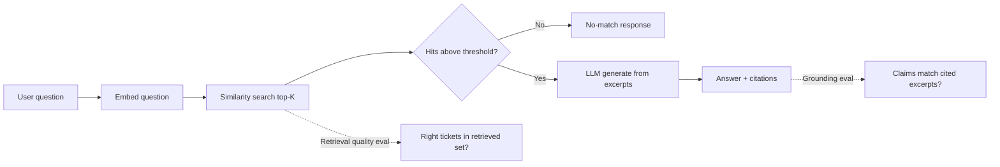

# Evaluation strategy — RAG retrieval quality and failure detection

> **Status:** agreed (2026-10-04) — defines **how** to evaluate probabilistic ask behaviour for the assessment learning goals; numeric retrieval defaults → [`rag-ingestion.md`](rag-ingestion.md) §9.3 (**DEC-16**); **DEC-19** (no metadata pre-filter on ask v1).  
> **Primary source:** `docs/Assessments.docx` p.2 (deterministic + probabilistic testing), p.4 (five illustrative questions), p.4–6 (retrieve → generate, grounding); restated in [`requirements.md`](requirements.md) §2.5, FEAT-22, §4.3, AC-CORE-16…18; summary [`docs/assessment-brief.md`](../docs/assessment-brief.md) §10.  
> **Related:** Grounding review → `commands/review-rag-output.md`; pipeline → [`architecture.md`](architecture.md) §15.5–15.7; ingest/chunking → [`rag-ingestion.md`](rag-ingestion.md); test bands A/B/C → [`test-strategy.md`](test-strategy.md) **§6**; state machine determinism → **§5**; rules → `rules/rag-vector-store.md`, `rules/testing.md`.

**Label legend:** **PDF** | **Convention** | **Agreed** | **Example** | **Open**

---

## Table of contents

0. [Document guide](#0-document-guide)  
1. [Problem and context](#1-problem-and-context)  
2. [Scope and non-goals](#2-scope-and-non-goals)  
3. [Two questions every ask review must answer](#3-two-questions-every-ask-review-must-answer)  
4. [Retrieval quality](#4-retrieval-quality--what-why-how)  
5. [Example eval corpus](#5-example-eval-corpus-requirements-43)  
6. [Evaluation procedure](#6-evaluation-procedure-step-by-step)  
7. [Obtaining the retrieved set](#7-obtaining-the-retrieved-set-evidence)  
8. [Failures and detection](#8-failures-and-detection)  
9. [Recording results](#9-recording-results-eval-log)  
10. [Acceptance criteria](#10-acceptance-criteria-ac-eval)  
11. [Requirements traceability](#11-requirements-traceability)  
12. [Open questions](#12-open-questions-and-decisions)  
13. [Revision history](#13-revision-history)  

---

## 0. Document guide

### 0.1 PDF coverage map

| **PDF** | Section |
|---------|---------|
| Learning goal: test/debug **probabilistic** retrieval (p.2) | §1, §4 |
| Five illustrative questions (p.4) | §5 |
| Retrieve → generate; grounded answers; citations; no fabrication (p.4–6) | §3, cross-ref [`rag-api-contract.md`](rag-api-contract.md) |
| Chunking/embedding **documentation** lives in `architecture.md` — eval measures **retrieval**, not prose golden strings | §4.3–§4.4 |

### 0.2 Business, functional, and implementation requirements

**Business requirements**

- Demonstrate engineering discipline on AI features: separate **retrieval quality** from **grounding**, document failures, iterate on chunk/K/threshold without fooling reviewers with fluent hallucinations.

**Functional requirements**

| ID | Requirement | AC |
|----|-------------|-----|
| FR-EVAL-01 | For each **PDF** example question, record whether expected ticket ids appear in retrieved set | **AC-EVAL-01…05** |
| FR-EVAL-02 | Classify failures (ingest, chunk, threshold, generation, citation) | §8 **F-01…F-10** |
| FR-EVAL-03 | Align with `commands/review-rag-output.md` verdict vocabulary | §4.3 step 6 |

**Implementation requirements**

| ID | Requirement |
|----|-------------|
| IR-EVAL-01 | Dev-only logging or test hook to capture retrieved ticket ids (not required on public API) | §7 |
| IR-EVAL-02 | Optional markdown eval log under `docs/` (**Convention**) — not mandated filename |
| IR-EVAL-03 | No JUnit assertion on full LLM answer text | §4.4, [`test-strategy.md`](test-strategy.md) §6.2 |

### 0.3 Independent reading units

| Unit | Section | Standalone? | Read first (this file) | Delivers | See also |
|------|---------|-------------|------------------------|----------|----------|
| **EVAL-A** | §3 | Yes | — | Grounding vs retrieval (**PDF** learning goal) | [`rag-api-contract.md`](rag-api-contract.md) |
| **EVAL-B** | §4.1–§4.2 | Yes | **EVAL-A** | Definitions + why retrieval matters | — |
| **EVAL-C** | §4.3–§4.4 | Yes | **EVAL-B** | Manual procedure; what JUnit must **not** do | [`test-strategy.md`](test-strategy.md) §6 |
| **EVAL-D** | §5 Corpus | Yes | — | **Example** tickets + five **PDF** questions | [`requirements.md`](requirements.md) §4.3 |
| **EVAL-E** | §6 Procedure | Yes | **EVAL-D** | Step-by-step eval run | §7 evidence |
| **EVAL-F** | §8 Failures F-01…F-10 | Yes | **EVAL-A** | Taxonomy + detection | `commands/review-rag-output.md` |
| **EVAL-G** | §9–§10 | Yes | **EVAL-E** | Log fields + **AC-EVAL-*** | — |

**PDF verbatim (p.4 questions):** payment failures; resolution for TKT-1001; shipment causes; similar resolved; high-priority payment-related.

---

## 1. Problem and context

The assessment is not only “does CRUD work?” — it expects you to **design, test, and debug** an AI assistant where some behaviour is **exact** (ticket state machine) and some is **probabilistic** (which tickets similarity search returns, how the model phrases an answer). **PDF** learning goals (p.2) call out retrieval quality explicitly.

Without a written evaluation approach, teams either (a) skip retrieval and only eyeball fluent answers, or (b) encode a single golden LLM string in unit tests that flakes on every model change. This spec defines a **repeatable, honest** middle path: measure **whether the right ticket evidence was retrieved**, separate from **whether the prose is grounded in that evidence**, and document **how failures are detected and classified**.

**FEAT-22** and **AC-FEAT-22-01/02** require this document plus reviewable results for the **PDF** illustrative questions — not one fixed answer paragraph in JUnit.

---

## 2. Scope and non-goals

| In scope | Out of scope |
|----------|----------------|
| Definition of **retrieval quality** vs **grounding** | Automated CI gate on embedding model quality scores |
| Manual / seeded eval procedure and verdicts | Golden full-text LLM answers in unit tests |
| **Example** eval corpus (aligned with [`requirements.md`](requirements.md) §4.3) | Mandating production seed data or ticket id format |
| Failure taxonomy and detection signals | Reranking, hybrid BM25+vector, agentic tool use |
| What backend tests **can** assert deterministically | Public API fields for chunk dumps or similarity scores (default: not public) |
| Links to `commands/review-rag-output.md` | Replacing human review for every demo |

---

## 3. Two questions every ask review must answer · unit **EVAL-A**

Ask quality splits into two independent checks. Both are **PDF**-relevant; conflating them hides bugs.

| Dimension | Question | Primary proof | Typical owner |
|-----------|----------|---------------|---------------|
| **Grounding** | Is every factual claim supported by **cited** text that was **actually retrieved**? | `commands/review-rag-output.md` (steps 0–3); AC-CORE-17, AC-CORE-18 | Reviewer + API tests with stubs |
| **Retrieval quality** | Did similarity search return the **right ticket(s)** for this question (in top-K)? | **This spec** §5–§8; FEAT-22; AC-EVAL-01…05 | Reviewer + seeded DB + dev logs |

**Why separate them:** A model can **ground** a weak answer in the wrong chunk (“TKT-1005 says duplicate charge” when the user asked about payment failures) — grounding review **passes** on those chunks while the product **fails** the user. Conversely, retrieval can return **TKT-1001** but the model omits it from citations — retrieval is **good**, grounding/citation orchestration is **bad**.

---

## 4. Retrieval quality — what, why, how · units **EVAL-B**, **EVAL-C**

### 4.1 What “retrieval quality” means (**PDF** learning goal)

For this project, **retrieval quality** means:

> For a given natural-language **question** and a known ticket corpus, similarity search (after optional threshold filtering) returns **chunks whose ticket ids** are **useful** for answering that question — typically the same ids a human agent would want open in tabs.

It is **not**:

- Exact match of the generated answer wording (probabilistic — see [`requirements.md`](requirements.md) §2.5).
- Proof that the LLM “understood” the question (no separate metric required).
- Keyword search on the ticket list API (orthogonal FEAT-06 path).

**Unit of evaluation:** **ticket id** presence in the **retrieved set** (and optionally **rank** among hits), not chunk text hash equality. Multiple chunks per ticket count as one id for pass/fail.

### 4.2 Why it matters

| Reason | Explanation |
|--------|-------------|
| **Assessment intent** | **PDF** stresses debugging **probabilistic** RAG, not only deterministic CRUD. |
| **Root-cause isolation** | Bad answers split into ingest (stale/missing text), chunking (fact split across chunks), embedding mismatch, threshold too strict, top-K too small, or generation/citation bugs. |
| **Safe iteration** | When changing chunk size, model, K, or threshold ([`rag-ingestion.md`](rag-ingestion.md) §12), retrieval eval shows regressions before demo. |
| **Honest scope** | Improves the **retrieve** stage; does not replace grounding guardrails (AC-CORE-18). |

### 4.3 How retrieval quality is measured (this project)

**Convention** for v1 — no mandatory automated metric library:

1. **Seed** a database with a known corpus ([§5](#5-example-eval-corpus-requirements-43)).
2. Run ingest so `ticket_vector_chunk` reflects that corpus (Flow D).
3. For each eval question, call `POST /api/ai/ask` (**PDF** path; **Convention** alias `/api/v1/ai/ask`).
4. Capture the **retrieved set**: ticket ids (and ranks/scores if logged) that similarity search returned **before** or **during** generation — see §7.
5. Compare retrieved ids to **expected ticket ids** for that question (§5.2).
6. Assign a **retrieval verdict** per question: `good` | `partial` | `poor` | `not evaluated` (same vocabulary as `commands/review-rag-output.md` **Retrieval quality** section).
7. Optionally run **grounding** review on the same HTTP response.

**Pass rule (retrieval only):** For each eval row, every **required** expected id appears in the retrieved set (see §5.2). **Optional** ids may be absent without failing. **Partial:** at least one required id missing but at least one relevant id present. **Poor:** no required id in retrieved set when corpus clearly contains them.

**Do not** assert a single full answer string in `./mvnw test` (`rules/testing.md`, [`test-strategy.md`](test-strategy.md) **§6.2** Band A only).

### 4.4 What deterministic tests still cover

Backend tests remain valuable for **contracts**, not prose:

| Behaviour | Example assertion | AC linkage |
|-----------|-------------------|------------|
| Blank `question` → 400 | Validation error envelope | API contract |
| Empty retrieval → no-match shape | 200 + agreed no-match inside `data` | AC-CORE-18 |
| Cited ids exist in DB | Integration test with fixed stub retrieval | AC-CORE-17 |
| Ingest hook on update | Service test / integration | AC-CORE-20 |

Stubbed retrieval in tests proves **orchestration** given a fixed retrieved set; it does **not** prove embedding quality — that requires §4.3.

---

## 5. Example eval corpus ([`requirements.md`](requirements.md) §4.3) · unit **EVAL-D**

> **Chunk EVAL-D** — Prerequisites: none. **Example** data only. Pair with **EVAL-E** for a full eval run.

The **PDF** does **not** mandate seed data. The table below is **Example** only (same as requirements §4.3). Use it for demos, manual eval, and optional local fixtures.

### 5.1 Corpus rows (**Example**)

| Ticket id | Status | Priority | Category | Assignee | Summary text for ingestion |
|-----------|--------|----------|----------|----------|----------------------------|
| TKT-1001 | RESOLVED | HIGH | payments | sam@example.com | Payment failure: timeout at gateway; resolution: fail over to backup processor |
| TKT-1002 | CLOSED | MEDIUM | payments | alex@example.com | Intermittent 402 on Visa; resolution: issuer decline, customer retried |
| TKT-1003 | RESOLVED | LOW | shipment | sam@example.com | Tracking stuck at label created; resolution: carrier API outage, cached status refreshed |
| TKT-1004 | IN_PROGRESS | HIGH | payments | sam@example.com | Checkout spinner; comment: investigating processor latency |
| TKT-1005 | CANCELLED | LOW | billing | alex@example.com | Duplicate charge report; cancelled as duplicate of TKT-1001 |

Populate relational rows and comments per [`data-model.md`](data-model.md); ingest per [`rag-ingestion.md`](rag-ingestion.md).

### 5.2 PDF illustrative questions → expected retrieval (**Example**)

> **Chunk EVAL-D (continued)** — Maps **PDF** p.4 questions to expected ticket ids for §5.1 corpus.

These five questions are from the **PDF** (also listed in `rules/rag-vector-store.md`). **Expected ids** describe what retrieval should surface for the §5.1 corpus — not exact answer text.

| # | Question (**PDF**) | Required retrieved ticket ids | Optional / also relevant | Notes |
|---|-------------------|--------------------------------|--------------------------|-------|
| 1 | Have we seen payment failures before? | TKT-1001, TKT-1002, TKT-1004 | TKT-1005 (billing/payment adjacent) | Thematic match on “payment” + failure language |
| 2 | What was the resolution for ticket TKT-1001? | TKT-1001 | — | Id-specific; should rank TKT-1001 top |
| 3 | What are the common causes of shipment tracking issues? | TKT-1003 | — | Category/shipment theme |
| 4 | Show me similar resolved tickets. | TKT-1001, TKT-1003 | TKT-1002 (CLOSED) | **Open:** “similar” is underspecified — eval focuses on **resolved/closed** payment/shipment exemplars present in seed |
| 5 | Which high-priority tickets are related to payment? | TKT-1001, TKT-1004 | — | **DEC-19:** no metadata pre-filter on ask — eval uses similarity over ingested text/metadata in chunks; tune K/threshold if needed |

**Negative / no-match fixtures (Flow E):** empty vector index; or question “What is the capital of France?” with policy that ticket-grounded ask must not use world knowledge → expect **no relevant tickets** (AC-CORE-18), retrieval **empty** — retrieval verdict `good` when empty is correct.

### 5.3 Worked examples (retrieval verdict)

Assume seeded §5.1, ingest complete, dev logs show retrieved ids.

**Example A — good retrieval, grounding also good**

- **Question:** “What was the resolution for ticket TKT-1001?”
- **Retrieved ids (logged):** `[TKT-1001, TKT-1002]` (rank 1 = TKT-1001)
- **Cited ids (API):** `[TKT-1001]`
- **Retrieval verdict:** `good` (required TKT-1001 present)
- **Grounding:** pass if answer mentions backup processor failover only from TKT-1001 excerpt

**Example B — poor retrieval, grounding may still “pass” on wrong evidence**

- **Question:** “Have we seen payment failures before?”
- **Retrieved ids:** `[TKT-1005]` only (billing duplicate wording)
- **Cited ids:** `[TKT-1005]`
- **Retrieval verdict:** `poor` (missing TKT-1001, TKT-1002, TKT-1004)
- **Grounding:** may still pass on TKT-1005 text — **flag retrieval miss** per `commands/review-rag-output.md`

**Example C — good retrieval, citation failure**

- **Question:** “Which high-priority tickets are related to payment?”
- **Retrieved ids:** `[TKT-1004, TKT-1001]`
- **Cited ids:** `[TKT-1001]` only; answer ignores TKT-1004
- **Retrieval verdict:** `good`
- **Grounding / orchestration:** flag **incomplete citation** (generation issue, not search)

**Example D — threshold too aggressive**

- **Question:** “Common causes of shipment tracking issues?”
- **Retrieved ids:** `[]` (all scores below threshold)
- **API:** no-match
- **Retrieval verdict:** `poor` if TKT-1003 chunks exist in index — hypothesis: threshold or embedding mismatch
- **Grounding:** no-match correct **given** empty retrieval; fix retrieval, not prompt

---

## 6. Evaluation procedure (step-by-step) · unit **EVAL-E**

### 6.1 Prerequisites

- [ ] Example corpus loaded (§5.1) or documented substitute with **written** expected ids.
- [ ] Ingest completed; spot-check `ticket_vector_chunk` row count for seeded tickets (AC-CORE-15).
- [ ] Embedding model for query = ingest model (**PDF** + `rules/rag-vector-store.md`).
- [ ] `rag.retrieval.top-k` and `similarity-threshold` set to agreed or **proposed** values ([`rag-ingestion.md`](rag-ingestion.md) §12) — record values in eval notes.
- [ ] Dev logging or test harness available for **retrieved set** (§7).

### 6.2 Per-question checklist

Use `commands/review-rag-output.md` **Retrieval quality** checklist; expanded here:

1. Record **question**, **config snapshot** (K, threshold, model ids), **timestamp**.
2. Execute ask; save full HTTP envelope.
3. Record **retrieved ticket ids** (ordered if available).
4. Compare to §5.2 **required** ids → retrieval verdict.
5. Run grounding review on same response → `grounded` | `partially grounded` | `ungrounded` | `cannot verify`.
6. If mismatch, classify failure (§8).
7. Store outcome in eval log (§9).

### 6.3 When to re-run eval

| Trigger | Why |
|---------|-----|
| Chunking / overlap change | Alters chunk boundaries |
| Embedding model or dimension change | Rebuild index; scores shift |
| top-K or threshold change | AC-CORE-21 / FEAT-19 |
| Ingest text assembly change | Different tokens in index |
| Prompt template change (generation) | May affect citations; retrieval unchanged but re-check end-to-end |

---

## 7. Obtaining the retrieved set (evidence) · unit **EVAL-E**

The public ask API does **not** expose chunk text by default (`rules/rag-vector-store.md`). Evaluators need **one or more** of:

| Source | **Convention** use | Pros / cons |
|--------|-------------------|-------------|
| **Dev structured log** | Log `retrievedTicketIds` (+ optional scores) at INFO in non-prod | Simple; disable or sample in prod |
| **Integration test doubles** | Fixed in-memory search returns known ids | Proves wiring; not real embedding quality |
| **Temporary debug endpoint** | Admin-only, spec-gated | Powerful; must not ship without agreement |
| **Direct vector query** | SQL / internal tool against `ticket_vector_chunk` with same embed pipeline | Closest to truth; manual |

If no retrieved set is available, set retrieval verdict to `not evaluated` and grounding to `cannot verify` for fabrication checks — same as `commands/review-rag-output.md`.

---

## 8. Failures and detection · unit **EVAL-F**

### 8.1 Failure mode taxonomy

| ID | Mode | Symptom | Detection signal | Likely layer |
|----|------|---------|------------------|--------------|
| **F-01** | **Retrieval miss** | Wrong or empty ids vs §5.2 | Required id absent from retrieved set | Embed model, chunking, threshold, K |
| **F-02** | **False empty** | No-match while relevant tickets exist | DB has chunks; retrieved set empty | Threshold too high, embed mismatch, stale index |
| **F-03** | **False hit** | Irrelevant ids rank high | Retrieved ids off-topic; grounding may pass on wrong chunk | Embedding weakness, noisy chunks |
| **F-04** | **Stale index** | Old text in answer or miss after update | Repro after edit before re-ingest | Ingest hook / FEAT-14 (**DEC-01**) |
| **F-05** | **Chunk boundary split** | Fact only half retrievable | Right ticket sometimes missed; inspect chunk text | [`rag-ingestion.md`](rag-ingestion.md) §6–§9 |
| **F-06** | **Citation drop** | Good retrieval; cited ids ⊂ retrieved | Compare retrieved vs API citations | Generation / prompt |
| **F-07** | **Hallucination under load** | Claims not in excerpts | Grounding review fail | Generation; also check empty-context bug |
| **F-08** | **Fabricated no-match** | Fluent answer when retrieval empty | Situation A violation | Must not call LLM on empty context |
| **F-09** | **World-knowledge leak** | Answer without ticket support | Flow E2; citations empty or bogus | Policy / prompt; AC-CORE-18 |
| **F-10** | **Metadata mismatch** | Filter-style question wrong | Q5 high-priority payment misses TKT-1004 | Metadata on chunks vs question intent |

### 8.2 Detection methods (what to use when)

| Method | Detects | Does not detect |
|--------|---------|-----------------|
| **§5.2 id checklist** | F-01, F-02 (partial), F-10 | Fluent hallucination with wrong citations |
| **Grounding claim table** (`review-rag-output`) | F-06, F-07, F-08, F-09 | Embedding weakness if model cites wrong chunk consistently |
| **DB + chunk inspect** | F-04, F-05 | Threshold tuning |
| **Config A/B** (K, threshold) | F-02, F-03 | Illegal state transitions |
| **Re-ingest test** (update description → ask) | F-04 | Retrieval ranking quality |
| **Empty corpus ask** | F-08, F-09 | Payment-themed ranking |

### 8.3 Escalation and artefacts

| Severity | Action |
|----------|--------|
| **Demo blocker** | Retrieval `poor` on PDF Q1–Q5 with §5.1 seed — fix before grading script step 9 ([`requirements.md`](requirements.md) §8.7) |
| **Grounding fail** | Treat as AC-CORE-18 risk; consider `docs/ai-mistakes.md` entry (**PDF** FEAT-23) |
| **Flaky prose** | Do **not** add golden string tests; tune retrieval or prompt, re-run §6 |

---

## 9. Recording results (eval log) · unit **EVAL-G**

**Convention:** keep a lightweight log assessors can read — markdown table in PR description, `docs/` note, or SpecStory session. No required file path for v1.

| Field | Example |
|-------|---------|
| Date / commit | 2026-10-04 / `abc123` |
| Corpus | requirements §4.3 Example |
| Config | `top-k=8`, `threshold=0.72`, `distance=COSINE`, model `nomic-embed-text` (**DEC-09**, **DEC-16**) |
| Question # | 2 |
| Retrieved ids | TKT-1001, TKT-1002 |
| Retrieval verdict | good |
| Grounding verdict | grounded |
| Failure ids | — |
| Notes | — |

---

## 10. Acceptance criteria (**AC-EVAL-***) · unit **EVAL-G**

| ID | Criterion | Proof |
|----|-----------|-------|
| **AC-EVAL-01** | Retrieval quality is defined separately from grounding (§3–§4). | This spec + `commands/review-rag-output.md` |
| **AC-EVAL-02** | Eval uses **Example** corpus §5 and five **PDF** questions §5.2. | Checklist run recorded §9 |
| **AC-EVAL-03** | Results are **reviewable** without a single golden LLM string. | Verdicts `good`/`partial`/`poor` + notes |
| **AC-EVAL-04** | Failure modes §8 are used to classify at least one miss during development (**Example**). | Eval log or `docs/ai-mistakes.md` |
| **AC-EVAL-05** | Procedure satisfies **AC-FEAT-22-01/02** and supports demo script AC-CORE-16…18. | Requirements §8.7 steps 9–10, **17** |

---

## 11. Requirements traceability

| Source | Link |
|--------|------|
| FEAT-22 | §1, §4, §10 |
| AC-FEAT-22-01/02 | §6, §10 |
| AC-CORE-16 (grounded ask) | End-to-end with §5.2 + grounding review |
| AC-CORE-17 (citations) | Grounding + F-06 |
| AC-CORE-18 (no-match) | §5.2 negative fixtures; F-08, F-09 |
| §2.5 probabilistic split | §4.4 |
| `commands/review-rag-output.md` | §3, §6, §7 |
| `commands/generate-tests.md` | No golden strings; Bands A/B/C in [`test-strategy.md`](test-strategy.md) **§6** |
| [`test-strategy.md`](test-strategy.md) **§5–§6** | Deterministic SM vs probabilistic retrieval split |
| [`rag-api-contract.md`](rag-api-contract.md) | Ask grounding contract (**AC-RAG-API-***) |
| `commands/review-spec.md` | Lists this file as Evaluation artefact |

---

## 12. Open questions and decisions

| ID | Topic | Status | Notes |
|----|-------|--------|-------|
| **DEC-09** | Embedding model / dimension | **Agreed 2026-10-04** | Ollama `nomic-embed-text`, 768-dim |
| **DEC-19** | Metadata pre-filter on ask | **Agreed 2026-10-04** | Not in v1 — pure similarity retrieval |
| **DEC-11** | No-match wording | **Agreed 2026-10-04** | Does not change retrieval id checks |
| **OQ** | Metadata pre-filter for Q5 (“high-priority payment”) | **Reference** | Not PDF-mandated; eval uses retrieval + corpus text — do not build metadata-only ask filter for assessment |
| **OQ** | Automated recall@K in CI | **Reference** | PDF expects eval approach documented + reviewable results; do not add CI golden recall automation unless scope changes |

Numeric K/threshold defaults: **DEC-16** in [`rag-ingestion.md`](rag-ingestion.md) §9.3 / §12.

---

## 13. Revision history

| Date | Note |
|------|------|
| 2026-10-04 | Initial draft: retrieval quality (what/how/why), §4.3-aligned corpus, worked examples, failure taxonomy, AC-EVAL-01…05, traceability to FEAT-22 and review command. |
| 2026-10-04 | Cross-links: `rules/documentation.md` reviewer map; `review-spec` / `review-rag-output` / `test-strategy` §4.1; `architecture` §15.7. |
| 2026-10-04 | Test proof bands: [`test-strategy.md`](test-strategy.md) **§6** (A/B/C); §5 state machine. |
| 2026-10-04 | Demo step 17 ([`requirements.md`](requirements.md) §8.7); ask contract §6 cross-ref. |
| 2026-10-04 | §0 guide: TOC, PDF map, business/functional/implementation requirement triad. |
| 2026-10-04 | §0.3 **EVAL-*** units; §5 chunk callouts for corpus + PDF question map. |
| 2026-10-04 | Major `##` headings tagged with **EVAL-*** unit ids. |
| 2026-10-04 | Promoted to **agreed** with ten-file spec set (user sign-off); **DEC-19** cross-ref in header. |
