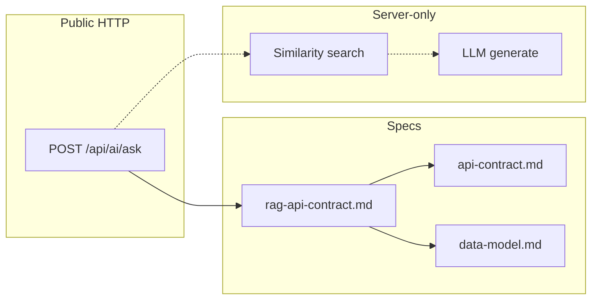
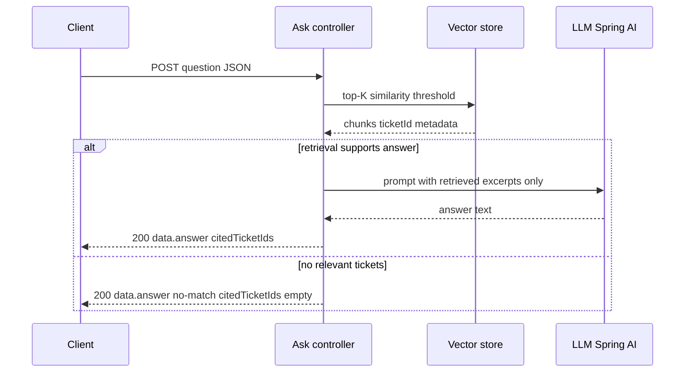

# RAG API contract — grounded ask over ticket knowledge

> **Status:** agreed (2026-10-04) — **PDF**-named spec for natural-language Q&A over ingested ticket text. HTTP envelopes and shared REST rules → `rules/api-standards.md`. Ticket REST → [`api-contract.md`](api-contract.md) §4–§5. Ingestion → [`rag-ingestion.md`](rag-ingestion.md); pipeline → [`architecture.md`](architecture.md) §15. **DEC-11**, **DEC-17**.  
> **Primary source:** `docs/Assessments.docx` (RAG & Assistant Requirements, Core Acceptance Criteria p.5–6).  
> **Related:** [`requirements.md`](requirements.md) FEAT-15…18, Flows B/E, **AC-CORE-16…18**; UI display → [`ui-flow.md`](ui-flow.md) §10; grounding review → `commands/review-rag-output.md`; retrieval quality → [`evaluation-strategy.md`](evaluation-strategy.md).

**Label legend**

| Label | Meaning |
|-------|---------|
| **PDF** | Required or named in the assessment. |
| **Convention** | Project choice; not a PDF mandate. |
| **Agreed** | Recorded in [`requirements.md`](requirements.md) §10.2 / [`data-model.md`](data-model.md). |
| **Example** | Illustrative sample values — not mandated seed data. |
| **Open** | Unresolved until **DEC-*** confirmed. |

---

## Table of contents

1. [Problem and context](#1-problem-and-context)  
2. [Scope and non-goals](#2-scope-and-non-goals)  
3. [Relationship to other artefacts](#3-relationship-to-other-artefacts)  
4. [RAG ask flow (logical)](#4-rag-ask-flow-logical)  
5. [Endpoints](#5-endpoints)  
6. [Request contract](#6-request-contract)  
7. [Success response contract](#7-success-response-contract)  
8. [Outcome matrix (HTTP and envelopes)](#8-outcome-matrix-http-and-envelopes)  
9. [Grounding and citations](#9-grounding-and-citations)  
10. [No-match and out-of-scope](#10-no-match-and-out-of-scope)  
11. [Guardrails — non-agentic assistant](#11-guardrails--non-agentic-assistant)  
12. [PDF illustrative questions](#12-pdf-illustrative-questions)  
13. [Client and UI obligations](#13-client-and-ui-obligations)  
14. [Server boundary — not exposed on the API](#14-server-boundary--not-exposed-on-the-api)  
15. [Configuration vs API](#15-configuration-vs-api)  
16. [Traceability](#16-traceability)  
17. [Acceptance criteria (**AC-RAG-API-***)](#17-acceptance-criteria-ac-rag-api)  
18. [Open questions and decisions](#18-open-questions-and-decisions)  
19. [Revision history](#19-revision-history)  

---

## 0. Document guide

### 0.1 PDF coverage map (ask API only)

| **PDF** (p.3–6) | Section |
|-----------------|---------|
| NL Q&A grounded in ticket data | §1, §9 |
| Cite ticket id(s) used | §7, §9 |
| Explicit no relevant tickets | §10 |
| `POST /api/ai/ask` + example question JSON | §5–§6 |
| Single retrieve → generate; not an agent | §11 |
| Five illustrative questions | §12 |

### 0.2 Business, functional, and implementation requirements

**Business requirements** — one HTTP operation turns a support question into an answer **traceable** to ticket ids or an honest empty result.

**Functional requirements**

| ID | Requirement | AC |
|----|-------------|-----|
| FR-RAG-API-01 | Accept non-blank `question` | **AC-RAG-API-01** |
| FR-RAG-API-02 | Success `data.answer` + `data.citedTicketIds` when grounded | **AC-RAG-API-02…03** |
| FR-RAG-API-03 | No-match still **200** with agreed copy inside `data` | **AC-RAG-API-04** (**DEC-11**) |
| FR-RAG-API-04 | No side effects on tickets/comments | **AC-RAG-API-05** |

**Implementation requirements**

| ID | Requirement |
|----|-------------|
| IR-RAG-API-01 | Controller → `AskService` → retrieval + Spring AI chat |
| IR-RAG-API-02 | Versioned alias `/api/v1/ai/ask` same handler as **PDF** path |
| IR-RAG-API-03 | Do not return raw chunks or prompts in JSON |

### 0.3 Independent reading units

| Unit | Section | Standalone? | Read first (this file) | Delivers | See also |
|------|---------|-------------|------------------------|----------|----------|
| **ASK-A** | §1 + §5 | Yes | — | **PDF** path `POST /api/ai/ask` | `rules/api-standards.md` envelopes |
| **ASK-B** | §6 Request | Yes | **ASK-A** | `AskRequest`, validation **400** | §6.3 error table |
| **ASK-C** | §7 Grounded **200** | Yes | **ASK-B** | `answer` + `citedTicketIds` examples | [`data-model.md`](data-model.md) DEC-04 |
| **ASK-D** | §10 No-match **200** | Yes | **ASK-B** | Honest empty retrieval (**DEC-11**) | [`requirements.md`](requirements.md) AC-CORE-18 |
| **ASK-E** | §9 Citations | Yes | **ASK-C** | Citation integrity rules | `commands/review-rag-output.md` |
| **ASK-F** | §11 Guardrails | Yes | — | Non-agentic (**PDF** p.5–6) | [`requirements.md`](requirements.md) FEAT-18 |
| **ASK-G** | §12 PDF questions | Yes | **ASK-C**, **ASK-D** | Five illustrative prompts | [`evaluation-strategy.md`](evaluation-strategy.md) §5 |
| **ASK-H** | §17 AC-RAG-API | Yes | **ASK-B…F** | Contract acceptance IDs | [`test-strategy.md`](test-strategy.md) §6.2 |

**PDF verbatim (p.5 API):** `POST /api/ai/ask` with `{ "question": "What caused previous payment failures?" }`.

---

## 1. Problem and context · unit **ASK-A**

The assessment requires a **natural-language question-answering** capability over **ticket history**, with answers **grounded strictly in real ticket data**, **citations** to ticket ids used, and **honest** handling when nothing relevant exists (**PDF** p.3–6).

The **only PDF-named HTTP surface** for this capability is:

```http
POST /api/ai/ask
Content-Type: application/json

{ "question": "What caused previous payment failures?" }
```

This document defines the **public RAG API contract**: paths, request/response JSON inside standard envelopes, semantic rules for grounded vs no-match outcomes, and guardrails. It does **not** define prompts, chunk text in responses, or embedding model ids.

---

## 2. Scope and non-goals

### 2.1 In scope

| Area | This spec defines |
|------|-------------------|
| **Endpoints** | `POST /api/ai/ask` (**PDF**); versioned alias (**Convention**) |
| **Request** | `AskRequest` — only `question` (non-blank, max **2000** chars — **DEC-17**); unknown properties → **400** |
| **Success `data`** | `AskResponseData` — `answer`, `citedTicketIds` |
| **HTTP mapping** | 200 success (grounded **or** no-match); 400 validation; 5xx server errors |
| **Grounding rules** | Context-only answers; citation integrity; single retrieve→generate pass |
| **Non-agentic** | No ticket/comment mutations or tool side effects from ask |
| **Acceptance** | **AC-RAG-API-01…05**; maps to **AC-CORE-16…18** |

### 2.2 Non-goals

| Item | Owner / note |
|------|----------------|
| Ticket CRUD REST | [`api-contract.md`](api-contract.md) |
| Ingest, chunk, embed, re-ingest | [`rag-ingestion.md`](rag-ingestion.md) |
| Retrieval quality eval procedure | [`evaluation-strategy.md`](evaluation-strategy.md) |
| Ask UI layout | [`ui-flow.md`](ui-flow.md) |
| Auth, rate limits, streaming SSE | **Reference** — not in **PDF** assessment scope (**DEC-12** no auth) |
| Confidence scores, retrieved chunk bodies in JSON | **PDF** does not require |
| Agent tools, multi-turn threads, follow-up actions | **PDF** explicitly out of scope |

---

## 3. Relationship to other artefacts



| Artefact | Role for ask |
|----------|----------------|
| **`rag-api-contract.md` (this file)** | **Authoritative** RAG ask semantics (**PDF** filename) |
| [`api-contract.md`](api-contract.md) §6 | Combined HTTP catalog + duplicate summary for ticket+ask reviewers |
| `rules/api-standards.md` | Envelopes, both paths, 200 no-match rule |
| `rules/rag-vector-store.md` | Implementation guardrails (not duplicated here) |
| [`data-model.md`](data-model.md) §5.5 | Citation id format **TKT-{n}** (**Agreed** DEC-04) |

---

## 4. RAG ask flow (logical)

**PDF** pipeline (user-visible outcome only):

```text
User question (HTTP)
    → Similarity search over vector store (ticket chunks + metadata)
    → If relevant: LLM + retrieved context only → grounded answer + ticket sources
    → If not relevant: honest no-match (no fabrication)
    → HTTP 200 + success envelope in both grounded and no-match cases
```



**FEAT-16** implements the internal stages; **FEAT-15** exposes this HTTP contract.

---

## 5. Endpoints · unit **ASK-A**

### 5.1 Catalog

| # | Method | Path | **PDF** | Notes |
|---|--------|------|---------|-------|
| 1 | `POST` | `/api/ai/ask` | **Required** | Assessment path; must remain callable |
| 2 | `POST` | `/api/v1/ai/ask` | **Convention** | Same handler, same contract |

| Property | Value |
|----------|--------|
| **Auth** | None (assessment) |
| **Idempotent** | No — each call may run retrieval + generation |
| **Side effects** | **None** on tickets/comments (**PDF**) |
| **Content-Type** | `application/json` request and response |

**Convention:** Implementations expose **one** controller method; route both paths to it. Frontends **should** prefer `/api/v1/ai/ask`; assessors may use `/api/ai/ask` (**PDF**).

### 5.2 Base URL

**Example:** `http://localhost:8080` — see `rules/api-standards.md` and `VITE_API_BASE_URL` in `rules/frontend.md`.

---

## 6. Request contract · unit **ASK-B**

### 6.1 `AskRequest` (**PDF**)

Flat JSON at the request root (not wrapped in `data`).

| Property | Type | Required | Validation |
|----------|------|----------|------------|
| `question` | string | yes | Non-blank after trim; max length **2000** characters (**DEC-17**) |

**PDF example:**

```json
{
  "question": "What caused previous payment failures?"
}
```

### 6.2 Forbidden / ignored fields

| Rule | Rationale |
|------|-----------|
| No `ticketId`, `action`, `createTicket`, `tools` | **PDF** non-agentic |
| No `sessionId` / `conversation` in v1 | Single-shot Q&A (**PDF**) |
| Extra unknown properties | **Agreed (DEC-17):** reject with **400** `VALIDATION_ERROR` (strict request body) |

### 6.3 Validation failures

| Condition | HTTP | Envelope |
|-----------|------|----------|
| Missing `question` | **400** | `error` |
| Blank/whitespace `question` | **400** | `error` |
| `question` longer than 2000 characters | **400** | `VALIDATION_ERROR` |
| Unknown property (e.g. `"ticketId"`) | **400** | `VALIDATION_ERROR` |
| Malformed JSON | **400** | `error` (`BAD_REQUEST` or `VALIDATION_ERROR` per `rules/api-standards.md`) |

**Example error** (missing question) — full shape in [`api-contract.md`](api-contract.md) §6.1.

---

## 7. Success response contract · unit **ASK-C**

### 7.1 Envelope (**Convention**)

On **200 OK**, always the **success** envelope:

```json
{
  "data": { }
}
```

No `meta` on ask responses.

### 7.2 `AskResponseData` (inside `data`)

**Agreed** shape (**DEC-11**); no-match phrase per PDF p.6.

| Property | Type | Required | Semantics |
|----------|------|----------|-----------|
| `answer` | string | yes | Grounded narrative **or** honest no-match phrase |
| `citedTicketIds` | string[] | yes | Public ticket ids from retrieval; `[]` when no-match |

**Agreed id format (DEC-04):** each non-empty element is `TKT-{n}` and **must** exist in the relational DB at response time (**PDF**).

### 7.3 Grounded example (**PDF** theme)

```http
POST /api/ai/ask HTTP/1.1
Host: localhost:8080
Content-Type: application/json

{ "question": "What caused previous payment failures?" }
```

```http
HTTP/1.1 200 OK
Content-Type: application/json;charset=UTF-8

{
  "data": {
    "answer": "Previous payment failures were linked to gateway timeouts (see cited tickets).",
    "citedTicketIds": ["TKT-1001", "TKT-1004"]
  }
}
```

### 7.4 No-match example (**PDF** p.6)

```json
{
  "data": {
    "answer": "No relevant tickets found.",
    "citedTicketIds": []
  }
}
```

**Agreed (**DEC-11**):** use this phrase (or equivalent honest wording). Meaning: nothing relevant in ticket corpus — not a generic error and not fabricated facts.

---

## 8. Outcome matrix (HTTP and envelopes)

| Situation | HTTP | Envelope | `citedTicketIds` | `answer` |
|-----------|------|----------|------------------|----------|
| Grounded hit | **200** | `data` | Non-empty ⊆ retrieved ticket ids | Ticket-sourced text |
| Empty / below-threshold retrieval | **200** | `data` | `[]` | No-match phrase |
| Out-of-scope (no ticket evidence) | **200** | `data` | `[]` | Same honesty as no-match (**Flow E2**) |
| Invalid `question` | **400** | `error` | — | — |
| Server failure | **5xx** | `error` | — | — |

| Anti-pattern | Correct handling |
|--------------|------------------|
| No-match as **404** | **Forbidden** — use **200** + no-match `data` |
| No-match as `error` on **200** | **Forbidden** |
| Grounded answer with invented ids | **Forbidden** — **AC-RAG-API-04** |
| **200** with world-knowledge essay and empty citations for support question | **Forbidden** — **AC-CORE-18** |

---

## 9. Grounding and citations · unit **ASK-E**

### 9.1 Grounding rules (**PDF** p.5–6)

| ID | Rule |
|----|------|
| **G-01** | `answer` MUST be derived from **retrieved ticket excerpts** passed to the LLM for **support-specific** questions — not general model knowledge when ticket evidence is required. |
| **G-02** | When retrieval supports an answer, `citedTicketIds` MUST list ids that appeared in the **retrieval result** for that request — not ids invented by the model. |
| **G-03** | Non-empty `citedTicketIds` implies each id exists in PostgreSQL SoR (**PDF**). |
| **G-04** | Single pass: one similarity search → one generation — no agent loop (**PDF**). |

### 9.2 Citation semantics

| Topic | Specification |
|-------|----------------|
| **Granularity** | Ticket-level ids (**PDF** “cite specific ticket(s)”) — not comment uuid or chunk uuid in v1 |
| **Ordering** | **Agreed (DEC-17):** preserve **retrieval relevance order** (highest similarity first); map from ranked chunks to ticket ids without reordering by lexicographic id |
| **Duplicates** | **Agreed (DEC-17):** dedupe ticket ids while **preserving first occurrence** order |
| **UI** | Clients link each id to ticket detail ([`ui-flow.md`](ui-flow.md) §10.2) |

### 9.3 Review

Manual / demo proof: `commands/review-rag-output.md` (every claim traceable to cited ids or honest no-match).

Retrieval quality (right tickets in top-K): [`evaluation-strategy.md`](evaluation-strategy.md) — separate from HTTP shape tests.

### 9.4 Hybrid retrieval for explicit ticket ids (**DEC-21**)

When the user names a public id in `question` (pattern `TKT-{n}` per **DEC-04**):

| Step | Behaviour |
|------|-----------|
| Parse | Collect ids in **first-mention order**; dedupe |
| Load | `VectorChunkStore.findByTicketId(id)` for each |
| Rank | Prepend loaded chunks **before** vector-similarity hits; assign rank so explicit-id chunks precede semantic hits (**DEC-17** ordering) |
| Threshold | Explicit-id chunks are **not** discarded by `similarity-threshold`; vector hits still are |
| Merge | Dedupe on `(ticketId, content)`; if merged set empty → no-match §10 |
| Generate | Unchanged — single pass, excerpts only (**G-04**) |

**Maps to PDF illustrative question:** “What was the resolution for ticket TKT-1001?” — must retrieve that ticket even when the question embedding is weak against description-only chunks ([`evaluation-strategy.md`](evaluation-strategy.md) §5.2 Q2).

**Implementation (2026-10-04):** `AskQuestionTicketIds.extractInOrder`; `AskService.mergeRetrieval()`; Band A — `AskServiceTest`, `AskApiIT.askByExplicitTicketIdCitesTicketEvenWhenVectorMatchIsWeak`.

---

## 10. No-match and out-of-scope · unit **ASK-D**

**PDF** p.6: when no tickets are relevant, respond with an honest **“no relevant tickets found”** (or equivalent) — **not** a fabricated plausible answer.

| Scenario | Expected API behaviour |
|----------|------------------------|
| Empty vector corpus | **200**, empty citations, no-match `answer` |
| Question below similarity threshold | Same |
| “Capital of France?” with ticket-only policy | **200**, no-match — not “Paris” from model memory (**Example** Flow E2) |
| User message implies “create a ticket” | **200** ask only — **no** row created (**AC-FEAT-18-04**) |

**DEC-11 (Agreed):** no separate machine-readable `reason` / codes in v1 (PDF bundles out-of-scope with honest no-match). Optional fields require a future **DEC**.

---

## 11. Guardrails — non-agentic assistant · unit **ASK-F**

**PDF** p.5–6: deliberately **not** an autonomous agent.

| Forbidden from ask handler | **PDF** / AC |
|----------------------------|--------------|
| `INSERT`/`UPDATE` on `ticket` or `comment` | **AC-RAG-API-05**, AC-FEAT-18-04 |
| Notifications, emails, webhooks | Out of scope |
| Chained tool calls or “plan then act” | Out of scope |
| Returning executable “actions” in JSON | Out of scope unless future **DEC** |

The API must remain **read-only** with respect to ticket SoR.

---

## 12. PDF illustrative questions · unit **ASK-G**

**PDF** lists questions the assistant should be able to answer when the corpus supports them (**Example** ids and corpus — not mandated seed data). See also [`requirements.md`](requirements.md) §4.2 FEAT-17 and [`evaluation-strategy.md`](evaluation-strategy.md) §5.

| Question (**PDF**) | Expected response **shape** |
|--------------------|----------------------------|
| Have we seen payment failures before? | Summary from matching tickets + **citedTicketIds** |
| What was the resolution for ticket TKT-1001? | Resolution-themed **answer** + cite `TKT-1001` when that ticket is retrieved |
| What are the common causes of shipment tracking issues? | Themes from similar tickets + ids |
| Show me similar resolved tickets. | Summary/list tone + resolved ticket ids |
| Which high-priority tickets are related to payment? | Subset narrative + ids matching priority/topic |

**Contract tests** prove HTTP shape and stubbed retrieval paths; **probabilistic** answer text is evaluated per [`evaluation-strategy.md`](evaluation-strategy.md), not golden strings in `./mvnw test` ([`test-strategy.md`](test-strategy.md) §6).

---

## 13. Client and UI obligations

| Obligation | Spec |
|------------|------|
| Send only `{ "question" }` | **AC-RAG-API-01** |
| Parse success `{ data }` / error `{ error }` | `rules/frontend.md` |
| Show `answer` distinct from ticket fields | **AC-UI-12** |
| Link `citedTicketIds` to detail | **AC-UI-09** |
| Honest no-match at **200** — not styled as hard error | **AC-UI-10** |
| No “create ticket from answer” UI | **AC-UI-11** |

---

## 14. Server boundary — not exposed on the API

Implementers may log or test internally; **must not** return in ask JSON:

| Internal artefact | Why hidden |
|-------------------|------------|
| Prompt templates | Security / prompt injection surface |
| Raw chunk text / scores | **PDF** does not require; eval may use logs |
| Model id, temperature, top-K, threshold values | **Convention** — configuration only ([`rag-ingestion.md`](rag-ingestion.md) §12) |
| Token usage | Optional metrics — not assessment contract |

---

## 15. Configuration vs API

**PDF** requires top-K and similarity threshold **configurable**, not hardcoded (**AC-CORE-21**, FEAT-19). Property keys and defaults live in [`rag-ingestion.md`](rag-ingestion.md) — **not** in ask request/response bodies.

Changing config may change which questions ground vs no-match; HTTP contract shape stays the same.

---

## 16. Traceability

| PDF theme | Requirement IDs | Features |
|-----------|-----------------|----------|
| `POST /api/ai/ask` + `question` | FR-15, AC-CORE-16 | FEAT-15 |
| Similarity → LLM with context | FR-15, AC-CORE-16 | FEAT-16 |
| Citations | FR-16, AC-CORE-17 | FEAT-17 |
| No-match / no fabrication | FR-17, AC-CORE-18 | FEAT-18 |
| Non-agentic | §2.2 requirements | FEAT-18 |
| Demo Flow B / E | §4.1, §8.7 steps 9–10 | — |

---

## 17. Acceptance criteria (**AC-RAG-API-***) · unit **ASK-H**

| ID | Criterion |
|----|-----------|
| **AC-RAG-API-01** | Request body contains **only** `question` (non-blank after trim, max **2000** characters — **DEC-17**); unknown JSON properties → **400** `VALIDATION_ERROR`; same rules on `/api/ai/ask` and `/api/v1/ai/ask` (**PDF**). |
| **AC-RAG-API-02** | Success responses use `data.answer` + `data.citedTicketIds` per §7.2. |
| **AC-RAG-API-03** | No-match and grounded outcomes both return **200** + success envelope. |
| **AC-RAG-API-04** | Non-empty `citedTicketIds` only when retrieval supported the answer (**PDF**). |
| **AC-RAG-API-05** | Ask handler performs no ticket or comment mutations (**PDF**). |
| **AC-RAG-API-06** | `question` over 2000 chars or unknown JSON properties → **400** (**DEC-17**). |
| **AC-RAG-API-07** | Non-empty `citedTicketIds` follow retrieval relevance order, deduped (**DEC-17**). |
| **AC-RAG-API-08** | Given question containing `TKT-{n}` and stored chunks for that id, when ask runs, then retrieval includes those chunks even if vector similarity alone is below threshold (**DEC-21**). |

**Also maps to:** **AC-CORE-16…18**, **AC-API-06/07** in [`api-contract.md`](api-contract.md) §9.

---

## 18. Open questions and decisions

| ID | Topic | Status | Notes |
|----|-------|--------|-------|
| **DEC-11** | No-match wording; optional `reason` / codes | **Agreed 2026-10-04** | Phrase §7.4; no `reason` field in v1 |
| **DEC-09** | Embedding model affects retrieval only — not response fields | **Agreed 2026-10-04** | [`rag-ingestion.md`](rag-ingestion.md) §12 — `nomic-embed-text` / 768 |
| **DEC-17** | Ask request + citations | **Agreed 2026-10-04** | §6, §9.2 |
| **DEC-21** | Ask hybrid retrieval for explicit `TKT-{n}` in question | **Agreed + implemented 2026-10-04** | §9.4; ingest header chunk [`rag-ingestion.md`](rag-ingestion.md) §6.1 |
| Extra properties on `AskResponseData` | e.g. `confidence` | **Reference** | Not in **PDF** — do not implement ([`requirements.md`](requirements.md) §2.3) |

---

## 19. Revision history

| Date | Note |
|------|------|
| 2026-10-04 | Initial **PDF** `rag-api-contract.md`: endpoints, AskRequest/AskResponseData, grounding, no-match, guardrails, AC-RAG-API-01…05. |
| 2026-10-04 | **DEC-17:** question max 2000, strict unknown properties, citation order + dedupe; AC-RAG-API-06/07. |
| 2026-10-04 | **DEC-21:** §9.4 hybrid retrieval for explicit `TKT-{n}`; **AC-RAG-API-08**. |
| 2026-10-04 | Cross-linked across `spec/`, `rules/`, `commands/`, `docs/` as authoritative ask contract. |
| 2026-10-04 | §0 document guide: PDF ask themes; business/functional/implementation triad. |
| 2026-10-04 | §0.3 **ASK-*** independent reading units + PDF `/api/ai/ask` quote. |
| 2026-10-04 | Major `##` headings tagged with **ASK-*** unit ids. |
| 2026-10-04 | Doc sync: **AC-RAG-API-01** aligned with **DEC-17** (merged with AC-RAG-API-06 validation themes). |
| 2026-10-04 | Promoted to **agreed** with ten-file spec set (user sign-off). |
