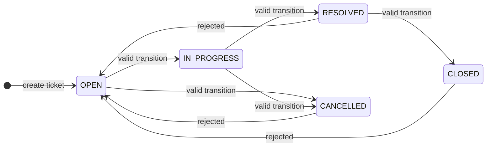
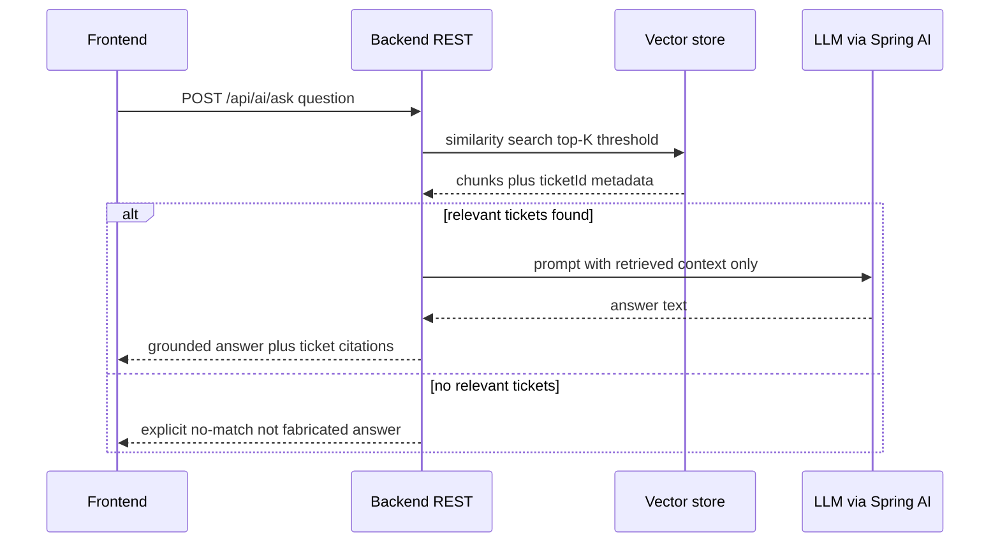
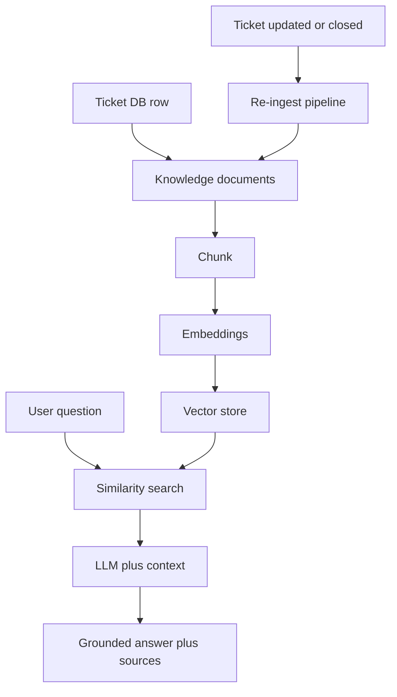

# Requirements — AI-Powered Support Ticket Management System

> **Primary source:** `docs/Assessments.docx` (6-page ATL/TL assignment).  
> **Secondary reference (human summary, same rule):** [`docs/assessment-brief.md`](../docs/assessment-brief.md).  
> **Status:** draft — faithful to the PDF; elaboration and examples clarify PDF text; they do **not** add new product capabilities. Becomes **agreed** only after open decisions (§10.2) are confirmed and recorded.  
> **Version:** 2026-10-04 (see §14 revision history).  
> **Open decisions:** 9 (§10.2 — **DEC-01, 02, 06, 09–12, 14, 15** still open; **DEC-03, 04, 05, 07, 08, 13** agreed 2026-10-04 in [`data-model.md`](data-model.md)).  
> **Rule:** Anything not stated in the PDF is an **open question** or belongs in a downstream spec (`api-contract.md`, `data-model.md`, etc.), not silently decided here.

**Child spec completeness (implementability)**

| Spec file | Status in repo | Role relative to this document |
|-----------|----------------|--------------------------------|
| `requirements.md` | Present (this file) | PDF + acceptance hub |
| [`architecture.md`](architecture.md) | Present (draft) | System design (modules, ticket shape, APIs, communication, RAG, vector DB); chunking + embedding justification (**PDF**, §16); reviewer map in [`rules/documentation.md`](../rules/documentation.md) |
| [`data-model.md`](data-model.md) | Present (agreed) | Resolves OQ-01, OQ-02, OQ-03, OQ-10, OQ-13, OQ-14; **DEC-03, 04, 05, 07, 08, 13** recorded §10.2 |
| [`api-contract.md`](api-contract.md) | Present (draft) | Ticket/comment REST + ask boundary; **DEC-14** interim; **DEC-06** PATCH `status` |
| [`state-machine.md`](state-machine.md) | Present (draft) | T1–T5 / X1–X3 matrix; **DEC-02** default (A); interim PATCH (**DEC-06** open); **DEC-07** cross-ref |
| [`rag-ingestion.md`](rag-ingestion.md) | Present (draft) | Chunking (paragraph + fixed hybrid), ingest sources, re-ingest (**DEC-01** interim), **DEC-09** |
| [`evaluation-strategy.md`](evaluation-strategy.md) | Present (draft) | Retrieval quality eval (**PDF** learning goal, FEAT-22) |
| [`test-strategy.md`](test-strategy.md) | Present (draft) | **§5** state machine determinism; **§6** ask/retrieval bands; AC-CORE / AC-SM / AC-API maps |

**PDF list items consolidated (no separate file in repo):** ask `data` semantics, citations, no-match (**DEC-11**) → [`api-contract.md`](api-contract.md) **§6.2–§6.5**; screens and flows A–E → [`architecture.md`](architecture.md) **§12.3–§12.6** (`rules/frontend.md` for UI conventions).

**Label legend**

| Label | Meaning |
|-------|---------|
| **PDF** | Explicitly required or named in `docs/Assessments.docx` (assignment document). |
| **Example** | Illustrative only; not a locked design unless the PDF names it (e.g. sample question text). |
| **Open** | Underspecified in the PDF; resolve in a later spec after confirmation. |
| **Convention** | Project choice documented in `rules/*` or agreed specs; **not** a PDF mandate unless marked **PDF**. |

---

## 0. How to use this document

### 0.1 Audience

| Reader | Start here | Use for |
|--------|------------|---------|
| **Implementer** | §2 scope, §2.4 precedence, §4.2 feature AC | What to build; what **not** to guess |
| **Reviewer / tech lead** | §8 AC-CORE, §9 traceability, §10 decisions | Sign-off and gap tracking |
| **Demo / grader walkthrough** | §8.7 demo script, §4.1 flows | Repeatable proof of PDF acceptance |
| **AI assistant (Cursor)** | §2.7 anti-patterns, §13 scope boundary | Avoid inventing requirements |

### 0.2 Recommended read order

1. **§2** — In scope, out of scope, deterministic vs probabilistic, canonical enums  
2. **§4.1** — End-to-end flows (A–E)  
3. **§4.2** — Per-feature description, flows, **AC-FEAT-*** (testable)  
4. **§8** — **AC-CORE-*** master checklist  
5. **§10** — Open questions, decision register, spec handoff  
6. **§12** — Glossary  
7. **§13** — What does not belong in this file

### 0.3 What this file is and is not

| This file **is** | This file **is not** |
|------------------|----------------------|
| PDF-faithful requirements and acceptance criteria | HTTP status codes, JSON envelopes, or `/api/v1` path rules → `rules/api-standards.md` + `api-contract.md` |
| Feature slices (FEAT-*) and traceability to FR / AC | Table schemas, Liquibase, vector dimensions → `data-model.md`, `rag-ingestion.md` |
| Flows and **Example** demo data (§4.3) | UI wireframes → [`architecture.md`](architecture.md) §12.3–§12.6, `rules/frontend.md` |
| Explicit **Open** items and **DEC-*** register | Prompt templates, model IDs, numeric top-K → `architecture.md`, `rag-ingestion.md` |

Until §10 decisions are **agreed**, treat implementable detail in child specs as **draft**; do not close Open items only in code. See [`rules/documentation.md`](../rules/documentation.md) (“Agreed spec”).

### 0.4 Assessment PDF coverage map (**PDF** → this repo)

Use this table to confirm nothing from the assignment is “lost” between the assignment document and specs. Page numbers refer to `docs/Assessments.docx` (6 pages). Human restatement: [`docs/assessment-brief.md`](../docs/assessment-brief.md).

| PDF theme (typical page) | Captured in | Gap / owner if not implementable yet |
|--------------------------|-------------|--------------------------------------|
| Process: spec-driven workflow, hygiene rules/commands, prompt history, AI mistake evidence (p.1–2) | §3.4, §6.8, §7 NFR-01…05, FEAT-23 | Mistake log file `docs/ai-mistakes.md` when first entry exists |
| Learning goals: specs for AI-native feature; test deterministic + probabilistic (p.2) | §1.3, §2.5, FEAT-22, §6.7 | [`evaluation-strategy.md`](evaluation-strategy.md), [`test-strategy.md`](test-strategy.md) |
| Token optimisation plugins + prompt caching (p.2) | §7 NFR-11, `rules/documentation.md` | Optional tooling — not product behaviour |
| Stack: Java 21, Spring Boot, Spring AI, PostgreSQL/H2, embedding, vector store, REST, React/Next or equivalent (p.2–3) | §2.1, §6.1 | **DEC-09**, **DEC-10** for store/DB roles in `architecture.md` / `rag-ingestion.md` |
| Ticket CRUD, comments, search, filter, persistence, validation, UI errors (p.3–4) | §4.2 FEAT-01…10, §8.1–8.2 | HTTP → [`api-contract.md`](api-contract.md); UI → [`architecture.md`](architecture.md) §12.3–§12.6 |
| Backend state machine; valid transitions; invalid reopen examples (p.4) | §2.6, FEAT-11, Flow A/C | [`state-machine.md`](state-machine.md); skipped hops → **DEC-02** |
| Basic RAG pipeline diagram: tickets → knowledge → chunk → embed → store → ask → search → LLM → answer → sources (p.4) | §6.6, Flow D | [`architecture.md`](architecture.md) §15; `rules/rag-vector-store.md` pipeline |
| Five illustrative assistant questions (p.4) | §4.3 **Example** table | Eval: [`evaluation-strategy.md`](evaluation-strategy.md) §5–§8; review: `commands/review-rag-output.md` |
| RAG: ingest description/comments/resolution; metadata keys; re-ingest on update or closed (p.5) | FEAT-12…14, Flow D | Numeric chunk/model → `rag-ingestion.md`; **DEC-01** |
| Ask flow: similarity search → LLM; grounded answer; citations; example questions (p.4–5) | FEAT-15…17, Flow B, §4.3 | Response `data` → [`api-contract.md`](api-contract.md) §6, **§6.2–§6.5** (**DEC-11** wording open) |
| Grounding guardrails; no agent; no create/notify/tools (p.5–6) | §2.2, FEAT-18, Flow E | — |
| Configurable top-K and similarity threshold (p.5) | FEAT-19, AC-CORE-21 | Property names/values → `rag-ingestion.md` |
| Document chunking + embedding justification (p.5–6) | FEAT-20, AC-CORE-19 | Narrative in `architecture.md` §16; numbers in `rag-ingestion.md` |
| Core acceptance checklist (p.6) | §8 **AC-CORE-01…23**, §8.7 demo script | Sign-off uses §8.6 checklist |
| Process artefacts + token optimisation (p.1–2) | §6.8, §7 NFR-01…11, FEAT-23 | Demo steps 15, 18; `docs/ai-mistakes.md` when first entry |
| `POST /api/ai/ask` request `{ "question": "..." }` (p.5) | FEAT-15, §2.6 | Response shape **Open** → **DEC-11** |
| PDF spec file list (ten names, p.1–2) | Child-spec table (top); §6.8; [`docs/assessment-brief.md`](../docs/assessment-brief.md) §4 | **Eight** files on disk; `rag-api-contract` themes → [`api-contract.md`](api-contract.md) §6.2–§6.5; `ui-flow` themes → [`architecture.md`](architecture.md) §12.3–§12.6 |

**Not in the PDF (do not add without a new agreed spec):** authentication, multi-tenancy, attachments, notifications, delete-ticket API, agentic tool use, confidence scores on ask responses.

---

## 1. Problem and context

### 1.1 Product problem (**PDF**)

Support teams need a **ticket management system** that handles everyday ticket operations **and** lets users ask **natural-language questions** over historical ticket content. Answers must be **grounded in real ticket data**, with **citations**, and **honest handling** when nothing relevant exists—not plausible fabrications.

The assessment treats the AI assistant as **native to the design**, not a later add-on.

### 1.2 Assessment problem (**PDF**)

The assignment evaluates two layers:

1. **Process / AI engineering** — spec-driven delivery, reusable AI instructions, prompt history, structured review (including hallucination / ungrounded answers), and evidence that AI output is validated—not accepted blindly.
2. **Product** — the ticket system plus a **retrieve-then-generate** RAG assistant with explicit grounding guardrails.

The PDF states the application is important, but the **main assessment** is **how** it is built with AI and **how** the assistant is designed (grounding, hallucination, retrieval quality vs deterministic ticket logic).

### 1.3 Learning outcomes the solution must demonstrate (**PDF**)

- Analyse requirements and produce specifications for a system that includes an **AI-native feature from the start**.
- Apply **spec-driven development** to both **conventional CRUD** and a **RAG pipeline**.
- Manage AI context and validate **AI-generated code** and **AI-generated answers** (grounding, hallucination).
- Test and debug **deterministic** behaviour (ticket state machine) and **probabilistic** behaviour (retrieval quality).

---

## 2. Scope

### 2.1 In scope (**PDF**)

| Area | Summary |
|------|---------|
| Ticket CRUD & ops | Create, list, detail, update core fields, comments, keyword search, status filter |
| Persistence | Database-backed; data survives application restart |
| Validation & errors | Backend validation; meaningful errors in the UI |
| State machine | Backend-enforced transitions; invalid transitions rejected |
| RAG ingestion | Description, comments, resolution notes → knowledge docs → chunk → embed → vector store |
| RAG freshness | Re-ingest / refresh when ticket **updated or closed** (ingestion section, p.5) |
| RAG API | `POST /api/ai/ask` with JSON `{ "question": "..." }` |
| RAG behaviour | Grounded answers, ticket ID citations, explicit no-match; single retrieval → generate (not an agent) |
| Retrieval tuning | **top-K** and **similarity threshold** configurable, not hardcoded |
| Documentation | Chunking strategy and embedding model choice **justified** in `architecture.md` |
| Stack (named) | Java 21, Spring Boot, Spring AI, PostgreSQL/H2, embedding model, vector store (e.g. PGVector or Chroma), REST, React/Next.js or equivalent |
| Process artefacts | Spec set, hygiene rules/commands, prompt history, documented AI mistake |

### 2.2 Out of scope (**PDF**)

The ask flow is **one question → one grounded response**. The assistant must **not** act as an autonomous agent. It must **not** independently:

- Create tickets
- Send notifications
- Chain into other tools or take further actions

**Example (behavioural):** A user asks “Create a ticket for my outage.” The system may answer from ticket history if relevant tickets exist; it must **not** create a ticket as a side effect of `/api/ai/ask`.

### 2.3 Non-goals (not in PDF — do not assume)

Authentication, roles, multi-tenancy, attachments, email/Slack notifications, workflow beyond the stated status machine, and agentic tool use are **Open** unless added in a future agreed spec.

### 2.4 Authority and precedence (**PDF** vs specs vs rules)

When documents disagree, resolve in this order:

| Priority | Source | Resolves |
|----------|--------|----------|
| **1** | `docs/Assessments.docx` | What the assignment requires |
| **2** | `spec/requirements.md` (this file) | Faithful restatement, acceptance criteria, **Open** / **DEC-*** register |
| **3** | Agreed `spec/*.md` | Payloads, field catalogs, transition rules, RAG numeric tuning |
| **4** | `rules/*.md` | Engineering conventions (envelopes, `/api/v1`, testing layers) where they **do not contradict** PDF + agreed specs |

**Clarifications**

- **`POST /api/ai/ask`** is **PDF**-named; project may alias (e.g. `/api/v1/ai/ask`) in **Convention** if behaviour is identical—see `rules/api-standards.md`.
- Ticket REST shapes, pagination, and error envelopes are **Convention** unless/until captured in agreed `api-contract.md`.
- [`architecture.md`](architecture.md) **must** justify chunking and embedding model (**PDF**); numeric chunk size is **Open** until `rag-ingestion.md` is agreed.

### 2.5 Deterministic vs probabilistic requirements

The PDF expects both **exact** ticket logic and **evaluated** retrieval quality (learning goals p.2).

| Area | Nature | How acceptance is proven |
|------|--------|---------------------------|
| CRUD, search, filter, persistence | **Deterministic** | AC-CORE-01…11; repeatable manual or automated tests |
| Backend validation | **Deterministic** | AC-CORE-10; negative API cases |
| Status state machine | **Deterministic** | AC-CORE-12…14; integration tests (**PDF** explicit) |
| Embeddings exist in vector store | **Deterministic** | AC-CORE-15; inspect store or integration fixture |
| Ask: citations reference real tickets | **Deterministic** | AC-CORE-17; cited ids exist in DB |
| Ask: no fabrication / honest no-match | **Policy + review** | AC-CORE-18; `commands/review-rag-output.md` |
| Ask: answer phrasing and ranking | **Probabilistic** | AC-CORE-16 + `evaluation-strategy.md`; **not** a single golden LLM string in unit tests |
| Retrieval quality (right tickets in top-K) | **Probabilistic** | FEAT-22; human or structured eval—not one fixed paragraph |

**Example:** State machine test asserts `CLOSED` → `OPEN` always fails. RAG eval asserts retrieved chunk ids include TKT-1001 for a seeded question—not an exact word match of the model answer.

### 2.6 Canonical enums and constants (**PDF**-implied)

Use these consistently across FEAT, specs, and tests unless a **DEC** changes them.

**Ticket status (state machine)** — **PDF**

`OPEN` | `IN_PROGRESS` | `RESOLVED` | `CLOSED` | `CANCELLED`

**Allowed transitions** — see FEAT-11 / §4.2 (edges T1–T5). **Forbidden reopen examples** — to `OPEN` from `CLOSED`, `RESOLVED`, `CANCELLED` (X1–X3).

**Priority** — **PDF** requires a priority field; allowed values → [`data-model.md`](data-model.md) §5.2 (DEC-13).

**RAG metadata keys** — **PDF** (names only): `ticketId`, `status`, `priority`, `assignee`, `category`.

**Ask endpoint path** — **PDF**: `POST /api/ai/ask`; request field `question` (**PDF** example JSON).

### 2.7 Common misunderstandings and anti-patterns

| Misunderstanding | Why it is wrong | Correct requirement |
|------------------|-----------------|---------------------|
| Enforce status only in the UI | PDF requires **backend** enforcement | FEAT-11, AC-CORE-12/13 |
| Hardcode top-K or similarity threshold | PDF: configurable, not hardcoded | FEAT-19, AC-CORE-21 |
| `/api/ai/ask` creates or updates tickets | PDF: not an autonomous agent | §2.2, AC-FEAT-18-04 |
| Answer from general LLM knowledge when retrieval is empty | PDF grounding guardrails | FEAT-18, AC-CORE-18 |
| Treat §4.3 sample tickets or `TKT-1001` as mandated ID format | **Example** only | OQ-01 |
| Treat `rules/api-standards.md` envelopes as PDF requirements | **Convention** | §2.4, §13 |
| Resolve OQ/DEC only in code without spec update | Breaks spec-driven workflow | §10.3 |
| Unit-test RAG with one fixed answer string | Probabilistic output | §2.5, `evaluation-strategy.md` |
| Skip `architecture.md` chunking/model narrative | PDF acceptance | AC-CORE-19 |
| Assume re-ingest on **close** is optional without **DEC-01** | PDF p.5 vs p.6 conflict | §11.1, DEC-01 |

---

## 3. Business requirements

Business requirements express **why** the organisation cares and **what success looks like** at a product and assessment level. Wording follows the PDF’s exercise and acceptance themes.

### 3.1 Stakeholder value

- **Support agents** can record, find, and progress tickets without losing history across restarts (**PDF**).
- **Support agents or leads** can ask historical questions (“have we seen this before?”) and receive answers **traceable to ticket IDs** (**PDF**).
- **Engineering leadership** can see **spec-driven**, reviewable delivery and **documented** AI guardrails—not a one-shot generated codebase (**PDF**).

### 3.2 Business rules (integrity)

- Ticket **status** changes follow a **published lifecycle**; illegal lifecycle moves are **refused** by the backend (**PDF**).
- The assistant must **not** invent ticket facts when retrieval does not support an answer (**PDF**).
- The assistant must **not** substitute general world knowledge for **support-specific** questions when ticket evidence is required (**PDF**).
- Operational knowledge in the vector index must **not go stale** when tickets change or close—embeddings are refreshed on **update or closed** per ingestion text (**PDF**); see §11.1 for acceptance wording tension.

### 3.3 Success measures (acceptance-aligned)

The solution is **business-complete** when all items in §8 **Core acceptance criteria** are satisfied (**PDF**), including:

- End-to-end ticket workflows from the **UI**
- **Honest** no-match / out-of-scope responses from the ask endpoint
- **Documented** chunking and embedding decisions in `architecture.md`
- **Configurable** retrieval parameters
- **No secrets** in the repository
- At least **one meaningful documented AI mistake** (wrong code and/or ungrounded answer)

### 3.4 Compliance with assessment process

- Work follows: **Requirement → Specification → Plan/Tasks → Implementation → Testing → Review → Fix** (**PDF**).
- Do **not** begin with “Build the complete application” as the primary AI prompt strategy (**PDF**).
- Prompt history is retained (e.g. `.specstory/history/`, `docs/prompt-history.md`) (**PDF**).

---

## 4. Independent feature catalogue

Features below are **independent delivery slices** for planning and traceability. Each maps to PDF capabilities; detailed contracts live in downstream specs.

| Feature ID | Feature name | Primary layer | PDF anchor |
|------------|--------------|---------------|------------|
| **FEAT-01** | Create ticket | UI + API + DB | App requirements p.3 |
| **FEAT-02** | List tickets | UI + API + DB | App requirements p.3 |
| **FEAT-03** | View ticket details | UI + API + DB | App requirements p.3 |
| **FEAT-04** | Update title, description, priority, assignee | UI + API + DB | App requirements p.3–4 |
| **FEAT-05** | Add comments | UI + API + DB | App requirements p.4 |
| **FEAT-06** | Keyword search | UI + API + DB | App requirements p.4 |
| **FEAT-07** | Filter by status | UI + API + DB | App requirements p.4 |
| **FEAT-08** | Persist tickets and survive restart | DB + backend | App requirements p.4 |
| **FEAT-09** | Backend input validation | Backend | App requirements p.4 |
| **FEAT-10** | Meaningful UI errors | Frontend | App requirements p.4 |
| **FEAT-11** | Status state machine (enforce + reject) | Backend (+ UI trigger **Open**) | App requirements p.4 |
| **FEAT-12** | RAG: build knowledge documents from ticket text | Backend + DB + vector store | RAG ingestion p.5 |
| **FEAT-13** | RAG: chunk and embed with metadata | Backend + vector store | RAG ingestion p.5 |
| **FEAT-14** | RAG: re-ingest on ticket update or close | Backend | RAG ingestion p.5 |
| **FEAT-15** | Ask API: `POST /api/ai/ask` | Backend | RAG API p.5 |
| **FEAT-16** | Ask: similarity search → LLM with context | Backend + Spring AI | RAG flow p.4–5 |
| **FEAT-17** | Ask: citations and grounded answers | Backend (+ UI display **Open**) | App + RAG p.3–5 |
| **FEAT-18** | Ask: honest no-match / out-of-scope | Backend (+ UI **Open**) | Grounding p.5–6 |
| **FEAT-19** | Configurable top-K and similarity threshold | Backend config | Retrieval quality p.5 |
| **FEAT-20** | Document chunking and embedding model justification | `architecture.md` | Retrieval quality p.5–6 |
| **FEAT-21** | State-machine integration tests | Test | Acceptance p.6 |
| **FEAT-22** | Retrieval quality evaluation approach | Test / docs | Learning goals p.2 |
| **FEAT-23** | Engineering hygiene (rules, commands, prompt history, AI mistake log) | Process | Generic artefacts p.1–2 |

**Dependency sketch (planning only)**

```text
FEAT-08 → FEAT-01..07, FEAT-11
FEAT-09 → FEAT-01..05
FEAT-10 → FEAT-09 (UI consumes API errors)
FEAT-12,13 → FEAT-14 → FEAT-16 → FEAT-15,17,18
FEAT-19 → FEAT-16
FEAT-20 → parallel to FEAT-12..19 (documentation)
```

### 4.1 End-to-end flows (**PDF**-aligned)

Flows below describe **observable behaviour** the system must support. Step names are logical; REST paths → [`api-contract.md`](api-contract.md); screen map → [`architecture.md`](architecture.md) §12.3–§12.6.

#### Flow A — Agent resolves a ticket (deterministic core)

**Purpose:** Prove CRUD, comments, state machine, persistence, validation, and UI errors in one path (**PDF** application requirements + acceptance checklist).

| Step | Actor | Action | System response (expected) |
|------|-------|--------|----------------------------|
| A1 | Agent | Opens ticket list | Lists persisted tickets (**PDF**) |
| A2 | Agent | Creates ticket with title, description, priority, assignee | Ticket stored in DB; visible in list (**PDF**) |
| A3 | Agent | Opens ticket detail | Shows fields including status and comments (**PDF**) |
| A4 | Agent | Adds comment | Comment persisted on ticket (**PDF**) |
| A5 | Agent | Transitions status along allowed path (e.g. toward `IN_PROGRESS`) | Backend accepts valid transition (**PDF**) |
| A6 | Agent | Updates description / resolution-related text | Fields saved; triggers re-ingest per FEAT-14 (**PDF** ingestion) |
| A7 | Agent | Completes allowed path to `RESOLVED` then `CLOSED` | Each step accepted if transition is legal (**PDF**) |
| A8 | Operator | Restarts application | Ticket, comments, and status unchanged (**PDF** acceptance) |



**Example (Flow A narrative):** Agent creates “Shipment tracking stuck at label created” (`OPEN`), assigns to `sam@example.com`, adds comment “Carrier API returned 503.” Status moves `OPEN` → `IN_PROGRESS` → `RESOLVED` (with resolution notes **Open** field shape) → `CLOSED`. After JVM restart, the same ticket id still shows full history.

#### Flow B — Search, filter, then ask (ticket ops + RAG)

**Purpose:** Connect keyword search, status filter, and grounded ask (**PDF**).

| Step | Actor | Action | System response (expected) |
|------|-------|--------|----------------------------|
| B1 | Agent | Filters list by status `RESOLVED` | Only matching tickets shown (**PDF**) |
| B2 | Agent | Searches keyword “payment” | Matching tickets returned (**PDF**) |
| B3 | Agent | Opens Ask UI / calls ask API | `POST /api/ai/ask` available (**PDF**) |
| B4 | Agent | Submits question (PDF example shape) | JSON `{ "question": "..." }` accepted (**PDF**) |
| B5 | System | Retrieves similar ticket chunks | Similarity search over vector store (**PDF** flow) |
| B6 | System | Generates answer from retrieved context only | Grounded answer + cited ticket ID(s) (**PDF**) |
| B7 | Agent | Reads citations | Can map each cited id back to a real ticket (**PDF**) |



**Example (Flow B):** Corpus contains resolved tickets about payment gateway timeouts. Agent asks: “Have we seen payment failures before?” Response summarises patterns **only** from retrieved tickets and cites ids such as `TKT-1001` (**Example** id format from PDF question list—not mandated).

#### Flow C — Invalid reopen (state machine + errors)

**Purpose:** PDF invalid examples and meaningful UI errors.

| Step | Actor | Action | System response (expected) |
|------|-------|--------|----------------------------|
| C1 | Agent | Opens ticket in terminal state (`CLOSED`, `RESOLVED`, or `CANCELLED`) | Detail visible (**PDF**) |
| C2 | Agent | Attempts transition to `OPEN` | Backend **rejects** (**PDF** examples) |
| C3 | Agent | Views UI | **Meaningful error** explaining rejection (**PDF**) |

**Example (Flow C):** Ticket `CLOSED`. Agent attempts “Reopen” to `OPEN`. API returns rejection; UI shows message such as “Cannot transition from CLOSED to OPEN” (**Example** wording—exact copy **Open**).

#### Flow D — RAG ingestion and freshness

**Purpose:** PDF ingestion pipeline and re-ingest rules.

| Step | Trigger | System action |
|------|---------|---------------|
| D1 | Ticket created or first indexed | Build knowledge docs from description (+ comments when present); chunk; embed; store with metadata (**PDF**) |
| D2 | Comment added | Ticket **updated** → re-ingest / refresh embeddings (**PDF** p.5; acceptance p.6 says **updated**) |
| D3 | Field update (title, description, priority, assignee) | Same as D2 (**PDF** “updated”) |
| D4 | Ticket **closed** | Re-ingest per ingestion text (**PDF** p.5 **updated or closed**—see §11.1) |
| D5 | Ask after D2–D4 | Retrieved text reflects latest comment / status in metadata (**PDF** “do not go stale”) |



#### Flow E — Honest no-match (grounding)

**Purpose:** PDF guardrails and acceptance “out-of-scope / no-match”.

| Scenario | Retrieval result | Required behaviour (**PDF**) |
|----------|------------------|------------------------------|
| E1 — No similar tickets | Empty or below threshold | Explicit no relevant tickets; **no** plausible fabrication |
| E2 — General knowledge question | No ticket evidence | Same honesty; **no** fallback to world knowledge for support-specific intent |
| E3 — In-scope question but corpus empty | Empty | Same as E1 |
| E4 — User asks ask endpoint to create ticket | N/A | **No** ticket created (**PDF** non-agentic) |

**Example (E2):** “What is the capital of France?” → response states no relevant tickets found (**Example** phrasing)—not “Paris” from model memory if policy treats this as ticket-grounded ask (**PDF** grounding intent).

---

### 4.2 Feature specifications (description, flows, acceptance criteria, examples)

Each feature lists **testable acceptance criteria** (`AC-FEAT-xx-yy`). Wording uses Given / When / Then for clarity; automated tests may paraphrase but must prove the same behaviour.

---

#### FEAT-01 — Create ticket

**Description (**PDF**):** Users can create a support ticket from the UI; creation is the entry point for persistence, validation, state machine, and later RAG ingestion.

**Primary flow**

1. Agent opens “create ticket” from UI.
2. Agent enters title, description, priority, assignee (and any other fields agreed in `data-model.md`).
3. UI submits to backend.
4. Backend validates; persists to database.
5. UI navigates to detail or list showing the new ticket.

**Acceptance criteria**

- **AC-FEAT-01-01:** Given the create form, When the agent submits valid data, Then a new ticket exists in the database and appears in the ticket list (**PDF** acceptance: created from UI).
- **AC-FEAT-01-02:** Given invalid data (e.g. missing required title **Open**), When the agent submits, Then the backend rejects the request (**PDF** validation theme).
- **AC-FEAT-01-03:** Given a successfully created ticket, When the application restarts, Then the ticket still exists (**PDF** persistence).

**Examples**

- **Positive:** Title “Payment gateway timeout”, description “Checkout fails after 30s”, priority `HIGH`, assignee `alex@example.com`.
- **Negative:** Submit with blank title → validation error surfaced (FEAT-09/10).

---

#### FEAT-02 — List tickets

**Description:** Agents see all tickets (or a paginated subset **Open**) to choose work items.

**Primary flow:** Agent opens tickets view → backend returns list from DB → UI renders rows.

**Acceptance criteria**

- **AC-FEAT-02-01:** Given multiple tickets in the database, When the agent opens the list, Then all persisted tickets are listed (**PDF**).
- **AC-FEAT-02-02:** Given a newly created ticket, When the list refreshes, Then the new ticket appears without manual DB edits (**PDF**).

**Examples**

- After creating three tickets about “payment”, “shipment”, and “login”, list shows at least three entries with distinguishable titles (**Example**).

---

#### FEAT-03 — View ticket details

**Description:** Agents inspect one ticket’s full context before updating, commenting, or transitioning status.

**Primary flow:** Agent selects ticket from list → UI loads detail → backend returns authoritative record.

**Acceptance criteria**

- **AC-FEAT-03-01:** Given a ticket id, When the agent opens detail, Then title, description, priority, assignee, status, and comments are shown (**PDF** fields implied by update + comments + filter).
- **AC-FEAT-03-02:** Given comments exist, When detail is loaded, Then comments appear in chronological or agreed order (**Open** ordering).

**Examples**

- Open `TKT-1001` (**Example** id) and see description plus two comments from Flow A.

---

#### FEAT-04 — Update title, description, priority, assignee

**Description:** Agents keep ticket metadata current; updates may trigger RAG re-ingest (**PDF**).

**Primary flow:** Agent edits allowed fields on detail → save → backend validates and persists.

**Acceptance criteria**

- **AC-FEAT-04-01:** Given a ticket, When the agent changes title, Then the new title persists after reload (**PDF** acceptance: fields updated).
- **AC-FEAT-04-02:** Given a ticket, When the agent changes assignee, Then assignee change persists (**PDF** acceptance: assignee changed).
- **AC-FEAT-04-03:** Given a ticket, When description or priority is updated, Then values persist after restart (**PDF** persistence).
- **AC-FEAT-04-04:** Given a successful field update, When embeddings pipeline runs, Then vector store reflects updated text no later than re-ingest policy (**PDF** freshness—FEAT-14).

**Examples**

- Change assignee `alex@example.com` → `sam@example.com` for payment ticket.
- Expand description with root cause “upstream processor latency spike.”

---

#### FEAT-05 — Add comments

**Description:** Agents record timeline notes; comments are **RAG source text** (**PDF** ingestion).

**Primary flow:** Agent enters comment on detail → submit → comment stored linked to ticket.

**Acceptance criteria**

- **AC-FEAT-05-01:** Given a ticket, When the agent adds a comment, Then the comment appears on detail view (**PDF**).
- **AC-FEAT-05-02:** Given a new comment, When the ticket is updated for ingestion purposes, Then comment text is eligible for knowledge documents (**PDF** description + comments).
- **AC-FEAT-05-03:** Given empty or invalid comment (**Open** rules), When submitted, Then backend rejects with validation error (**PDF** validation).

**Examples**

- “Customer confirmed Visa; retry succeeded.”
- “Escalated to carrier; case ref CA-9921.”

---

#### FEAT-06 — Keyword search

**Description:** Agents locate tickets by keyword across agreed searchable fields (**Open** scope).

**Primary flow:** Agent enters search term → backend queries DB → UI shows matching tickets.

**Acceptance criteria**

- **AC-FEAT-06-01:** Given tickets where keyword appears in searchable content, When the agent searches that keyword, Then matching tickets are returned (**PDF**: search works).
- **AC-FEAT-06-02:** Given no matches, When the agent searches, Then empty result is shown clearly (**Example** UX).

**Examples**

- Search “payment” returns tickets whose title or description mentions payment (**Example**—field scope **Open**).
- Search “zzznomatch” returns no rows.

---

#### FEAT-07 — Filter by status

**Description:** Agents focus on tickets in a given lifecycle state (**PDF**).

**Primary flow:** Agent selects status filter → list restricted to that status.

**Acceptance criteria**

- **AC-FEAT-07-01:** Given tickets in multiple statuses, When filter `IN_PROGRESS` is applied, Then only `IN_PROGRESS` tickets appear (**PDF**: status filter works).
- **AC-FEAT-07-02:** Given filter cleared, When list reloads, Then full set (subject to search **Open**) returns (**Example**).

**Examples**

- Mix of `OPEN`, `RESOLVED`, `CLOSED`; filter `RESOLVED` shows only resolved rows.

---

#### FEAT-08 — Persist tickets and survive restart

**Description:** Authoritative ticket data lives in a database, not ephemeral memory (**PDF**).

**Acceptance criteria**

- **AC-FEAT-08-01:** Given tickets and comments created via UI/API, When the application process restarts, Then all data is still present (**PDF** acceptance).
- **AC-FEAT-08-02:** Given vector store is separate from relational DB, When restart occurs, Then relational ticket data remains intact (**PDF** DB requirement); vector consistency follows re-ingest policy (**PDF**).

**Examples**

- Integration test: create ticket → restart Spring Boot → GET/list still returns ticket (**PDF** testing theme).

---

#### FEAT-09 — Backend input validation

**Description:** All invalid input is rejected at the backend before corrupt state (**PDF**).

**Acceptance criteria**

- **AC-FEAT-09-01:** Given invalid create/update/comment payload, When API is called, Then response indicates failure without persisting invalid state (**PDF**).
- **AC-FEAT-09-02:** Given invalid status transition, When attempted, Then rejection is validation/state error, not silent ignore (**PDF** FEAT-11).

**Examples**

- Null title on create → 4xx with field error (**Open** status code).
- Oversized description if limits exist in `data-model.md` (**Open**).

---

#### FEAT-10 — Meaningful UI errors

**Description:** Users understand failures without reading server logs (**PDF**).

**Acceptance criteria**

- **AC-FEAT-10-01:** Given backend validation failure, When UI submits form, Then a human-readable message is displayed (**PDF** acceptance).
- **AC-FEAT-10-02:** Given invalid status transition, When UI triggers transition, Then error explains that transition is not allowed (**PDF** + Flow C).
- **AC-FEAT-10-03:** Given network or 5xx failure, When UI calls API, Then user sees failure state, not blank screen (**Example** UX).

**Examples**

- “Title is required” adjacent to title field.
- “Cannot transition from CLOSED to OPEN” on reopen attempt.

---

#### FEAT-11 — Status state machine (enforce + reject)

**Description:** Backend is source of truth for lifecycle; PDF defines allowed edges and explicit illegal reopen examples.

**Allowed transitions (**PDF**)** — must succeed via backend:

| # | From | To |
|---|------|-----|
| T1 | `OPEN` | `IN_PROGRESS` |
| T2 | `IN_PROGRESS` | `RESOLVED` |
| T3 | `RESOLVED` | `CLOSED` |
| T4 | `OPEN` | `CANCELLED` |
| T5 | `IN_PROGRESS` | `CANCELLED` |

**Forbidden examples (**PDF**)** — must fail:

| # | From | To |
|---|------|-----|
| X1 | `CLOSED` | `OPEN` |
| X2 | `RESOLVED` | `OPEN` |
| X3 | `CANCELLED` | `OPEN` |

**Acceptance criteria**

- **AC-FEAT-11-01:** Given ticket in `OPEN`, When transition to `IN_PROGRESS` is requested, Then status becomes `IN_PROGRESS` (**PDF** valid transitions work).
- **AC-FEAT-11-02:** For each allowed edge T1–T5, When requested on a ticket in the source state, Then transition succeeds (**PDF**).
- **AC-FEAT-11-03:** For each forbidden example X1–X3, When transition is requested, Then backend rejects (**PDF** invalid rejected).
- **AC-FEAT-11-04:** Given rejection, When observed from UI, Then meaningful error is shown (**PDF** UI errors).
- **AC-FEAT-11-05:** State-machine **integration tests** cover legal and illegal paths (**PDF** acceptance).

**Examples**

- Happy path: `OPEN` → `IN_PROGRESS` → `RESOLVED` → `CLOSED`.
- Cancel path: `OPEN` → `CANCELLED`.
- Illegal: `RESOLVED` → `OPEN` (reopen) rejected.

**Open:** Skipped hops (**DEC-02** — default (A) in [`state-machine.md`](state-machine.md) §5.3); transition API shape (**DEC-06** — interim PATCH in `state-machine.md` §6.1). Initial status → **agreed** **DEC-07** / `data-model.md` §5.1.

---

#### FEAT-12 — RAG: knowledge documents from ticket text

**Description:** Ticket narrative becomes searchable documents built from description, comments, resolution notes (**PDF**).

**Acceptance criteria**

- **AC-FEAT-12-01:** Given a ticket with description, When ingestion runs, Then at least one knowledge document includes description text (**PDF**).
- **AC-FEAT-12-02:** Given comments on a ticket, When ingestion runs, Then comment bodies appear in knowledge corpus (**PDF**).
- **AC-FEAT-12-03:** Given resolution notes (**Open** field), When present, Then they are included in documents (**PDF**).

**Examples**

- Document body concatenates or sections: `Ticket {id}: {title}\n{description}\nComments:\n- {text}` (**Example** structure).

---

#### FEAT-13 — RAG: chunk, embed, metadata

**Description:** Documents are chunked, embedded, and stored with PDF metadata dimensions.

**Metadata (**PDF**):** `ticketId`, `status`, `priority`, `assignee`, `category`.

**Acceptance criteria**

- **AC-FEAT-13-01:** Given ingested ticket, When inspecting vector store records, Then each chunk/embeddings row carries required metadata keys (**PDF**).
- **AC-FEAT-13-02:** Given ingestion completes, When querying store, Then embeddings exist for ticket content (**PDF** acceptance: converted into embeddings and stored).
- **AC-FEAT-13-03:** Given chunking strategy is chosen, When documented in `architecture.md`, Then strategy is justified for ticket-shaped text (**PDF**).

**Examples**

- Chunk metadata: `{ ticketId: "TKT-1001", status: "RESOLVED", priority: "HIGH", assignee: "sam@...", category: "payments" }` (**Example** values).

---

#### FEAT-14 — RAG: re-ingest on update or close

**Description:** Embeddings stay aligned with ticket reality (**PDF** p.5); acceptance p.6 emphasises **updated**.

**Acceptance criteria**

- **AC-FEAT-14-01:** Given ticket text changes via update, When update commits, Then re-ingest or refresh runs so ask can retrieve new text (**PDF**).
- **AC-FEAT-14-02:** Given new comment, When comment saved, Then knowledge base eventually includes comment (**PDF** updated).
- **AC-FEAT-14-03:** Given ticket transitions to `CLOSED`, When closed, Then ingestion reflects closed status in metadata (**PDF** p.5 updated **or** closed—§11.1).
- **AC-FEAT-14-04:** Given stale embedding scenario test, When ask runs after update, Then answer may cite updated content not pre-update only (**Example** eval scenario).

**Examples**

- Before update: ask about workaround → old answer; after comment “use backup gateway” → ask retrieves new comment.

---

#### FEAT-15 — Ask API: `POST /api/ai/ask`

**Description:** Single PDF-named endpoint for natural-language questions.

**Request contract (**PDF**):**

```json
{
  "question": "What caused previous payment failures?"
}
```

**Acceptance criteria**

- **AC-FEAT-15-01:** Given valid JSON with `question`, When POST `/api/ai/ask`, Then HTTP success path returns a structured response (**Open** schema) (**PDF** endpoint exists).
- **AC-FEAT-15-02:** Given missing or empty question (**Open** validation), When POST, Then backend rejects (**Example** validation).

---

#### FEAT-16 — Ask: similarity search → LLM with context

**Description:** Implements PDF pipeline stages from question through retrieval to generation.

**Acceptance criteria**

- **AC-FEAT-16-01:** Given indexed tickets, When question matches semantic content, Then similarity search returns related chunks before LLM call (**PDF** flow).
- **AC-FEAT-16-02:** Given retrieval results, When LLM generates, Then prompt/context is built from retrieved ticket text only (**PDF** grounding).
- **AC-FEAT-16-03:** Given ask handling, When request completes, Then no side effects such as ticket creation occur (**PDF** non-agentic).

---

#### FEAT-17 — Ask: citations and grounded answers

**Description:** Answers must be ticket-sourced with explicit ticket id citations (**PDF**).

**Acceptance criteria**

- **AC-FEAT-17-01:** Given in-scope question with relevant corpus, When ask succeeds, Then response includes answer text derived from retrieved tickets (**PDF** grounded answer).
- **AC-FEAT-17-02:** Given successful answer, When citations examined, Then each cited ticket id exists in database (**PDF** cite specific ticket IDs).
- **AC-FEAT-17-03:** Given PDF illustrative questions (payment failures, TKT-1001 resolution, shipment causes, similar resolved, high-priority payment), When corpus seeded appropriately (**Example** test data), Then system can produce grounded answers with citations (**PDF** example list).

**Examples (question → expectation shape)**

| Question (**PDF** illustrative) | Expected shape (**Example**) |
|-----------------------------------|------------------------------|
| Have we seen payment failures before? | Yes/no summary from tickets + ids |
| What was the resolution for ticket TKT-1001? | Resolution text from that ticket + cite TKT-1001 |
| Common causes of shipment tracking issues? | Themes from similar tickets + ids |
| Show me similar resolved tickets. | List/summary referencing resolved ticket ids |
| High-priority tickets related to payment? | Subset matching priority + topic + ids |

---

#### FEAT-18 — Ask: honest no-match / out-of-scope

**Description:** No fabrication; no general-knowledge fallback for support-specific questions (**PDF**).

**Acceptance criteria**

- **AC-FEAT-18-01:** Given retrieval finds no relevant tickets, When ask runs, Then response explicitly indicates no relevant tickets found (or equivalent) (**PDF**).
- **AC-FEAT-18-02:** Given out-of-scope question, When ask runs, Then same honesty—not a fabricated plausible answer (**PDF** acceptance wording).
- **AC-FEAT-18-03:** Given no-match, When citations present, Then they are empty or minimal—not unrelated ids (**Example** review criterion).
- **AC-FEAT-18-04:** Given user message implies create ticket or notify, When ask runs, Then system does not perform those actions (**PDF** out of scope).

**Examples**

- Empty corpus + “payment failures” → no-match.
- “Capital of France” → no-match, not geography essay (**PDF** grounding intent).

---

#### FEAT-19 — Configurable top-K and similarity threshold

**Description:** Retrieval tuning is configuration, not magic constants (**PDF**).

**Acceptance criteria**

- **AC-FEAT-19-01:** Given default config, When application starts, Then top-K and threshold load from configuration (**PDF** not hardcoded).
- **AC-FEAT-19-02:** Given operator changes config values (**Open** mechanism), When ask runs, Then retrieval breadth/strictness changes without code change (**PDF**).
- **AC-FEAT-19-03:** Given tests, When inspecting codebase, Then no literal-only K/threshold without config path (**PDF** intent).

**Examples**

- `rag.retrieval.top-k=5` vs `10` returns different chunk counts (**Example** property names **Open**).

---

#### FEAT-20 — Document chunking and embedding model in architecture.md

**Description:** PDF requires documented **justification**, not a specific algorithm choice.

**Acceptance criteria**

- **AC-FEAT-20-01:** Given `architecture.md`, When reviewed, Then chunking strategy for ticket data is described and justified (**PDF** acceptance).
- **AC-FEAT-20-02:** Given `architecture.md`, When reviewed, Then embedding model choice and cost/latency/quality tradeoffs are documented (**PDF**).
- **AC-FEAT-20-03:** Given alternatives (paragraph vs fixed-size vs semantic), When documented, Then rationale ties to ticket content shape (**PDF** retrieval quality section).

---

#### FEAT-21 — State-machine integration tests

**Description:** PDF explicitly requires passing state-machine integration tests.

**Acceptance criteria**

- **AC-FEAT-21-01:** Given test suite, When run, Then integration tests cover all allowed transitions T1–T5 (**PDF**).
- **AC-FEAT-21-02:** Given test suite, When run, Then integration tests cover forbidden reopen examples X1–X3 (**PDF**).
- **AC-FEAT-21-03:** Given CI/local build, When tests run, Then state-machine integration tests pass (**PDF** acceptance).

---

#### FEAT-22 — Retrieval quality evaluation

**Description:** Learning goal: debug probabilistic retrieval, not only deterministic CRUD (**PDF**).

**Acceptance criteria**

- **AC-FEAT-22-01:** Given [`evaluation-strategy.md`](evaluation-strategy.md) (draft), When eval runs per that spec (§6–§7), Then approach measures retrieval usefulness for ticket ask and satisfies **AC-EVAL-01…05** (**PDF** learning goals).
- **AC-FEAT-22-02:** Given sample questions (**PDF** list; mapped in [`evaluation-strategy.md`](evaluation-strategy.md) §5.2), When eval runs, Then results are reviewable (eval log §9 or review report)—not single golden LLM string only (**Example** aligns with project testing rules).

---

#### FEAT-23 — Engineering hygiene

**Description:** Process artefacts and evidence of validated AI use (**PDF** generic artefacts + acceptance).

**Acceptance criteria**

- **AC-FEAT-23-01:** Given repository, When inspected, Then hygiene rules/commands exist per PDF list (**PDF**).
- **AC-FEAT-23-02:** Given development history, When inspected, Then `.specstory/history/` (or equivalent) and `docs/prompt-history.md` exist (**PDF**).
- **AC-FEAT-23-03:** Given delivery, When complete, Then at least one meaningful AI mistake is documented (**PDF** acceptance).
- **AC-FEAT-23-04:** Given repository, When scanned, Then no secrets committed (**PDF** acceptance).

---

### 4.3 Example ticket corpus for demos and evaluation (**Example**)

The PDF does **not** mandate seed data. The table below is an **Example** corpus to exercise Flows B, D, E and PDF question types during manual or eval testing. Ticket ids use PDF sample shape **Example** only.

| Ticket id (**Example**) | Status | Priority | Category (**Example**) | Assignee (**Example**) | Summary text for ingestion |
|-------------------------|--------|----------|------------------------|-------------------------|----------------------------|
| TKT-1001 | RESOLVED | HIGH | payments | sam@example.com | Payment failure: timeout at gateway; resolution: fail over to backup processor |
| TKT-1002 | CLOSED | MEDIUM | payments | alex@example.com | Intermittent 402 on Visa; resolution: issuer decline, customer retried |
| TKT-1003 | RESOLVED | LOW | shipment | sam@example.com | Tracking stuck at label created; resolution: carrier API outage, cached status refreshed |
| TKT-1004 | IN_PROGRESS | HIGH | payments | sam@example.com | Checkout spinner; comment: investigating processor latency |
| TKT-1005 | CANCELLED | LOW | billing | alex@example.com | Duplicate charge report; cancelled as duplicate of TKT-1001 |

**Example eval prompts mapped to corpus**

1. “Have we seen payment failures before?” → expect citations among TKT-1001, TKT-1002, TKT-1004 (**Example**).
2. “What was the resolution for ticket TKT-1001?” → expect backup processor resolution + cite TKT-1001 (**PDF** question).
3. “Common causes of shipment tracking issues?” → expect TKT-1003 themes (**PDF** question).
4. “Show me similar resolved tickets.” → expect resolved ids such as TKT-1001, TKT-1003 (**PDF** question).
5. “Which high-priority tickets are related to payment?” → expect TKT-1001, TKT-1004 (**PDF** question).

---

## 5. Functional requirements (summary index)

> **Authoritative detail** — descriptions, step flows, examples, and **Given/When/Then** acceptance — is in **§4.2** (`AC-FEAT-*`) and **§8** (`AC-CORE-*`). This section avoids repeating §4.2 to prevent wording drift.

### 5.1 Domain summary (**PDF**)

| Domain | FR range | Features | Detail |
|--------|----------|----------|--------|
| Ticket CRUD | FR-01…05 | FEAT-01…05 | §4.2 FEAT-01…05 |
| Search & filter | FR-06…07 | FEAT-06…07 | §4.2; Flow B |
| Persistence | FR-08 | FEAT-08 | Flow A8; AC-CORE-09 |
| Validation & UI errors | FR-09…10 | FEAT-09…10 | Flow C |
| State machine | FR-11…12 | FEAT-11 | §2.6; Flow A/C |
| RAG ingest | FR-13…14 | FEAT-12…14 | Flow D; §11.1 |
| RAG ask | FR-15…18, FR-21…22 | FEAT-15…19 | Flow B/E; §4.3 **Example** corpus |
| Documentation / eval | FR-19…20, FR-23…24 | FEAT-20…23 | §6.2; §2.5 |
| Frontend (implied) | FR-01…10, FR-15…18 | UI + API | §4.2; [`architecture.md`](architecture.md) §12 (**DEC-06** / **DEC-15**) |

### 5.2 Functional requirements index

| ID | Requirement | Feature(s) | Primary acceptance |
|----|-------------|------------|-------------------|
| FR-01 | Create ticket from UI | FEAT-01 | AC-CORE-01, §4.2 |
| FR-02 | List tickets | FEAT-02 | AC-CORE-02 |
| FR-03 | View ticket details | FEAT-03 | AC-CORE-03 |
| FR-04 | Update title, description, priority, assignee | FEAT-04 | AC-CORE-04 |
| FR-05 | Add comments | FEAT-05 | AC-CORE-06 |
| FR-06 | Keyword search | FEAT-06 | AC-CORE-07 |
| FR-07 | Filter by status | FEAT-07 | AC-CORE-08 |
| FR-08 | Persist in DB; survive restart | FEAT-08 | AC-CORE-09 |
| FR-09 | Backend validates input | FEAT-09 | AC-CORE-10 |
| FR-10 | UI shows meaningful errors | FEAT-10 | AC-CORE-11 |
| FR-11 | Backend allows valid status transitions | FEAT-11 | AC-CORE-12 |
| FR-12 | Backend rejects invalid status transitions | FEAT-11 | AC-CORE-13 |
| FR-13 | Ticket text ingested to embeddings in vector store with stated metadata | FEAT-12,13 | AC-CORE-15 |
| FR-14 | Re-ingest/refresh on ticket updated or closed (ingestion text) | FEAT-14 | AC-CORE-20; DEC-01 |
| FR-15 | `POST /api/ai/ask` returns grounded answer for in-scope questions | FEAT-15–17 | AC-CORE-16 |
| FR-16 | Response cites ticket ID(s) used | FEAT-17 | AC-CORE-17 |
| FR-17 | No relevant tickets → explicit indication; no fabrication | FEAT-18 | AC-CORE-18 |
| FR-18 | top-K and similarity threshold configurable | FEAT-19 | AC-CORE-21 |
| FR-19 | Chunking strategy documented and justified in `architecture.md` | FEAT-20 | AC-CORE-19 |
| FR-20 | Embedding model choice documented and justified in `architecture.md` | FEAT-20 | AC-CORE-19 |
| FR-21 | Ask flow is retrieval → generate only (not autonomous agent) | FEAT-18 | AC-FEAT-16-03, AC-FEAT-18-04 |
| FR-22 | Out-of-scope / no-match returns honest no-relevant-tickets response | FEAT-18 | AC-CORE-18 |
| FR-23 | State-machine integration tests pass | FEAT-21 | AC-CORE-14 |
| FR-24 | At least one documented meaningful AI mistake | FEAT-23 | AC-CORE-23 |

---

## 6. Implementation requirements

Implementation requirements describe **how the organisation expects the system to be built and proven**, per the PDF exercise and generic artefacts. They do **not** replace detailed design in other spec files.

### 6.1 Technology stack (**PDF**)

Build using (**PDF** exercise list):

- **Java 21**
- **Spring Boot**
- **Spring AI**
- **PostgreSQL / H2** (roles **Open**)
- An **embedding model** (specific product **Open**)
- A **vector store** (e.g. **PGVector** or **Chroma**—choice **Open**)
- **REST API**
- **React / Next.js or equivalent** frontend
- **Cursor / GitHub Copilot / Kiro** (tooling for assessed workflow)

**Note:** Repository **project conventions** (e.g. Spring Boot 3, PostgreSQL + PgVector + Liquibase for persistence, React + Vite + TypeScript) may be recorded in `rules/*` and `architecture.md` where they exceed PDF mandates—those conventions must not contradict PDF requirements.

### 6.2 Spec artefacts before implementation (**PDF**)

Create and maintain specifications before coding. PDF example set:

| Spec file | Purpose (from PDF structure) |
|-----------|------------------------------|
| `requirements.md` | This document — PDF-derived requirements |
| `architecture.md` | System design; **must justify chunking and embedding model** |
| `data-model.md` | Entities, fields, persistence |
| [`api-contract.md`](api-contract.md) | REST contracts (tickets, comments, errors, ask boundary) |
| [`state-machine.md`](state-machine.md) | Transitions, rejection rules, API/UI touchpoints |
| `rag-ingestion.md` | Knowledge docs, metadata, re-ingest triggers |
| `evaluation-strategy.md` | Retrieval quality evaluation |
| `test-strategy.md` | **§5** state machine determinism; **§6** ask bands A/B/C; AC layer maps |

Ask JSON semantics (PDF list name `rag-api-contract.md`): [`api-contract.md`](api-contract.md) §6.2–§6.5. UI flows (PDF list name `ui-flow.md`): [`architecture.md`](architecture.md) §12.3–§12.6.

### 6.3 Backend implementation requirements (**PDF** + engineering implications)

- Implement ticket and comment persistence in a **relational database** (**PDF**).
- Enforce the **state machine in backend/domain logic**, not only in the UI (**PDF**).
- Expose **REST** endpoints for ticket operations (**PDF** REST); exact paths **Open** in `api-contract.md`.
- Implement **`POST /api/ai/ask`** with Spring AI and vector similarity search (**PDF**).
- Wire **embedding generation** and **vector store** writes on ingestion; refresh on ticket update/close (**PDF**).
- Externalise **top-K** and **similarity threshold** to configuration (**PDF**).
- Validate all mutating ticket/comment input at the API boundary (**PDF**).
- Do **not** implement agentic side effects on the ask path (**PDF**).

### 6.4 Frontend implementation requirements (**PDF**)

- Provide a web UI that satisfies UI-facing acceptance criteria (§8) (**PDF**).
- Call backend REST APIs for ticket CRUD, search, filter, comments, and status changes (**PDF** implied).
- Call **`POST /api/ai/ask`** for the assistant feature (**PDF**).
- Render **errors** from failed API calls in a user-visible way (**PDF**).
- Display **citations** (ticket IDs) with assistant answers (**PDF** functional theme; layout **Open**).

### 6.5 Database and vector store implementation requirements (**PDF**)

- Persist tickets (and comment-related data **Open**) in **PostgreSQL and/or H2** per environment choice (**PDF**).
- Store **embeddings** in a **vector store** (PGVector or Chroma examples) (**PDF**).
- Store or derive **metadata** fields required for RAG: `ticketId`, `status`, `priority`, `assignee`, `category` (**PDF**).
- Ensure **restart durability** for authoritative ticket data (**PDF** acceptance).

### 6.6 RAG pipeline implementation requirements (**PDF**)

- **Document assembly:** Build knowledge documents from description, comments, resolution notes (**PDF**).
- **Chunk:** Apply a documented strategy (paragraph / fixed-size / semantic—**choice** in architecture) (**PDF**).
- **Embed:** Use chosen embedding model; document tradeoffs (local Ollama vs cloud: cost, latency, quality) in `architecture.md` (**PDF**).
- **Index:** Write vectors + metadata to the vector store (**PDF**).
- **Retrieve:** Similarity search with configurable **top-K** and **threshold** (**PDF**).
- **Generate:** Pass retrieved context to LLM; constrain prompts/policies so answers use retrieved ticket context only (**PDF** grounding).
- **Respond:** Include **ticket ID citations**; distinguish **no-match** from success (**PDF**).
- **Refresh:** Pipeline re-runs on ticket **update or closed** (**PDF** ingestion); reconcile with §11.1.

### 6.7 Testing and verification implementation requirements (**PDF**)

- **Integration tests** for the **state machine** (**PDF** acceptance).
- Tests for **deterministic** ticket logic (validation, transitions, persistence) (**PDF** learning goals).
- Approach for **retrieval quality** (probabilistic) documented and executed per `evaluation-strategy.md` (**PDF** learning goals).
- Prove acceptance checklist items (§8) before calling the exercise complete (**PDF**).

### 6.8 Engineering hygiene implementation requirements (**PDF**)

Maintain steering artefacts including at minimum (**PDF**). Repo paths (edit `rules/` and `commands/`; Cursor pointers under `.cursor/`):

| PDF hygiene item | Repo file(s) |
|------------------|--------------|
| Java Spring Boot guidelines | `rules/java-springboot.md` |
| Testing guidelines | `rules/testing.md` |
| API standards | `rules/api-standards.md` |
| Documentation skills | `rules/documentation.md`, `skills/documentation/SKILL.md` |
| RAG / vector store guidelines (chunking convention, embedding model choice, retrieval-tuning defaults) | `rules/rag-vector-store.md`; justification [`architecture.md`](architecture.md) §16; numeric keys [`rag-ingestion.md`](rag-ingestion.md) |
| Review code | `commands/review-code.md` |
| Review spec | `commands/review-spec.md` |
| Generate tests | `commands/generate-tests.md` |
| Review AI output (hallucination / ungrounded answers) | `commands/review-rag-output.md` |
| *(Convention)* Review frontend | `commands/review-frontend.md` — not named in PDF |
| *(Convention)* Refresh prompt-history index | `commands/update-prompt-history.md` — rebuild `docs/prompt-history.md` from `.specstory/history/` |
| *(Convention)* Re-align existing specs/rules/docs with assignment | `commands/improve-from-assessment-pdf.md` — `docs/Assessments.docx`; edit-only; skips `docs/prompt-history.md` |

Demonstrate **reusable AI instructions** across the project (**PDF**).

**Prompt history (**PDF**):**

- `.specstory/history/` (or equivalent)
- `docs/prompt-history.md`

**Token optimisation (**PDF**):** Use tools such as Graphify, Caveman, Codebase-memory MCP; use **prompt caching** for static instruction/guardrail text.

**Secrets (**PDF** acceptance):** No secrets committed to the repository.

**AI mistake log (**PDF** acceptance):** Document ≥1 meaningful mistake (wrong code and/or ungrounded RAG answer).

### 6.9 Implementation requirements index

| ID | Requirement |
|----|-------------|
| IR-01 | Java 21 + Spring Boot + Spring AI |
| IR-02 | REST API for tickets and ask |
| IR-03 | PostgreSQL/H2 persistence (roles Open) |
| IR-04 | Vector store + embedding model (products Open) |
| IR-05 | React/Next or equivalent UI |
| IR-06 | Complete PDF spec artefact set before implementation (**PDF** lists ten filenames; **eight** markdown files in `spec/` with `rag-api-contract` / `ui-flow` themes consolidated — child-spec table) |
| IR-07 | `architecture.md` justifies chunking and embedding model |
| IR-08 | Configurable top-K and similarity threshold |
| IR-09 | State-machine integration tests |
| IR-10 | Hygiene rules + review/generate commands |
| IR-11 | Prompt history + documented AI mistake |
| IR-12 | No secrets in repo |
| IR-13 | Spec-driven workflow; no “build entire app” shortcut |
| IR-14 | RAG re-ingest on ticket update/close (ingestion section) |

---

## 7. Non-functional requirements (**PDF**-derived)

| ID | Requirement |
|----|-------------|
| NFR-01 | Spec-driven workflow: Requirement → Specification → Plan/Tasks → Implementation → Testing → Review → Fix |
| NFR-02 | Do not start from “build the complete application” as primary delivery |
| NFR-03 | Maintain hygiene artefacts and structured review commands |
| NFR-04 | Create specifications before implementation (PDF spec list) |
| NFR-05 | Prompt history saved (`.specstory/history/`, `docs/prompt-history.md`) |
| NFR-06 | No secrets committed |
| NFR-07 | Chunking strategy and embedding model choice documented and justified in `architecture.md` |
| NFR-08 | At least one meaningful AI mistake documented during development |
| NFR-09 | State-machine integration tests pass |
| NFR-10 | Demonstrate reusable AI instructions; validate AI-generated code and answers |
| NFR-11 | Token usage optimisation (Graphify, Caveman, etc.) and prompt caching for static instructions |

---

## 8. Core acceptance criteria (**PDF** p.6)

The solution is complete when every item below passes. Each item expands the PDF checklist with **detailed acceptance criteria** (`AC-CORE-xx`) and links to features / flows.

### 8.1 Ticket UI and CRUD

| PDF checklist | Detailed acceptance criteria | Feature / flow |
|---------------|------------------------------|----------------|
| Ticket can be created from UI | **AC-CORE-01:** Agent completes create form → ticket in DB → visible in list without manual SQL (**AC-FEAT-01-01**) | FEAT-01, Flow A |
| Tickets can be listed | **AC-CORE-02:** Multiple tickets persist → list shows them (**AC-FEAT-02-01**) | FEAT-02 |
| Ticket details can be viewed | **AC-CORE-03:** Select ticket → detail shows title, description, priority, assignee, status, comments (**AC-FEAT-03-01**) | FEAT-03 |
| Ticket fields can be updated | **AC-CORE-04:** Edit title/description/priority → survives reload (**AC-FEAT-04-01,03**) | FEAT-04 |
| Assignee can be changed | **AC-CORE-05:** Assignee update persists (**AC-FEAT-04-02**) | FEAT-04 |
| Comments can be added | **AC-CORE-06:** Comment appears on detail; stored in DB (**AC-FEAT-05-01**) | FEAT-05, Flow A |

**Example end-to-end proof (AC-CORE-01..06):** Execute Flow A steps A1–A4; verify each AC-CORE row.

### 8.2 Search, filter, persistence, validation, errors

| PDF checklist | Detailed acceptance criteria | Feature / flow |
|---------------|------------------------------|----------------|
| Search works | **AC-CORE-07:** Keyword search returns tickets containing term in searchable fields (**AC-FEAT-06-01**) | FEAT-06, Flow B |
| Status filter works | **AC-CORE-08:** Filter by status restricts list correctly (**AC-FEAT-07-01**) | FEAT-07, Flow B |
| Data survives application restart | **AC-CORE-09:** After process restart, tickets/comments unchanged (**AC-FEAT-08-01**) | FEAT-08, Flow A8 |
| Backend validation works | **AC-CORE-10:** Invalid payloads rejected without corrupt rows (**AC-FEAT-09-01**) | FEAT-09 |
| UI shows meaningful errors | **AC-CORE-11:** Validation and transition failures show readable UI messages (**AC-FEAT-10-01,02**) | FEAT-10, Flow C |

### 8.3 State machine

| PDF checklist | Detailed acceptance criteria | Feature / flow |
|---------------|------------------------------|----------------|
| Valid status transitions work | **AC-CORE-12:** All PDF allowed edges T1–T5 succeed via backend (**AC-FEAT-11-01,02**) | FEAT-11, Flow A |
| Invalid status transitions rejected | **AC-CORE-13:** CLOSED/RESOLVED/CANCELLED → OPEN rejected (**AC-FEAT-11-03**) | FEAT-11, Flow C |
| State-machine integration tests pass | **AC-CORE-14:** Automated integration tests green for legal + illegal paths (**AC-FEAT-21-01..03**) | FEAT-21 |

**Example proof (AC-CORE-12..13):** Run happy path `OPEN`→`CLOSED`; attempt X1–X3 and expect rejection.

### 8.4 RAG index, ask, grounding

| PDF checklist | Detailed acceptance criteria | Feature / flow |
|---------------|------------------------------|----------------|
| Ticket data → embeddings in vector store | **AC-CORE-15:** After ingestion, vector store contains embeddings with PDF metadata (**AC-FEAT-13-01,02**) | FEAT-12–13, Flow D |
| POST /api/ai/ask grounded for in-scope questions | **AC-CORE-16:** Ask returns ticket-sourced answer when corpus matches (**AC-FEAT-17-01**) | FEAT-15–17, Flow B |
| Response cites ticket ID(s) used | **AC-CORE-17:** Every successful in-scope answer lists real ticket ids (**AC-FEAT-17-02**) | FEAT-17 |
| Out-of-scope / no-match honest | **AC-CORE-18:** No fabrication; explicit no relevant tickets theme (**AC-FEAT-18-01,02**) | FEAT-18, Flow E |
| Chunking + embedding justified in architecture.md | **AC-CORE-19:** Architecture doc passes review for strategy + model tradeoffs (**AC-FEAT-20-01..03**) | FEAT-20 |
| Re-ingestion when ticket updated | **AC-CORE-20:** After text update, retrieval can reflect new content (**AC-FEAT-14-01,02**) | FEAT-14, Flow D |
| top-K and threshold configurable | **AC-CORE-21:** Retrieval params loaded from config (**AC-FEAT-19-01**) | FEAT-19 |

**Note:** PDF p.6 acceptance text for re-ingestion mentions **updated** only; ingestion p.5 adds **closed**. **AC-CORE-20** follows p.6; **AC-FEAT-14-03** covers close per p.5 (§11.1).

**Example proof (AC-CORE-16..18):** Seed §4.3 example corpus → run five PDF illustrative questions → verify citations; empty corpus or unrelated question → verify AC-CORE-18.

### 8.5 Process and hygiene

| PDF checklist | Detailed acceptance criteria | Feature / flow |
|---------------|------------------------------|----------------|
| No secrets committed | **AC-CORE-22:** Secret scan / manual review finds no keys in repo (**AC-FEAT-23-04**) | FEAT-23 |
| ≥1 meaningful AI mistake documented | **AC-CORE-23:** `docs/ai-mistakes.md` or agreed log contains substantive entry (**AC-FEAT-23-03**) | FEAT-23 |

### 8.6 Master checklist (sign-off)

Use for final demo sign-off (**PDF** p.6):

- [ ] **AC-CORE-01** — Create from UI
- [ ] **AC-CORE-02** — List
- [ ] **AC-CORE-03** — Detail view
- [ ] **AC-CORE-04** — Field updates
- [ ] **AC-CORE-05** — Assignee change
- [ ] **AC-CORE-06** — Comments
- [ ] **AC-CORE-07** — Search
- [ ] **AC-CORE-08** — Status filter
- [ ] **AC-CORE-09** — Survives restart
- [ ] **AC-CORE-10** — Backend validation
- [ ] **AC-CORE-11** — Meaningful UI errors
- [ ] **AC-CORE-12** — Valid transitions
- [ ] **AC-CORE-13** — Invalid transitions rejected
- [ ] **AC-CORE-14** — State-machine integration tests pass
- [ ] **AC-CORE-15** — Embeddings in vector store
- [ ] **AC-CORE-16** — Grounded ask answers
- [ ] **AC-CORE-17** — Citations present
- [ ] **AC-CORE-18** — Honest no-match / out-of-scope
- [ ] **AC-CORE-19** — architecture.md chunking + embedding justification
- [ ] **AC-CORE-20** — Re-ingestion on update (see §11.1 for close)
- [ ] **AC-CORE-21** — Configurable top-K and threshold
- [ ] **AC-CORE-22** — No secrets committed
- [ ] **AC-CORE-23** — Documented AI mistake

**Learning goal (p.2, not a separate p.6 checkbox):** retrieval quality evidenced per **FEAT-22** / [`evaluation-strategy.md`](evaluation-strategy.md) — demo step 17.

### 8.7 Demo and grading script (**Example** walkthrough)

Repeatable path to demonstrate **AC-CORE-01…23** and **FEAT-22** (retrieval quality evidence). Adjust UI labels to match [`architecture.md`](architecture.md) §12.3–§12.6.

| Step | Action | Pass if |
|------|--------|---------|
| 1 | Create ticket from UI (Flow A1–A2) | AC-CORE-01 |
| 2 | List and open detail; add comment | AC-CORE-02, 03, 06 |
| 3 | Update assignee and description | AC-CORE-04, 05 |
| 4 | Run valid transitions to `CLOSED` (T1–T5 as applicable) | AC-CORE-12 |
| 5 | Attempt `CLOSED` → `OPEN` (Flow C) | AC-CORE-13, 11 (meaningful error) |
| 6 | Search “payment”; filter by status | AC-CORE-07, 08 |
| 7 | Restart application; verify ticket unchanged | AC-CORE-09 |
| 8 | Submit invalid create (empty title) | AC-CORE-10, 11 |
| 9 | Seed or use §4.3 **Example** corpus; run five PDF illustrative questions via ask | AC-CORE-16, 17 |
| 10 | Ask with empty corpus or unrelated question (Flow E) | AC-CORE-18 |
| 11 | Show `architecture.md` chunking + embedding sections | AC-CORE-19 |
| 12 | Change top-K/threshold in config; show effect (**Example** observation) | AC-CORE-21 |
| 13 | Edit ticket text; verify ask reflects update (after re-ingest) | AC-CORE-20; note DEC-01 for close-only |
| 14 | Run state-machine integration tests (CI or local) | AC-CORE-14 |
| 15 | Show prompt history + `docs/ai-mistakes.md` entry | AC-CORE-23; process **PDF** |
| 16 | Confirm no secrets in repo (scan or review) | AC-CORE-22 |
| 17 | Run retrieval-quality eval on five PDF questions (§4.3 corpus); record verdicts per [`evaluation-strategy.md`](evaluation-strategy.md) §6–§9 | **FEAT-22**, **AC-EVAL-***; learning goal p.2 |
| 18 | Show hygiene artefacts: `rules/*`, `commands/*`, SpecStory / `docs/prompt-history.md` | **FEAT-23**, NFR-03…05 |

**Optional evidence pack for assessors:** screenshots or short screen recording of steps 1–10; link to test report for step 14; eval log for step 17; mistake log for step 15.

---

## 9. Traceability: FR → AC → features

| FR | Summary | Primary AC | Features |
|----|---------|------------|----------|
| FR-01 | Create from UI | AC-CORE-01, AC-FEAT-01-* | FEAT-01 |
| FR-02 | List | AC-CORE-02 | FEAT-02 |
| FR-03 | Detail | AC-CORE-03 | FEAT-03 |
| FR-04 | Update fields | AC-CORE-04 | FEAT-04 |
| FR-05 | Comments | AC-CORE-06 | FEAT-05 |
| FR-06 | Search | AC-CORE-07 | FEAT-06 |
| FR-07 | Status filter | AC-CORE-08 | FEAT-07 |
| FR-08 | Persist / restart | AC-CORE-09 | FEAT-08 |
| FR-09 | Backend validation | AC-CORE-10 | FEAT-09 |
| FR-10 | UI errors | AC-CORE-11 | FEAT-10 |
| FR-11 | Valid transitions | AC-CORE-12 | FEAT-11 |
| FR-12 | Invalid transitions | AC-CORE-13 | FEAT-11 |
| FR-13 | Ingest + metadata | AC-CORE-15 | FEAT-12,13 |
| FR-14 | Re-ingest | AC-CORE-20, AC-FEAT-14-* | FEAT-14 |
| FR-15 | Grounded ask | AC-CORE-16 | FEAT-15–17 |
| FR-16 | Citations | AC-CORE-17 | FEAT-17 |
| FR-17 | No fabrication | AC-CORE-18 | FEAT-18 |
| FR-18 | Configurable K/threshold | AC-CORE-21 | FEAT-19 |
| FR-19 | Chunking doc | AC-CORE-19 | FEAT-20 |
| FR-20 | Embedding doc | AC-CORE-19 | FEAT-20 |
| FR-21 | Non-agentic ask | AC-FEAT-16-03, AC-FEAT-18-04 | FEAT-16,18 |
| FR-22 | Out-of-scope honesty | AC-CORE-18 | FEAT-18 |
| FR-23 | SM integration tests | AC-CORE-14 | FEAT-21 |
| FR-24 | AI mistake log | AC-CORE-23 | FEAT-23 |

---

## 10. Open questions, decisions, and spec handoff

Resolve **Open** items in downstream specs **after confirmation**—do not assume answers in implementation alone (§10.3).

### 10.1 Open question catalogue (OQ)

| ID | Topic | Summary |
|----|-------|---------|
| **OQ-01** | Ticket identity format | **Resolved** — `TKT-{n}` from sequence (DEC-04, `data-model.md` §5.5) |
| **OQ-02** | Full field catalog | **Resolved** — entity + DTO catalogs (DEC-13, `data-model.md` §6, §10, §16) |
| **OQ-03** | `category` source | **Resolved** — optional user enum (DEC-03, `data-model.md` §5.3) |
| **OQ-04** | REST map | Paths, methods, payloads for tickets/comments/transitions beyond `POST /api/ai/ask` request |
| **OQ-05** | Ask response schema | Answer body, citations, no-match representation |
| **OQ-06** | Authentication / authorization | Not stated in PDF |
| **OQ-07** | Embedding model and vector store | Examples only (PGVector, Chroma, Ollama, cloud) |
| **OQ-08** | H2 vs PostgreSQL | Dev, test, prod roles |
| **OQ-09** | Frontend framework | React/Next vs equivalent (**Convention:** React + Vite + TS in rules) |
| **OQ-10** | Resolution notes | **Resolved** — `resolution_notes` on `ticket` (DEC-05, `data-model.md` §6.1) |
| **OQ-11** | Status transition UX/API | How users trigger transitions |
| **OQ-12** | Skipped transitions | e.g. `OPEN` → `RESOLVED` allowed or not |
| **OQ-13** | Initial status on create | **Resolved** — default `OPEN`, server-assigned (DEC-07, `data-model.md` §5.1) |
| **OQ-14** | Keyword search scope | **Resolved** — `title` + `description` (DEC-08, `data-model.md` §15.2) |
| **OQ-15** | Re-ingest on close | Ingestion p.5 **updated or closed** vs acceptance p.6 **updated** only (§11.1) |

### 10.2 Pending decisions register (DEC)

Record **agreed** answers here and in the owning spec. Until **Decision** is filled, status stays **Open**.

| DEC ID | Related OQ | Question | Neutral options | Owner spec | Blocks | Status | Decision |
|--------|------------|----------|-----------------|------------|--------|--------|----------|
| **DEC-01** | OQ-15 | Re-ingest trigger on **close**? | (A) Update only per p.6 acceptance (B) Update or close per p.5 ingestion (C) Close always implies update event | `rag-ingestion.md` | AC-CORE-20, FEAT-14 | Open | — |
| **DEC-02** | OQ-12 | Allow skipped status hops? | (A) Only T1–T5 edges (B) Allow additional edges with spec list | `state-machine.md` | FEAT-11 tests | Open (implement **A** for now — confirmed 2026-10-04) | Interim: no skipped hops; full matrix §5.4 in `state-machine.md`. Revisit before adding edges. |
| **DEC-03** | OQ-03 | How is `category` set? | User field / enum / derived rule | `data-model.md` | FEAT-13 metadata | Agreed 2026-10-04 | Optional user-selected `TicketCategory` enum on create/update (`data-model.md` §5.3). |
| **DEC-04** | OQ-01 | Ticket id format | Opaque UUID / `TKT-*` / numeric | `data-model.md` | UI, citations | Agreed 2026-10-04 | Public id `TKT-{n}` from `ticket_number_seq` (start 1001); `ticket.id` `VARCHAR(16)` PK (`data-model.md` §5.5, §14.1). |
| **DEC-05** | OQ-10 | Resolution notes shape | Dedicated field / comment template / resolve action text | `data-model.md`, `rag-ingestion.md` | FEAT-12 | Agreed 2026-10-04 | Nullable `resolution_notes` column on `ticket`; ingested for RAG (`data-model.md` §6.1). |
| **DEC-06** | OQ-11 | Transition API & UI | Dedicated PATCH transition / status field on update / wizard | `api-contract.md`, [`architecture.md`](architecture.md) §12.4 | FEAT-11 | Interim | PATCH `status` on `PATCH /api/v1/tickets/{id}` — [`api-contract.md`](api-contract.md) §4.4; UX in architecture §12.4 |
| **DEC-07** | OQ-13 | Initial status on create | Default `OPEN` / other | `state-machine.md`, `data-model.md` | FEAT-01 | Agreed 2026-10-04 | Server default `OPEN` on create; not accepted from create request body (`data-model.md` §5.1). |
| **DEC-08** | OQ-14 | Searchable fields | Title only / title+description / include comments | `api-contract.md`, `data-model.md` | FEAT-06 | Agreed 2026-10-04 | Keyword `q` matches `title` and `description` (case-insensitive); comments excluded (`data-model.md` §15.2). |
| **DEC-09** | OQ-07 | Vector store + embedding product | PGVector vs Chroma; local vs cloud model | `architecture.md`, `rag-ingestion.md` | FEAT-13, IR-04 | Open | — |
| **DEC-10** | OQ-08 | DB roles | Postgres runtime + H2 tests / all Postgres / other | `architecture.md`, `test-strategy.md` | FEAT-08 | Open | — |
| **DEC-11** | OQ-05 | No-match vs out-of-scope messaging | Single message / distinct codes | [`api-contract.md`](api-contract.md) §6.3 | AC-CORE-18 | Open | Interim phrases in §6.3 until user confirms |
| **DEC-12** | OQ-06 | Auth | None for assessment / basic auth / other | `architecture.md` (if any) | **Open** scope | Open | — |
| **DEC-13** | OQ-02 | Required fields on create | Minimal set aligned to PDF | `data-model.md` | FEAT-01, 09 | Agreed 2026-10-04 | Create requires non-blank `title`; `description`, `assignee`, `category` optional; `priority` defaults `MEDIUM`; `description` defaults empty (`data-model.md` §16.1). |
| **DEC-14** | OQ-04 | Ticket REST surface | Align with **Convention** in `rules/api-standards.md` | `api-contract.md` | All FEAT API | Interim agreed 2026-10-04 | Paths/methods/payloads in [`api-contract.md`](api-contract.md); envelopes in `rules/api-standards.md` |
| **DEC-15** | OQ-09 | Frontend stack | React+Next vs React+Vite+TS (**Convention** in rules) | [`architecture.md`](architecture.md) §12, `rules/frontend.md` | FEAT UI | Open | Convention: React+Vite+TS |

### 10.3 Spec handoff map (OQ → spec)

| OQ | Primary spec | Secondary spec |
|----|--------------|----------------|
| OQ-01, OQ-02, OQ-03, OQ-10, OQ-13, OQ-14 | `data-model.md` | `api-contract.md` |
| OQ-04 | `api-contract.md` | `rules/api-standards.md` (**Convention**) |
| OQ-05, OQ-11 (wording) | [`api-contract.md`](api-contract.md) §6.3 | [`architecture.md`](architecture.md) §12.4–§12.5 |
| OQ-06 | `architecture.md` (if in scope) | — |
| OQ-07, OQ-15 | `rag-ingestion.md` | `architecture.md` |
| OQ-08 | `architecture.md` | `test-strategy.md` |
| OQ-09 | [`architecture.md`](architecture.md) §12 | `rules/frontend.md` (**Convention**) |
| OQ-11, OQ-12 | `state-machine.md` | [`architecture.md`](architecture.md) §12.4, `api-contract.md` |
| Retrieval eval (learning goal) | `evaluation-strategy.md` | `test-strategy.md` |

**Rule:** Closing an OQ requires (1) user confirmation, (2) update to owning spec, (3) **Decision** row in §10.2, (4) if PDF-facing, optional note in §11.

---

## 11. PDF inconsistencies and requirement reconciliation

### 11.1 Re-ingestion trigger

| Location | Wording |
|----------|---------|
| RAG ingestion (p.5) | Re-ingest when ticket is **updated or closed** |
| Core acceptance (p.6) | Re-ingestion when ticket is **updated** |

**Current requirement stance:** **FR-14 / FEAT-14** follow ingestion text (**updated or closed**). Acceptance checklist item follows p.6 (**updated**). **Confirm** before implementation whether **close** alone must trigger re-ingest to satisfy graders interpreting p.6 narrowly.

### 11.2 Out-of-scope vs empty retrieval

Acceptance bundles **out-of-scope** and **no-match** into one honest response theme (**PDF** p.6). Implementation should treat both as **no fabricated answer**; exact messaging may differ (**Open** → **DEC-11**, [`api-contract.md`](api-contract.md) §6.3).

---

## 12. Glossary

| Term | Definition |
|------|------------|
| **Ticket** | Primary support record with title, description, priority, assignee, status, comments, and optional resolution/category fields (**PDF** themes; detail in [`data-model.md`](data-model.md)). |
| **Knowledge document** | Text assembled for RAG from ticket description, comments, and resolution notes before chunking (**PDF** ingestion). |
| **Chunk** | Segment of a knowledge document used as one embedding unit (**PDF** flow). |
| **Embedding** | Vector representation of a chunk stored in the vector store (**PDF**). |
| **Vector store** | Database or extension holding embeddings (e.g. PGVector, Chroma—**PDF** examples). |
| **Ingestion** | Pipeline from ticket text → knowledge docs → chunk → embed → store (**PDF**). |
| **Re-ingest / refresh** | Re-run ingestion so indexes match current ticket content (**PDF**); trigger **Open** → DEC-01. |
| **Retrieval** | Similarity search over embeddings using question embedding, top-K, threshold (**PDF**). |
| **Grounded answer** | LLM output constrained to retrieved ticket context (**PDF** grounding). |
| **Citation** | Reference to **ticket ID(s)** used to produce the answer (**PDF**); response shape **Open** → OQ-05. |
| **No-match** | No relevant tickets retrieved; must be stated explicitly (**PDF**). |
| **Out-of-scope (ask)** | Question that ticket corpus cannot answer; acceptance requires same honesty as no-match (**PDF** p.6); messaging **Open** → DEC-11. |
| **Support-specific question** | Question expecting answer from ticket history, not general world knowledge (**PDF** grounding). **Example:** “Have we seen payment failures before?” **Counter-example:** “What is the capital of France?” when treated as ticket-grounded ask. |
| **Retrieve-then-generate** | Single path: search → LLM with context → response; not an agent (**PDF**). |
| **State machine** | Backend rules for legal status transitions (**PDF** §2.6, FEAT-11). |
| **AC-CORE-*** | Master acceptance criteria for assessment sign-off (§8). |
| **AC-FEAT-*** | Feature-level Given/When/Then criteria (§4.2). |
| **OQ-*** | Open question from PDF gaps (§10.1). |
| **DEC-*** | Pending or agreed decision (§10.2). |
| **PDF** / **Example** / **Convention** / **Open** | See label legend at top. |

---

## 13. What does not belong in this file

Keep `requirements.md` as the **PDF + acceptance hub**. Put implementable detail elsewhere:

| Topic | Where it belongs |
|-------|------------------|
| HTTP status codes, error envelopes, pagination query params | `rules/api-standards.md` (**Convention**), `api-contract.md` |
| `/api/v1/tickets` paths, PATCH semantics | `api-contract.md` |
| Entity tables, Liquibase, id generation | [`data-model.md`](data-model.md) |
| Legal/illegal transition matrix extensions (DEC-02) | `state-machine.md` |
| Chunk size, overlap, model id, vector dimensions, property keys | `rag-ingestion.md`, [`architecture.md`](architecture.md) |
| Ask `data` JSON fields, citation array shape, no-match rules | [`api-contract.md`](api-contract.md) §6.2–§6.5 |
| Screen map, navigation, transition UX, ask panel | [`architecture.md`](architecture.md) §12.3–§12.6 |
| Test class layout, Testcontainers usage | `test-strategy.md`, `rules/testing.md` |
| Prompt templates, system prompts for LLM | `rag-ingestion.md` / service config (not PDF-mandated text) |
| Code package layout | `rules/java-springboot.md` (**Convention**) |

If detail appears in both this file and a child spec, **child spec wins** for implementation once **agreed**; this file wins for **PDF traceability** and **acceptance** wording.

---

## 14. Revision history

| Date | Note |
|------|------|
| 2026-09-24 | Seed requirements restated only from `docs/Assessments.docx`. |
| 2026-09-24 | FR-11 clarified; acceptance re-ingestion aligned with RAG text; status-transition open questions added. |
| 2026-10-04 | Expanded structure: business / functional / implementation sections; feature catalogue; examples; traceability IDs; PDF inconsistency note. |
| 2026-10-04 | Added flows (A–E), per-feature AC (`AC-FEAT-*`), core AC expansion (`AC-CORE-*`), example corpus §4.3, FR→AC traceability. |
| 2026-10-04 | Clarity pass: §0 navigation, §2.4–2.7 precedence/enums/anti-patterns, §5 deduped, §8.7 demo script, §10 OQ/DEC/handoff, §12 glossary, §13 scope boundary. |
| 2026-10-04 | Child-spec table: `architecture.md` role aligned with expanded system-design spec and `rules/documentation.md` reviewer map. |
| 2026-10-04 | `data-model.md` agreed; OQ-01/02/03/10/13/14 resolved; DEC-03/04/05/07/08/13 recorded §10.2. |
| 2026-10-04 | PDF coverage map §0.4; removed duplicate §11.2 paragraph (no new spec files). |
| 2026-10-04 | Added draft [`state-machine.md`](state-machine.md); child-spec table and FEAT-11 handoff updated. |
| 2026-10-04 | PDF ten-name spec list; added [`evaluation-strategy.md`](evaluation-strategy.md); §0.4 coverage map (later: eight files on disk — consolidated paths in child-spec table). |
| 2026-10-04 | §0.4: RAG pipeline diagram + illustrative questions rows; §6.8 hygiene → concrete `rules/` / `commands/` paths. |
| 2026-10-04 | §6.8: `commands/update-prompt-history.md` (convention) for SpecStory index. |
| 2026-10-04 | Added draft [`api-contract.md`](api-contract.md); **DEC-06**/**DEC-14** interim in §10.2. |
| 2026-10-04 | FEAT-22 / §0.4 traceability to [`evaluation-strategy.md`](evaluation-strategy.md) §5–§8 and **AC-EVAL-***. |
| 2026-10-04 | [`test-strategy.md`](test-strategy.md) expanded §5 (SM) and §6 (retrieval/AI); **AC-TS-06**. |
| 2026-10-04 | PDF audit: `rag-api-contract` / `ui-flow` content paths; demo §8.7 steps 17–18 (FEAT-22, hygiene). |
| 2026-10-04 | UI flow pointers normalized to [`architecture.md`](architecture.md) §12.3–§12.6. |
| 2026-10-04 | `improve-from-assessment-pdf` in §6.8; §0.4 row for PDF ten-name spec list; IR-06 consolidation note. |
| 2026-10-04 | Primary source header: `docs/Assessments.docx`. |
| 2026-10-04 | All `Assessments.pdf` path references → `docs/Assessments.docx` across steering artefacts. |
