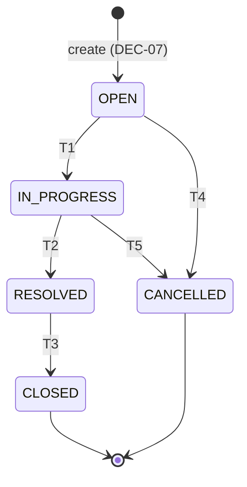

# Ticket status state machine

> **Status:** draft (2026-10-04) — **PDF** allowed edges (T1–T5) and forbidden reopen examples (X1–X3) are locked from [`requirements.md`](requirements.md) FEAT-11 / §2.6. **Agreed:** initial status on create (**DEC-07**). **Open:** skipped hops (**DEC-02**), transition UX/API shape (**DEC-06**).  
> **Primary source:** `docs/Assessments.pdf` (restated in [`requirements.md`](requirements.md), [`docs/assessment-brief.md`](../docs/assessment-brief.md)).  
> **Related:** [`data-model.md`](data-model.md) §5.1 (`TicketStatus`), §10 PATCH; [`architecture.md`](architecture.md) §17 (domain placement); `rules/api-standards.md` (409 envelope); `rules/java-springboot.md` (layering).

---

## 1. Problem and context

Support tickets move through a **lifecycle** from creation to completion or cancellation. The assessment requires a **backend-enforced** state machine: **valid** transitions must succeed; **invalid** transitions (including explicit “reopen” examples) must be **rejected** with meaningful errors—not silently ignored and not enforced only in the UI.

This spec is the **authoritative transition matrix** for implementation and tests. The `TicketStatus` enum stores the current value; **legality of moves** lives in domain logic (see §8).

---

## 2. Scope and non-goals

| In scope | Out of scope |
|----------|----------------|
| States, legal edges T1–T5, illegal edges under default **DEC-02** stance (§5.3) | Status **history** / audit table (not in [`data-model.md`](data-model.md)) |
| PDF forbidden reopen examples X1–X3 | Role-based “who may transition” (no auth in assessment) |
| How status changes are requested (**interim:** PATCH `status` — **DEC-06**) | Workflow beyond these five states |
| Domain enforcement, HTTP **409** mapping (**Convention**) | Re-opening policy changes without a **DEC** update |

---

## 3. States

Canonical enum (**PDF**): `OPEN` | `IN_PROGRESS` | `RESOLVED` | `CLOSED` | `CANCELLED`.

| State | Semantics | Terminal? |
|-------|-----------|-----------|
| `OPEN` | Ticket created; work not yet started | No |
| `IN_PROGRESS` | Agent is actively working the ticket | No |
| `RESOLVED` | Fix or answer documented; awaiting formal close | No |
| `CLOSED` | Successfully completed | **Yes** — no outbound legal edges |
| `CANCELLED` | Will not be completed (withdrawn / duplicate / etc.) | **Yes** — no outbound legal edges |

**Initial state (agreed — DEC-07):** On create, `status` is **`OPEN`**, assigned by the server. Create request bodies **must not** supply `status` ([`data-model.md`](data-model.md) §5.1, §10).

**Terminal states:** From `CLOSED` or `CANCELLED`, **no** transition in T1–T5 applies; any request to change status is **illegal** unless a future **DEC** adds edges (none today).

---

## 4. State machine (diagram)

**PDF** happy path and cancel branches:



ASCII equivalent:

```
                    T1
              OPEN ---------> IN_PROGRESS
               |    \              |
          T4   |     \         T5  | T2
               v      \            v
          CANCELLED    \       RESOLVED
                        \          | T3
                         \         v
                          ----> CLOSED
```

There are **no** backward edges to `OPEN` from terminal or late lifecycle states in the **PDF** examples (X1–X3).

---

## 5. Transitions

### 5.1 Valid transitions (**PDF** — must succeed)

These are the **only** legal status changes under the default rule in §5.3 (pending **DEC-02**).

| ID | From | To | Meaning |
|----|------|-----|---------|
| **T1** | `OPEN` | `IN_PROGRESS` | Work started |
| **T2** | `IN_PROGRESS` | `RESOLVED` | Resolution recorded |
| **T3** | `RESOLVED` | `CLOSED` | Ticket formally closed |
| **T4** | `OPEN` | `CANCELLED` | Cancelled before / without resolve |
| **T5** | `IN_PROGRESS` | `CANCELLED` | Cancelled while in progress |

**Requirements traceability:** FEAT-11, FR-11, FR-12, AC-FEAT-11-01/02, AC-CORE-12.

**Example happy path:** `OPEN` → `IN_PROGRESS` → `RESOLVED` → `CLOSED` (T1, T2, T3).  
**Example cancel path:** `OPEN` → `CANCELLED` (T4).

### 5.2 Forbidden examples (**PDF** — must fail)

Explicit assessment examples for illegal “reopen”:

| ID | From | To | Why rejected |
|----|------|-----|--------------|
| **X1** | `CLOSED` | `OPEN` | Terminal state; reopen not in PDF |
| **X2** | `RESOLVED` | `OPEN` | Backward reopen not in PDF |
| **X3** | `CANCELLED` | `OPEN` | Terminal state; reopen not in PDF |

**Requirements traceability:** AC-FEAT-11-03, AC-CORE-13, Flow C in [`requirements.md`](requirements.md).

**Example (Flow C):** Ticket in `CLOSED`. Client PATCHes `status: "OPEN"`. Backend rejects; UI shows a readable message (exact copy **Open** — e.g. “Cannot transition from CLOSED to OPEN”).

### 5.3 Default rule for all other pairs (**Convention** pending **DEC-02**)

| Decision | Options | This spec’s default until **DEC-02** is agreed |
|----------|---------|-----------------------------------------------|
| **DEC-02** | (A) Only T1–T5 edges (B) Additional edges with explicit list | **(A)** — any pair not listed in §5.1 is **illegal** |

Implications:

- **Skipped hops** (e.g. `OPEN` → `RESOLVED`, `OPEN` → `CLOSED`, `IN_PROGRESS` → `CLOSED`) are **rejected**.
- **Backward** moves (e.g. `IN_PROGRESS` → `OPEN`, `RESOLVED` → `IN_PROGRESS`) are **rejected**.
- **Self-transitions** (e.g. `OPEN` → `OPEN`) are **rejected** — not listed in T1–T5.
- From **terminal** states (`CLOSED`, `CANCELLED`), **every** target including staying in place is **rejected** (no legal outbound edge).

If **DEC-02** option (B) is chosen later, this document must gain a new table of extra legal edges and tests must be updated before implementation ships those hops.

### 5.4 Complete transition matrix (valid and invalid)

For each **from** state, every **to** state is either a legal edge (T1–T5), a PDF forbidden example (X1–X3), or **illegal** under §5.3 default.

#### From `OPEN`

| To | Result | Ref |
|----|--------|-----|
| `OPEN` | **Invalid** — self-transition | §5.3 |
| `IN_PROGRESS` | **Valid** | T1 |
| `RESOLVED` | **Invalid** — skipped hop | §5.3 |
| `CLOSED` | **Invalid** — skipped hop | §5.3 |
| `CANCELLED` | **Valid** | T4 |

#### From `IN_PROGRESS`

| To | Result | Ref |
|----|--------|-----|
| `OPEN` | **Invalid** — backward | §5.3 |
| `IN_PROGRESS` | **Invalid** — self-transition | §5.3 |
| `RESOLVED` | **Valid** | T2 |
| `CLOSED` | **Invalid** — skipped hop | §5.3 |
| `CANCELLED` | **Valid** | T5 |

#### From `RESOLVED`

| To | Result | Ref |
|----|--------|-----|
| `OPEN` | **Invalid** — reopen | X2 |
| `IN_PROGRESS` | **Invalid** — backward | §5.3 |
| `RESOLVED` | **Invalid** — self-transition | §5.3 |
| `CLOSED` | **Valid** | T3 |
| `CANCELLED` | **Invalid** — not in PDF | §5.3 |

#### From `CLOSED`

| To | Result | Ref |
|----|--------|-----|
| `OPEN` | **Invalid** — reopen | X1 |
| `IN_PROGRESS` | **Invalid** — terminal | §5.3 |
| `RESOLVED` | **Invalid** — terminal | §5.3 |
| `CLOSED` | **Invalid** — self / terminal | §5.3 |
| `CANCELLED` | **Invalid** — terminal | §5.3 |

#### From `CANCELLED`

| To | Result | Ref |
|----|--------|-----|
| `OPEN` | **Invalid** — reopen | X3 |
| `IN_PROGRESS` | **Invalid** — terminal | §5.3 |
| `RESOLVED` | **Invalid** — terminal | §5.3 |
| `CLOSED` | **Invalid** — terminal | §5.3 |
| `CANCELLED` | **Invalid** — self / terminal | §5.3 |

#### Master table (all 25 directed pairs)

| From \ To | `OPEN` | `IN_PROGRESS` | `RESOLVED` | `CLOSED` | `CANCELLED` |
|-----------|--------|---------------|------------|----------|-------------|
| `OPEN` | Invalid | **T1 Valid** | Invalid | Invalid | **T4 Valid** |
| `IN_PROGRESS` | Invalid | Invalid | **T2 Valid** | Invalid | **T5 Valid** |
| `RESOLVED` | **X2 Invalid** | Invalid | Invalid | **T3 Valid** | Invalid |
| `CLOSED` | **X1 Invalid** | Invalid | Invalid | Invalid | Invalid |
| `CANCELLED` | **X3 Invalid** | Invalid | Invalid | Invalid | Invalid |

---

## 6. API and persistence behaviour

### 6.1 Request shape (**Convention** — **DEC-06** open)

Until `api-contract.md` / `ui-flow.md` close **DEC-06**:

- Status change: **`PATCH /api/v1/tickets/{id}`** with JSON `data` containing **`status`** set to the **target** enum string (same values as §3).
- Non-status fields may appear on the same PATCH per [`data-model.md`](data-model.md) §10; when `status` is present, the state machine runs **before** commit.

Dedicated transition sub-resources or UI wizards require **DEC-06** and spec updates first.

### 6.2 Success

- Legal edge (§5.1): **200** with success envelope; `data.status` equals requested target; row persisted.
- `updatedAt` (and any audit fields) advance per data model.

### 6.3 Rejection (**Convention**)

| Condition | HTTP | `error.code` | Notes |
|-----------|------|--------------|-------|
| Illegal transition | **409** | `ILLEGAL_TRANSITION` | Message MUST name **current** and **requested** status (`rules/api-standards.md`) |
| Unknown enum string | **400** | `VALIDATION_ERROR` | Bean Validation / enum parse — not a state-machine edge test |
| Ticket not found | **404** | `NOT_FOUND` | No transition attempted |

On **409**, the ticket row’s `status` **must not** change (integration tests).

**UI:** Surface `error.message` (and `details` when present); backend remains source of truth (FEAT-10, AC-FEAT-11-04).

### 6.4 Interaction with other fields

- PATCH may update title, description, priority, assignee, category, `resolutionNotes` together with `status` only when each field is valid on its own ([`data-model.md`](data-model.md) §16).
- Illegal `status` **fails the whole operation** — do not partially apply other fields in the same transaction unless a future spec defines split semantics (**Open**).

---

## 7. RAG and side effects

- Chunk **metadata** includes `status` at ingest time ([`data-model.md`](data-model.md) §9).
- Transition to `CLOSED` may trigger re-ingestion per **DEC-01** ([`requirements.md`](requirements.md) §11.1); timing detail → `rag-ingestion.md` when present.
- State machine code does **not** call the LLM; ingestion hooks live in application services after successful commit ([`architecture.md`](architecture.md) §17).

---

## 8. Implementation placement

| Layer | Responsibility |
|-------|----------------|
| **`domain`** | `TicketStatus` enum; `TicketStatusMachine` (or equivalent) implementing §5; `IllegalTicketTransitionException` |
| **`service`** | Load ticket, apply field updates, invoke machine when `status` changes, persist, trigger RAG port |
| **`persistence`** | Load/save only — **no** ad-hoc `UPDATE status` bypass |
| **`api`** | Map PATCH → service; map domain exception → **409** |

Repositories must not encode transition rules ([`architecture.md`](architecture.md) §17).

---

## 9. Acceptance criteria (testable)

| ID | Criterion |
|----|-----------|
| **AC-SM-01** | For each row T1–T5, given ticket in **from** state, when PATCH requests **to** state, then response is 200 and DB `status` is **to**. |
| **AC-SM-02** | For each row X1–X3, when transition is requested, then API returns **409** `ILLEGAL_TRANSITION` and DB `status` unchanged. |
| **AC-SM-03** | For every cell marked **Invalid** in §5.4 master table, when requested, then **409** and DB unchanged. |
| **AC-SM-04** | Create ticket without `status` in body → persisted `OPEN` (**DEC-07**). |
| **AC-SM-05** | Domain unit tests cover §5.1 and §5.2 without Spring; integration or API tests cover at least T1–T5 and X1–X3 (**PDF** AC-FEAT-11-05). |

Maps to **AC-CORE-12**, **AC-CORE-13**, **AC-FEAT-11-*** in [`requirements.md`](requirements.md).

---

## 10. Open questions and decisions

| ID | Topic | Status | Owner spec |
|----|-------|--------|------------|
| **DEC-02** | Skipped hops / extra edges | **Open** — implement **option (A)** only (confirmed 2026-10-04; may revisit later) | This file |
| **DEC-06** | Dedicated transition API vs PATCH | **Open** — interim PATCH §6.1 | `api-contract.md`, `ui-flow.md` |
| **DEC-07** | Initial `OPEN` on create | **Agreed** | [`data-model.md`](data-model.md) §5.1 |

---

## 11. Revision history

| Date | Note |
|------|------|
| 2026-10-04 | Initial spec: PDF T1–T5 / X1–X3, full invalid matrix under DEC-02 default (A), API/domain placement, AC-SM-*. |
| 2026-10-04 | **DEC-02:** user confirmed interim **(A)** — only T1–T5; decision remains Open in requirements §10.2. |
