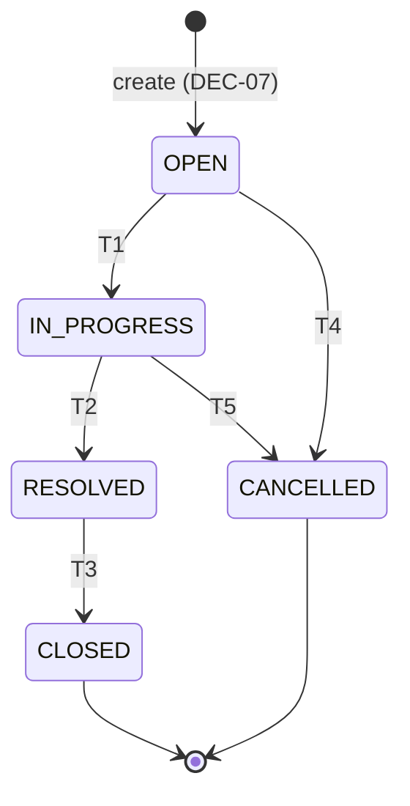

# Ticket status state machine

> **Status:** agreed (2026-10-04) — **PDF** allowed edges (T1–T5) and forbidden reopen examples (X1–X3) are locked from [`requirements.md`](requirements.md) FEAT-11 / §2.6. **DEC-07** initial status; **DEC-02 (A)** skipped hops; **DEC-06** PATCH `status`.  
> **Primary source:** `docs/Assessments.docx` (restated in [`requirements.md`](requirements.md), [`docs/assessment-brief.md`](../docs/assessment-brief.md)).  
> **Related:** [`data-model.md`](data-model.md) §5.1 (`TicketStatus`), §10 PATCH; [`architecture.md`](architecture.md) §17 (domain placement); `rules/api-standards.md` (409 envelope); `rules/java-springboot.md` (layering).

**Label legend:** **PDF** | **Convention** | **Agreed** | **Open**

---

## Table of contents

0. [Document guide](#0-document-guide)  
1. [Problem and context](#1-problem-and-context)  
2. [Scope and non-goals](#2-scope-and-non-goals)  
3. [States · **SM-A**](#3-states--unit-sm-a)  
4. [State machine diagram · **SM-A**](#4-state-machine-diagram--unit-sm-a)  
5. [Transitions · **SM-B**…**SM-E**](#5-transitions--units-sm-b-sm-e)  
6. [API and persistence · **SM-F**](#6-api-and-persistence-behaviour--unit-sm-f)  
7. [RAG side effects · **SM-G**](#7-rag-and-side-effects--unit-sm-g)  
8. [Implementation placement · **SM-H**](#8-implementation-placement--unit-sm-h)  
9. [Acceptance criteria · **SM-H**](#9-acceptance-criteria-testable--unit-sm-h)  
10. [Open questions](#10-open-questions-and-decisions)  
11. [Revision history](#11-revision-history)  

---

## 0. Document guide

### 0.1 PDF coverage map

| **PDF** (p.4) | Section |
|---------------|---------|
| Backend-enforced machine: `OPEN→IN_PROGRESS→RESOLVED→CLOSED`; cancel from `OPEN` / `IN_PROGRESS` | §4, §5.1 T1–T5 |
| Invalid transitions rejected; examples `CLOSED→OPEN`, `RESOLVED→OPEN`, `CANCELLED→OPEN` | §5.2 X1–X3, §5.6 |
| Integration tests for legal + illegal paths | §9 → [`test-strategy.md`](test-strategy.md) §5 |

### 0.2 Business, functional, and implementation requirements

**Business requirements**

- Ticket lifecycle reflects real support work: open → in progress → resolved → closed, or cancellation without completion.
- Reopening closed/cancelled tickets is **out of scope** unless a future **DEC** adds edges (**PDF** examples forbid reopen).

**Functional requirements**

| ID | Requirement | AC |
|----|-------------|-----|
| FR-SM-01 | Only T1–T5 succeed when `current ≠ target` | **AC-SM-01** |
| FR-SM-02 | All other pairs fail (incl. self-transition) | **AC-SM-03**, **AC-SM-06**, **AC-SM-07** |
| FR-SM-03 | X1–X3 explicitly fail | **AC-SM-02** |
| FR-SM-04 | New tickets start `OPEN` without client-supplied status | **AC-SM-04** (**DEC-07**) |
| FR-SM-05 | UI shows readable error; backend is source of truth | AC-FEAT-11-04 |

**Implementation requirements**

| ID | Requirement | Owner |
|----|-------------|-------|
| IR-SM-01 | `TicketStatusMachine` in **domain** package — no rules in repository | §8 |
| IR-SM-02 | Illegal transition → `IllegalTicketTransitionException` → HTTP **409** `ILLEGAL_TRANSITION` | §6.3 |
| IR-SM-03 | PATCH `/api/v1/tickets/{id}` with body field `status` (**DEC-06** agreed) | §6.1 |
| IR-SM-04 | On **409**, DB row unchanged (integration test) | §6.3 |

### 0.3 Independent reading units

| Unit | Section | Standalone? | Read first (this file) | Delivers | See also |
|------|---------|-------------|------------------------|----------|----------|
| **SM-A** | §3 States | Yes | — | Enum + terminal + **DEC-07** initial `OPEN` | [`data-model.md`](data-model.md) §5.1 |
| **SM-B** | §5.1 T1–T5 | Yes | **SM-A** | Five legal edges (**PDF** p.4) | [`requirements.md`](requirements.md) FEAT-11 |
| **SM-C** | §5.2 X1–X3 | Yes | **SM-A** | Three forbidden reopen examples (**PDF**) | §6.5 JSON |
| **SM-D** | §5.3–§5.4 | Yes | **SM-B**, **SM-C** | Skipped hops (**DEC-02** A); full matrix | §5.6 register |
| **SM-E** | §5.6 illegal register | Yes | **SM-D** | Twenty illegal pairs for tests | [`test-strategy.md`](test-strategy.md) §5.4 |
| **SM-F** | §6 API behaviour | Yes | **SM-B** | PATCH `status`, **409**, examples §6.5 | [`api-contract.md`](api-contract.md) §4.4 |
| **SM-G** | §7 RAG side effects | Yes | **SM-A** | Re-ingest on close (**DEC-01**) | [`rag-ingestion.md`](rag-ingestion.md) §10 |
| **SM-H** | §8–§9 | Yes | **SM-E**, **SM-F** | Layering + **AC-SM-*** | `rules/java-springboot.md` |

**PDF verbatim (p.4):** “The following state machine must be enforced by the backend: OPEN → IN_PROGRESS → RESOLVED → CLOSED; OPEN → CANCELLED; IN_PROGRESS → CANCELLED. Invalid transitions must be rejected.”

---

## 1. Problem and context

Support tickets move through a **lifecycle** from creation to completion or cancellation. The assessment requires a **backend-enforced** state machine: **valid** transitions must succeed; **invalid** transitions (including explicit “reopen” examples) must be **rejected** with meaningful errors—not silently ignored and not enforced only in the UI.

This spec is the **authoritative transition matrix** for implementation and tests. The `TicketStatus` enum stores the current value; **legality of moves** lives in domain logic (see §8).

---

## 2. Scope and non-goals

| In scope | Out of scope |
|----------|----------------|
| States, legal edges T1–T5, illegal edges under default **DEC-02** stance (§5.3) | Status **history** / audit table (not in [`data-model.md`](data-model.md)) |
| PDF forbidden reopen examples X1–X3 | Role-based “who may transition” (no auth in assessment) |
| How status changes are requested (**DEC-06:** PATCH `status`) | Workflow beyond these five states |
| Domain enforcement, HTTP **409** mapping (**Convention**) | Re-opening policy changes without a **DEC** update |

---

## 3. States · unit **SM-A**

Canonical enum (**PDF**): `OPEN` | `IN_PROGRESS` | `RESOLVED` | `CLOSED` | `CANCELLED`.

| State | Semantics | Terminal? |
|-------|-----------|-----------|
| `OPEN` | Ticket created; work not yet started | No |
| `IN_PROGRESS` | Agent is actively working the ticket | No |
| `RESOLVED` | Fix or answer documented; awaiting formal close | No |
| `CLOSED` | Successfully completed | **Yes** — no outbound legal edges |
| `CANCELLED` | Will not be completed (withdrawn / duplicate / etc.) | **Yes** — no outbound legal edges |

**Initial state (agreed — DEC-07):** On create, `status` is **`OPEN`**, assigned by the server. Create request bodies **must not** supply `status` ([`data-model.md`](data-model.md) §5.1, §10).

**Terminal states:** From `CLOSED` or `CANCELLED`, **no** transition in T1–T5 applies; any request to change status is **illegal** unless a future **DEC** adds edges (none today).

---

## 4. State machine (diagram) · unit **SM-A**

**PDF** happy path and cancel branches:



ASCII equivalent:

```
                    T1
              OPEN ---------> IN_PROGRESS
               |    \              |
          T4   |     \         T5  | T2
               v      \            v
          CANCELLED    \       RESOLVED
                        \          | T3
                         \         v
                          ----> CLOSED
```

There are **no** backward edges to `OPEN` from terminal or late lifecycle states in the **PDF** examples (X1–X3).

---

## 5. Transitions · units **SM-B**…**SM-E**

### 5.1 Valid transitions (**PDF** — must succeed)

These are the **only** legal status changes under **DEC-02 (A)** (§5.3).

| ID | From | To | Meaning |
|----|------|-----|---------|
| **T1** | `OPEN` | `IN_PROGRESS` | Work started |
| **T2** | `IN_PROGRESS` | `RESOLVED` | Resolution recorded |
| **T3** | `RESOLVED` | `CLOSED` | Ticket formally closed |
| **T4** | `OPEN` | `CANCELLED` | Cancelled before / without resolve |
| **T5** | `IN_PROGRESS` | `CANCELLED` | Cancelled while in progress |

**Requirements traceability:** FEAT-11, FR-11, FR-12, AC-FEAT-11-01/02, AC-CORE-12.

**Example happy path:** `OPEN` → `IN_PROGRESS` → `RESOLVED` → `CLOSED` (T1, T2, T3).  
**Example cancel path:** `OPEN` → `CANCELLED` (T4).

### 5.2 Forbidden examples (**PDF** — must fail)

Explicit assessment examples for illegal “reopen”:

| ID | From | To | Why rejected |
|----|------|-----|--------------|
| **X1** | `CLOSED` | `OPEN` | Terminal state; reopen not in PDF |
| **X2** | `RESOLVED` | `OPEN` | Backward reopen not in PDF |
| **X3** | `CANCELLED` | `OPEN` | Terminal state; reopen not in PDF |

**Requirements traceability:** AC-FEAT-11-03, AC-CORE-13, Flow C in [`requirements.md`](requirements.md).

**Example (Flow C):** Ticket in `CLOSED`. Client PATCHes `status: "OPEN"`. Backend rejects; UI shows `error.message` per §5.6 / [`api-contract.md`](api-contract.md) §4.4 (e.g. “Cannot transition from CLOSED to OPEN”).

### 5.3 Default rule for all other pairs (**Agreed DEC-02 (A)**)

| Decision | Options | **Agreed** decision |
|----------|---------|---------------------|
| **DEC-02** | (A) Only T1–T5 edges (B) Additional edges with explicit list | **(A)** — any pair not listed in §5.1 is **illegal** (PDF state machine + invalid-transition rule) |

Implications:

- **Skipped hops** (e.g. `OPEN` → `RESOLVED`, `OPEN` → `CLOSED`, `IN_PROGRESS` → `CLOSED`) are **rejected**.
- **Backward** moves (e.g. `IN_PROGRESS` → `OPEN`, `RESOLVED` → `IN_PROGRESS`) are **rejected**.
- **Self-transitions** (e.g. `OPEN` → `OPEN`) are **rejected** — not listed in T1–T5.
- From **terminal** states (`CLOSED`, `CANCELLED`), **every** target including staying in place is **rejected** (no legal outbound edge).

If **DEC-02** option (B) is chosen later, this document must gain a new table of extra legal edges and tests must be updated before implementation ships those hops.

### 5.4 Complete transition matrix (valid and invalid)

For each **from** state, every **to** state is either a legal edge (T1–T5), a PDF forbidden example (X1–X3), or **illegal** under §5.3 default.

#### From `OPEN`

| To | Result | Ref |
|----|--------|-----|
| `OPEN` | **Invalid** — self-transition | §5.3 |
| `IN_PROGRESS` | **Valid** | T1 |
| `RESOLVED` | **Invalid** — skipped hop | §5.3 |
| `CLOSED` | **Invalid** — skipped hop | §5.3 |
| `CANCELLED` | **Valid** | T4 |

#### From `IN_PROGRESS`

| To | Result | Ref |
|----|--------|-----|
| `OPEN` | **Invalid** — backward | §5.3 |
| `IN_PROGRESS` | **Invalid** — self-transition | §5.3 |
| `RESOLVED` | **Valid** | T2 |
| `CLOSED` | **Invalid** — skipped hop | §5.3 |
| `CANCELLED` | **Valid** | T5 |

#### From `RESOLVED`

| To | Result | Ref |
|----|--------|-----|
| `OPEN` | **Invalid** — reopen | X2 |
| `IN_PROGRESS` | **Invalid** — backward | §5.3 |
| `RESOLVED` | **Invalid** — self-transition | §5.3 |
| `CLOSED` | **Valid** | T3 |
| `CANCELLED` | **Invalid** — not in PDF | §5.3 |

#### From `CLOSED`

| To | Result | Ref |
|----|--------|-----|
| `OPEN` | **Invalid** — reopen | X1 |
| `IN_PROGRESS` | **Invalid** — terminal | §5.3 |
| `RESOLVED` | **Invalid** — terminal | §5.3 |
| `CLOSED` | **Invalid** — self / terminal | §5.3 |
| `CANCELLED` | **Invalid** — terminal | §5.3 |

#### From `CANCELLED`

| To | Result | Ref |
|----|--------|-----|
| `OPEN` | **Invalid** — reopen | X3 |
| `IN_PROGRESS` | **Invalid** — terminal | §5.3 |
| `RESOLVED` | **Invalid** — terminal | §5.3 |
| `CLOSED` | **Invalid** — terminal | §5.3 |
| `CANCELLED` | **Invalid** — self / terminal | §5.3 |

#### Master table (all 25 directed pairs)

| From \ To | `OPEN` | `IN_PROGRESS` | `RESOLVED` | `CLOSED` | `CANCELLED` |
|-----------|--------|---------------|------------|----------|-------------|
| `OPEN` | Invalid | **T1 Valid** | Invalid | Invalid | **T4 Valid** |
| `IN_PROGRESS` | Invalid | Invalid | **T2 Valid** | Invalid | **T5 Valid** |
| `RESOLVED` | **X2 Invalid** | Invalid | Invalid | **T3 Valid** | Invalid |
| `CLOSED` | **X1 Invalid** | Invalid | Invalid | Invalid | Invalid |
| `CANCELLED` | **X3 Invalid** | Invalid | Invalid | Invalid | Invalid |

### 5.5 Valid transition operations (explicit)

Each legal edge is a **directed** change from **current** persisted `status` to the **target** sent in PATCH `status`. Preconditions assume the ticket exists and the request body passes Bean Validation.

| ID | Current (`from`) | Request `status` (`to`) | HTTP on success | Persisted `status` after | Notes |
|----|------------------|-------------------------|---------------|--------------------------|-------|
| **T1** | `OPEN` | `IN_PROGRESS` | **200** | `IN_PROGRESS` | Typical “start work” |
| **T2** | `IN_PROGRESS` | `RESOLVED` | **200** | `RESOLVED` | May include `resolutionNotes` on same PATCH (**Convention**, [`data-model.md`](data-model.md) §13) |
| **T3** | `RESOLVED` | `CLOSED` | **200** | `CLOSED` | Terminal; may trigger re-ingest (**DEC-01**) |
| **T4** | `OPEN` | `CANCELLED` | **200** | `CANCELLED` | Terminal |
| **T5** | `IN_PROGRESS` | `CANCELLED` | **200** | `CANCELLED` | Terminal |

**API shape (all T1–T5):**

```http
PATCH /api/v1/tickets/{id} HTTP/1.1
Content-Type: application/json

{ "status": "<to>" }
```

Success: **200**, envelope `data` is full `TicketDetail` with `data.status` = `<to>` ([`api-contract.md`](api-contract.md) §4.4).

### 5.6 Invalid transitions — exhaustive register (20 pairs)

Under **DEC-02** default **(A)**, exactly **five** directed pairs are legal (§5.1); the remaining **20** of 25 possible `from`→`to` pairs are **illegal**. Every illegal pair MUST yield **409** `ILLEGAL_TRANSITION` when requested via PATCH (§6.3); the database `status` MUST remain the **from** value.

| # | From | To | Category | Ref |
|---|------|-----|----------|-----|
| 1 | `OPEN` | `OPEN` | Self-transition | §5.3 |
| 2 | `OPEN` | `RESOLVED` | Skipped hop | §5.3 |
| 3 | `OPEN` | `CLOSED` | Skipped hop | §5.3 |
| 4 | `IN_PROGRESS` | `OPEN` | Backward | §5.3 |
| 5 | `IN_PROGRESS` | `IN_PROGRESS` | Self-transition | §5.3 |
| 6 | `IN_PROGRESS` | `CLOSED` | Skipped hop | §5.3 |
| 7 | `RESOLVED` | `OPEN` | Reopen (PDF example) | **X2** |
| 8 | `RESOLVED` | `IN_PROGRESS` | Backward | §5.3 |
| 9 | `RESOLVED` | `RESOLVED` | Self-transition | §5.3 |
| 10 | `RESOLVED` | `CANCELLED` | Not in PDF | §5.3 |
| 11 | `CLOSED` | `OPEN` | Reopen (PDF example) | **X1** |
| 12 | `CLOSED` | `IN_PROGRESS` | Terminal outbound | §5.3 |
| 13 | `CLOSED` | `RESOLVED` | Terminal outbound | §5.3 |
| 14 | `CLOSED` | `CLOSED` | Self / terminal | §5.3 |
| 15 | `CLOSED` | `CANCELLED` | Terminal outbound | §5.3 |
| 16 | `CANCELLED` | `OPEN` | Reopen (PDF example) | **X3** |
| 17 | `CANCELLED` | `IN_PROGRESS` | Terminal outbound | §5.3 |
| 18 | `CANCELLED` | `RESOLVED` | Terminal outbound | §5.3 |
| 19 | `CANCELLED` | `CLOSED` | Terminal outbound | §5.3 |
| 20 | `CANCELLED` | `CANCELLED` | Self / terminal | §5.3 |

**409 message pattern (**Convention**):** `Cannot transition from {FROM} to {TO}` where `{FROM}` is the persisted status and `{TO}` is the requested PATCH `status`.

### 5.7 Domain transition API (**Convention**)

Implementation MUST centralize §5.1–§5.6 in domain code (§8), e.g.:

| Operation | Input | Output | Rule |
|-----------|-------|--------|------|
| `assertTransitionAllowed(current, target)` | `TicketStatus` × `TicketStatus` | void or exception | Throws `IllegalTicketTransitionException` when pair is not T1–T5 |
| `isTransitionAllowed(current, target)` | same | `boolean` | `true` only for T1–T5 when `current ≠ target` |

- **No-op:** `current == target` → **not allowed** (self-transition; rows #1, #5, #9, #14, #20 above).
- **Create:** No transition API on create; server sets `OPEN` (**DEC-07**).

---

## 6. API and persistence behaviour · unit **SM-F**

### 6.1 Request shape (**DEC-06** agreed — [`api-contract.md`](api-contract.md) §4.4)

- Status change: **`PATCH /api/v1/tickets/{id}`** with request body field **`status`** set to the **target** enum string (same values as §3). Success response wraps the ticket in envelope `data` (not request body).
- Non-status fields may appear on the same PATCH per [`data-model.md`](data-model.md) §10 / [`api-contract.md`](api-contract.md) §4.4; when `status` is present, the state machine runs **before** commit.

Dedicated transition sub-resources or UI-only wizards require a future **DEC-06** revision and spec update.

### 6.1.1 When `status` is omitted, unchanged, or invalid

| Request | State machine invoked? | HTTP | Notes |
|---------|------------------------|------|-------|
| PATCH body has **no** `status` property | **No** | **200** if at least one other valid field changes | Field-only update; current `status` unchanged |
| PATCH `{}` (no updatable fields) | **No** | **400** `VALIDATION_ERROR` | Per [`api-contract.md`](api-contract.md) §4.4 |
| PATCH `status` equals **current** persisted value | **Yes** (evaluated) | **409** `ILLEGAL_TRANSITION` | Treated as self-transition (§5.6 rows #1, #5, #9, #14, #20) |
| PATCH `status` is unknown string | **No** (parse fails first) | **400** `VALIDATION_ERROR` | Enum validation before domain |
| PATCH `status` is legal **to** from **current** | **Yes** | **200** | T1–T5 |

### 6.2 Success

- Legal edge (§5.1): **200** with success envelope; `data.status` equals requested target; row persisted.
- `updatedAt` (and any audit fields) advance per data model.

### 6.3 Rejection (**Convention**)

| Condition | HTTP | `error.code` | Notes |
|-----------|------|--------------|-------|
| Illegal transition | **409** | `ILLEGAL_TRANSITION` | Message MUST name **current** and **requested** status (`rules/api-standards.md`) |
| Unknown enum string | **400** | `VALIDATION_ERROR` | Bean Validation / enum parse — not a state-machine edge test |
| Ticket not found | **404** | `NOT_FOUND` | No transition attempted |

On **409**, the ticket row’s `status` **must not** change (integration tests).

**UI:** Surface `error.message` (and `details` when present); backend remains source of truth (FEAT-10, AC-FEAT-11-04).

### 6.4 Interaction with other fields

- PATCH may update title, description, priority, assignee, category, `resolutionNotes` together with `status` only when each field is valid on its own ([`data-model.md`](data-model.md) §16).
- Illegal `status` **fails the whole PATCH** — do not partially apply other fields in the same request (**Agreed** **Convention**; aligns with [`api-contract.md`](api-contract.md) §4.4).

### 6.5 REST examples (**Example** — envelope per `rules/api-standards.md`)

**Legal transition T1 (`OPEN` → `IN_PROGRESS`):**

```http
PATCH /api/v1/tickets/TKT-1001 HTTP/1.1
Content-Type: application/json

{ "status": "IN_PROGRESS" }
```

```json
{
  "data": {
    "id": "TKT-1001",
    "status": "IN_PROGRESS",
    "title": "Payment declined",
    "updatedAt": "2026-01-03T09:00:00Z"
  }
}
```

**Illegal reopen X1 (`CLOSED` → `OPEN`):**

```http
PATCH /api/v1/tickets/TKT-1001 HTTP/1.1
Content-Type: application/json

{ "status": "OPEN" }
```

```json
{
  "error": {
    "code": "ILLEGAL_TRANSITION",
    "message": "Cannot transition from CLOSED to OPEN"
  }
}
```

HTTP status **409**; persisted `status` remains `CLOSED`.

---

## 7. RAG and side effects · unit **SM-G**

- Chunk **metadata** includes `status` at ingest time ([`data-model.md`](data-model.md) §9).
- Transition to `CLOSED` may trigger re-ingestion per **DEC-01** ([`requirements.md`](requirements.md) §11.1); timing detail → `rag-ingestion.md` when present.
- State machine code does **not** call the LLM; ingestion hooks live in application services after successful commit ([`architecture.md`](architecture.md) §17).

---

## 8. Implementation placement · unit **SM-H**

| Layer | Responsibility |
|-------|----------------|
| **`domain`** | `TicketStatus` enum; `TicketStatusMachine` (or equivalent) implementing §5; `IllegalTicketTransitionException` |
| **`service`** | Load ticket, apply field updates, invoke machine when `status` changes, persist, trigger RAG port |
| **`persistence`** | Load/save only — **no** ad-hoc `UPDATE status` bypass |
| **`api`** | Map PATCH → service; map domain exception → **409** |

Repositories must not encode transition rules ([`architecture.md`](architecture.md) §17).

---

## 9. Acceptance criteria (testable) · unit **SM-H**

| ID | Criterion |
|----|-----------|
| **AC-SM-01** | For each row T1–T5, given ticket in **from** state, when PATCH requests **to** state, then response is 200 and DB `status` is **to**. |
| **AC-SM-02** | For each row X1–X3, when transition is requested, then API returns **409** `ILLEGAL_TRANSITION` and DB `status` unchanged. |
| **AC-SM-03** | For every cell marked **Invalid** in §5.4 master table, when requested, then **409** and DB unchanged. |
| **AC-SM-04** | Create ticket without `status` in body → persisted `OPEN` (**DEC-07**). |
| **AC-SM-05** | Domain unit tests cover §5.1 and §5.2 without Spring; integration or API tests cover at least T1–T5 and X1–X3 (**PDF** AC-FEAT-11-05). |
| **AC-SM-06** | For each row in §5.6 (all 20 illegal pairs), PATCH with matching `status` returns **409** and DB unchanged. |
| **AC-SM-07** | PATCH with `status` equal to current value returns **409** (self-transition). |
| **AC-SM-08** | PATCH without `status` updates only other fields; `status` unchanged. |

Maps to **AC-CORE-12**, **AC-CORE-13**, **AC-FEAT-11-*** in [`requirements.md`](requirements.md).

---

## 10. Open questions and decisions

| ID | Topic | Status | Owner spec |
|----|-------|--------|------------|
| **DEC-02** | Skipped hops / extra edges | **Agreed 2026-10-04** — **(A)** only T1–T5 | This file |
| **DEC-06** | Dedicated transition API vs PATCH | **Agreed 2026-10-04** — PATCH `status` per [`api-contract.md`](api-contract.md) §4.4 | [`ui-flow.md`](ui-flow.md) §9 for UX |
| **DEC-07** | Initial `OPEN` on create | **Agreed** | [`data-model.md`](data-model.md) §5.1 |

---

## 11. Revision history

| Date | Note |
|------|------|
| 2026-10-04 | Initial spec: PDF T1–T5 / X1–X3, full invalid matrix under DEC-02 default (A), API/domain placement, AC-SM-*. |
| 2026-10-04 | Transition UX pointer → [`architecture.md`](architecture.md) §12.4 (PDF ui-flow themes). |
| 2026-10-04 | Transition UX pointer → [`ui-flow.md`](ui-flow.md) §9 (**DEC-06**). |
| 2026-10-04 | **DEC-02** agreed **(A)** in hub §10.2 (PDF-backed). |
| 2026-10-04 | **DEC-06** agreed — PATCH `status` final for assessment scope. |
| 2026-10-04 | Doc sync: removed stale **interim** labels for **DEC-06**. |
| 2026-10-04 | Promoted to **agreed** with ten-file spec set (user sign-off). |
| 2026-10-04 | §6.1 aligned with [`api-contract.md`](api-contract.md) PATCH body (not request `data` wrapper). |
| 2026-10-04 | §5.5–5.7 valid ops + 20-row invalid register; §6.1.1 PATCH `status` presence rules; AC-SM-06–08. |
| 2026-10-04 | §0 guide (PDF map, BRF/FRI/IRI); §6.5 REST JSON examples for T1 and X1. |
| 2026-10-04 | §0.3 **SM-*** independent reading units + PDF verbatim state machine quote. |
| 2026-10-04 | Major `##` headings tagged `· unit **SM-***` / `· units **SM-B**…**SM-E**`; TOC jump links. |
