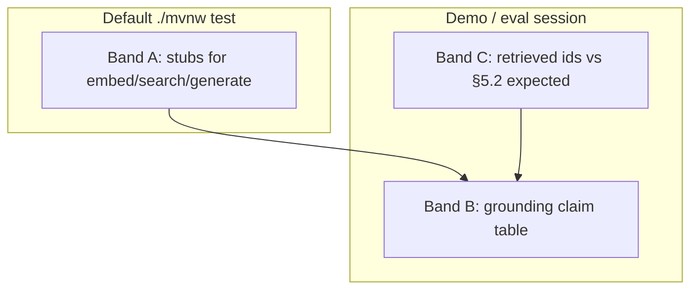

# Test strategy — acceptance mapping and layers

> **Status:** agreed (2026-10-04) — maps **AC-CORE-***, **AC-SM-***, **AC-API-***, **AC-DM-***, **AC-EVAL-***, and **AC-TS-*** to backend test layers. Tooling: `rules/testing.md` (JUnit 5, Mockito, Testcontainers, no frontend tests).  
> **Primary source:** `docs/Assessments.docx` p.2 (deterministic + probabilistic testing), p.4–6 (state machine, ask); [`requirements.md`](requirements.md) §2.5, §8–§9, Flows A/C/E, FEAT-11, FEAT-21, FEAT-22.  
> **Contracts:** [`state-machine.md`](state-machine.md) (T1–T5, §5.6 illegal register), [`api-contract.md`](api-contract.md) §2.11 / §4.4, [`evaluation-strategy.md`](evaluation-strategy.md) (retrieval + failure taxonomy), [`data-model.md`](data-model.md) §16–§18.

**Label legend:** **PDF** | **Convention** | **Example**

---

## Table of contents

0. [Document guide](#0-document-guide)  
1. [Problem and context](#1-problem-and-context)  
2. [Scope and non-goals](#2-scope-and-non-goals)  
3. [Test kinds](#3-test-kinds-summary)  
4. [Deterministic vs probabilistic](#4-deterministic-vs-probabilistic-index)  
5. [State machine determinism](#5-state-machine--deterministic-logic)  
6. [Retrieval and AI output](#6-retrieval-quality-and-ai-output)  
7.–14. AC maps, open decisions, **AC-TS-***, revision history  

---

## 0. Document guide

### 0.1 PDF coverage map

| **PDF** (p.2, p.4, p.6) | Proof location |
|-------------------------|----------------|
| Test **deterministic** state machine; integration tests pass | **§5**, **AC-CORE-14**, **AC-TS-03**, **AC-TS-06** |
| Test/debug **probabilistic** retrieval / AI answers | **§6**, [`evaluation-strategy.md`](evaluation-strategy.md) |
| Backend validation, persistence, invalid transitions rejected | §7, §9–§10 |
| Embeddings stored; ask grounded/cited/no-match | §6.2, §7 |
| No frontend tests this milestone | §11 (**Convention**) |

### 0.2 Business, functional, and implementation requirements

**Business requirements** — show assessors **evidence**, not hope: `./mvnw test` for ticket logic; structured eval + review commands for RAG.

**Functional requirements**

| ID | Requirement | Section |
|----|-------------|---------|
| FR-TS-01 | Every T1–T5 proven at domain + API integration | §5.2 |
| FR-TS-02 | All 20 illegal pairs + X1–X3 → **409**, row unchanged | §5.4, **AC-SM-06** |
| FR-TS-03 | Ask: 400 blank question; 200 no-match shape; cited ids exist (stub) | §6.2 Band A |
| FR-TS-04 | Retrieval quality sign-off for **PDF** Q1–Q5 | §6.3–§6.5, **AC-TS-05** |

**Implementation requirements**

| ID | Requirement | Tooling |
|----|-------------|---------|
| IR-TS-01 | JUnit 5, Mockito, Testcontainers PostgreSQL + Liquibase | `rules/testing.md` |
| IR-TS-02 | `./mvnw test` — no paid cloud LLM in default CI | §6.2 |
| IR-TS-03 | Use `commands/generate-tests.md` when extending catalogue | §1 |

### 0.3 Independent reading units

| Unit | Section | Standalone? | Read first (this file) | Delivers | See also |
|------|---------|-------------|------------------------|----------|----------|
| **TS-A** | §3–§4 | Yes | — | Test kinds; deterministic vs probabilistic index | `rules/testing.md` |
| **TS-B** | §5 SM proof | Yes | **TS-A** | T1–T5, X1–X3, 20 illegal pairs (**PDF**) | [`state-machine.md`](state-machine.md) **SM-E** |
| **TS-C** | §6.2 Band A | Yes | **TS-A** | JUnit-safe ask contract tests | [`rag-api-contract.md`](rag-api-contract.md) **ASK-H** |
| **TS-D** | §6.3–§6.5 Bands B–C | Yes | **TS-C** | Grounding review + retrieval eval | [`evaluation-strategy.md`](evaluation-strategy.md) **EVAL-*** |
| **TS-E** | §7–§10 AC maps | Yes | **TS-B**, **TS-C** | AC-CORE/SM/API/DM → layers | [`requirements.md`](requirements.md) §8 |
| **TS-F** | §11 UI substitute | Yes | — | Manual demo replaces UI tests | [`ui-model.md`](ui-model.md) §12 |
| **TS-G** | §13 AC-TS | Yes | **TS-B…E** | This spec’s own acceptance | — |

**PDF verbatim (p.6):** “State-machine integration tests pass.” → **TS-B** + **AC-CORE-14**.

---

## 1. Problem and context

The assessment expects proof of two qualitatively different behaviours:

1. **Deterministic ticket logic** — especially the **status state machine** (**PDF** p.4): every legal edge T1–T5 must succeed; forbidden reopen examples X1–X3 and all other illegal pairs under **DEC-02 (A)** must fail with **no silent ignore**; **integration tests** must cover legal and illegal paths (**AC-CORE-14**, FEAT-21).
2. **Probabilistic AI output** — **retrieval quality** (right tickets in top-K) and answer **grounding** (**PDF** learning goals p.2): evaluated with structured manual/seeded procedures, **not** a single golden LLM string in `./mvnw test`.

This spec answers: **which acceptance IDs are proven by which test kind**, with **detail** for state machine determinism (§5) and ask/retrieval (§6). Use with `commands/generate-tests.md` (test catalogue) and `commands/review-rag-output.md` (grounding + retrieval review).

---

## 2. Scope and non-goals

| In scope | Out of scope |
|----------|----------------|
| State machine **deterministic** proof (domain → API integration) | Frontend Vitest/Playwright |
| Ask **contract** tests (envelopes, 400/200, stubs) | Golden full-text LLM answers in JUnit |
| **Retrieval quality** procedure and sign-off (**AC-TS-05**, **AC-EVAL-***) | Automated CI embedding-quality scores |
| AC-CORE / AC-SM / AC-API / AC-DM mapping | Paid/real Ollama in default test suite |
| UI acceptance **substitutes** (§11) | Endpoints beyond [`api-contract.md`](api-contract.md) §2.11 |

---

## 3. Test kinds (summary) · unit **TS-A**

Authoritative layering rules: `rules/testing.md`.

| Kind | Proves | Tools |
|------|--------|-------|
| **Domain unit** | State machine T1–T5; illegal pairs (§5.6); domain exceptions | JUnit 5, real `TicketStatus`; **no** Spring, **no** Mockito on machine |
| **Service unit** | Orchestration; transition before `save`; ingest port on success only | JUnit 5, Mockito repositories/ports |
| **Controller slice** | Envelopes, `@Valid`, 409 mapping | MockMvc + mock service |
| **Repository integration** | SQL, search `q` (**DEC-08**), filters | Testcontainers PostgreSQL + Liquibase |
| **API integration** | HTTP + DB: transitions, **409** + row unchanged, restart | `@SpringBootTest` + MockMvc + Testcontainers |

Both **API slice** and **API integration** are required for implemented HTTP endpoints.

---

## 4. Deterministic vs probabilistic (index) · unit **TS-A**

| Area | Nature | Where detailed |
|------|--------|----------------|
| Status state machine T1–T5, §5.6 illegal matrix, X1–X3 | **Deterministic** | **§5**; `./mvnw test` |
| CRUD, search, filter, validation, persistence | **Deterministic** | §7; `rules/testing.md` |
| Ask: blank question, no-match shape, cited ids exist (stubbed retrieval) | **Deterministic** | **§6.2** |
| Ask: retrieval ranking, answer prose | **Probabilistic** | **§6.3–§6.5**; [`evaluation-strategy.md`](evaluation-strategy.md) |
| architecture.md chunking/model narrative | **Document review** | AC-CORE-19 |

---

## 5. State machine — deterministic logic · unit **TS-B**

**Authoritative transition rules:** [`state-machine.md`](state-machine.md) §5. **Requirements:** FEAT-11 (FR-11, FR-12), FEAT-21, AC-CORE-12…14, Flow A (happy path), Flow C (invalid reopen).

### 5.1 Why this is fully deterministic

Given persisted `status = from` and PATCH `status = to`:

- **Legal** pairs (exactly **five**: T1–T5) → **200**, DB `status = to`, every run.
- **Illegal** pairs (**twenty** under **DEC-02 (A)**) → **409** `ILLEGAL_TRANSITION`, DB `status` unchanged, every run.
- **Self-transition** (`from == to`) → **illegal** (rows #1, #5, #9, #14, #20 in [`state-machine.md`](state-machine.md) §5.6).

No randomness, no external services. The **PDF** explicitly requires **backend** enforcement and **integration tests** — not UI-only checks.

### 5.2 Legal edges — what to assert (T1–T5)

| ID | From | To | Domain unit | API integration (minimum) |
|----|------|-----|-------------|---------------------------|
| **T1** | `OPEN` | `IN_PROGRESS` | `assertTransitionAllowed` or apply → target | PATCH → **200**; reload row → `IN_PROGRESS` |
| **T2** | `IN_PROGRESS` | `RESOLVED` | same | same |
| **T3** | `RESOLVED` | `CLOSED` | same | same |
| **T4** | `OPEN` | `CANCELLED` | same | same |
| **T5** | `IN_PROGRESS` | `CANCELLED` | same | same |

**Success assertions (all layers that touch transitions):**

- HTTP **200**; envelope `data.status` equals target (API).
- Database column `ticket.status` equals target after reload (integration).
- Optional: `updatedAt` advanced (data model).

**Suggested API test body:**

```http
PATCH /api/v1/tickets/{id}
Content-Type: application/json

{ "status": "IN_PROGRESS" }
```

Use `@ParameterizedTest` with five rows `(from, to)` — name: `legalTransition_from{FROM}_to{TO}_persists`.

### 5.3 PDF forbidden reopen examples (X1–X3)

Minimum **negative** set required by **PDF** (in addition to full §5.6 matrix):

| ID | From | To | Must assert |
|----|------|-----|-------------|
| **X1** | `CLOSED` | `OPEN` | **409**; DB still `CLOSED` |
| **X2** | `RESOLVED` | `OPEN` | **409**; DB still `RESOLVED` |
| **X3** | `CANCELLED` | `OPEN` | **409**; DB still `CANCELLED` |

**Error contract (**Convention**):** `error.code` = `ILLEGAL_TRANSITION`; message names current and requested status ([`state-machine.md`](state-machine.md) §5.6, [`api-contract.md`](api-contract.md) §4.4). Maps **AC-FEAT-11-03**, **AC-CORE-13**, demo step 5 ([`requirements.md`](requirements.md) §8.7).

### 5.4 Full illegal matrix (20 pairs) — **AC-SM-06**

Under **DEC-02 (A)**, [`state-machine.md`](state-machine.md) §5.6 lists **all 20** illegal directed pairs. **Primary proof:** one `@ParameterizedTest` in **domain** and one in **API integration**, each with 20 rows.

**Per-row assertions:**

| Layer | Assert |
|-------|--------|
| **Domain** | `assertTransitionAllowed(from, to)` throws `IllegalTicketTransitionException` (or `isTransitionAllowed` → false) |
| **Service** | Service method throws **before** `repository.save` with illegal status; verify `save` **never** called with changed status |
| **API integration** | PATCH → **409**; `SELECT status` unchanged |

**Test name pattern:** `illegalTransition_from{FROM}_to{TO}_returns409AndLeavesDbUnchanged`.

**Categories to spot-check in test display names (debugging):** skipped hop (`OPEN`→`CLOSED`), backward (`IN_PROGRESS`→`OPEN`), self-transition, terminal outbound (`CLOSED`→`IN_PROGRESS`), PDF reopen (X1–X3).

### 5.5 Layer responsibilities (do not collapse)

| Layer | State machine responsibility | Common mistake |
|-------|------------------------------|----------------|
| **Domain** | Sole owner of T1–T5 / §5.6 truth | Mockito on the machine |
| **Service** | Invoke machine when PATCH includes `status`; persist only if legal | Illegal transition still saved |
| **Controller slice** | Map exception → **409** envelope | Proving full matrix only here |
| **Repository** | No transition rules in SQL | `UPDATE` bypass |
| **API integration** | End-to-end **AC-CORE-14** / FEAT-21 proof | Only X1–X3 without full 20 |

### 5.6 Special PATCH cases (**AC-SM-07**, **AC-SM-08**)

| Case | State machine? | Expected HTTP | Tests |
|------|----------------|---------------|-------|
| PATCH **without** `status` | No | **200** if other fields valid; `status` unchanged | **AC-SM-08** — e.g. title only |
| PATCH `status` == **current** | Yes (self-transition) | **409** | **AC-SM-07** — one per state or parameterized |
| PATCH unknown status string | No (parse first) | **400** `VALIDATION_ERROR` | Not counted as SM edge test |
| Illegal `status` + other fields | Machine rejects | **409**; **no** partial field apply | [`state-machine.md`](state-machine.md) §6.4 |

### 5.7 Lifecycle integration scenario (recommended)

Single API integration test (or ordered sequence) proving Flow A path:

1. `POST` create → `OPEN` (**DEC-07**, **AC-SM-04**).
2. T1 → `IN_PROGRESS`.
3. T2 → `RESOLVED`.
4. T3 → `CLOSED`.
5. Attempt X1 (`CLOSED` → `OPEN`) → **409**.

Covers **AC-CORE-12**, **AC-CORE-13**, and a slice of **AC-FEAT-21-01/02** in one readable story.

### 5.8 Sign-off — FEAT-21 / AC-CORE-14

Green `./mvnw test` **must** include an integration suite that collectively proves:

| AC | Proof |
|----|-------|
| **AC-FEAT-21-01** | All T1–T5 via HTTP PATCH (**§5.2**) |
| **AC-FEAT-21-02** | X1–X3 via HTTP (**§5.3**) |
| **AC-FEAT-21-03** | Suite runs with Testcontainers PostgreSQL — not Compose-only |
| **AC-CORE-14** | Above + recommended **§5.4** full 20-row parameterized test |

**AC-SM-01…08** quick map: see §8.

---

## 6. Retrieval quality and AI output · units **TS-C**, **TS-D**

**Authoritative eval procedure:** [`evaluation-strategy.md`](evaluation-strategy.md). **Grounding review:** `commands/review-rag-output.md`. **Requirements:** FEAT-15…18, FEAT-22, AC-CORE-16…18, Flow B / Flow E.

Ask testing splits into **three bands** — do not merge them in one assertion.

### 6.1 Three bands of ask proof

| Band | Question | Deterministic? | Primary proof |
|------|----------|----------------|---------------|
| **A — HTTP contracts** | Valid/invalid request? Correct envelope on 200/400? | **Yes** | API slice + integration with **doubles** |
| **B — Grounding policy** | Claims match cited retrieved text? Honest no-match? | **Policy + review** | `commands/review-rag-output.md` steps 0–3 |
| **C — Retrieval quality** | Right ticket ids in **retrieved set**? | **Probabilistic** | [`evaluation-strategy.md`](evaluation-strategy.md) §5–§8; **AC-EVAL-*** |



Band **C** can pass while Band **B** fails (wrong chunk cited). Band **B** can pass while **C** fails (grounded on irrelevant ticket). Tests and reviews must record which band failed.

### 6.2 Band A — deterministic ask tests (JUnit)

Use **Mockito doubles** for embedding, vector search, and generation — **no** real Ollama in default suite (`rules/testing.md`, **AC-TS-04**).

| Scenario | Setup | Assert | AC |
|----------|--------|--------|-----|
| Blank / missing `question` | — | **400** validation envelope | AC-API-06 |
| `question` longer than 2000 chars or unknown property | — | **400** `VALIDATION_ERROR` | **DEC-17**, AC-RAG-API-06 |
| Empty retrieval | Search returns `[]` | **200**; no-match inside `data`; **no** `error` | AC-CORE-18, Flow E1 |
| Stubbed hit | Fixed chunks + ticket ids | **200**; `citedTicketIds` ⊆ stub ids; ids exist in DB if integration | AC-CORE-17 |
| Both ask paths | Same case | `/api/ai/ask` ≡ `/api/v1/ai/ask` | AC-API-07 |
| Orchestration | Verify prompt/context built from stub excerpts only | Mockito verify on generate port | AC-FEAT-16-02 |

**Do not** assert exact `answer` prose against a golden string — wording is **probabilistic** ([`requirements.md`](requirements.md) §2.5).

**Stubbed retrieval proves:** wiring, envelope, citation subset, no-match branch — **not** embedding quality (Band C).

### 6.3 Band B — grounding (AI output honesty)

Not fully automatable without flaking. Run when:

- Implementing or changing prompts, ask handler, or citation mapping.
- Demo steps 9–10 ([`requirements.md`](requirements.md) §8.7).
- Any user-visible answer is questioned.

**Procedure:** `commands/review-rag-output.md` — retrieval situation A vs B; claim table; fabrication check; no-match correctness.

| AC | Grounding focus |
|----|-----------------|
| **AC-CORE-16** | In-scope question with corpus → answer ticket-sourced when retrieval supports |
| **AC-CORE-17** | Cited ids real and in retrieved set |
| **AC-CORE-18** | Empty retrieval / out-of-scope → no fabrication; no world-knowledge leak (Flow E2) |

Meaningful ungrounded output → consider `docs/ai-mistakes.md` (FEAT-23).

### 6.4 Band C — retrieval quality (probabilistic)

**What:** For each **PDF** illustrative question, similarity search (after threshold) should return ticket ids listed in [`evaluation-strategy.md`](evaluation-strategy.md) **§5.2** when the **Example** corpus ([`evaluation-strategy.md`](evaluation-strategy.md) §5.1 / [`requirements.md`](requirements.md) §4.3) is seeded and ingested.

| PDF question theme | Expected ids (Example) | Eval spec |
|--------------------|------------------------|-----------|
| Payment failures seen before? | TKT-1001, TKT-1002, TKT-1004 | §5.2 row 1 |
| Resolution for TKT-1001? | TKT-1001 | row 2 |
| Shipment tracking causes? | TKT-1003 | row 3 |
| Similar resolved tickets? | TKT-1001, TKT-1003 | row 4 |
| High-priority payment-related? | TKT-1001, TKT-1004 | row 5 |

**Pass rule (retrieval only):** each **required** id appears in the **retrieved set** (dev log or harness — [`evaluation-strategy.md`](evaluation-strategy.md) §7). Verdict: `good` | `partial` | `poor` | `not evaluated`.

**Sign-off:** **AC-TS-05**, **AC-FEAT-22-01/02**, **AC-EVAL-01…05** — documented eval log (spec §9) or review report; **not** a JUnit golden string.

### 6.5 Mapping failures to test vs manual follow-up

When demo or eval fails, use [`evaluation-strategy.md`](evaluation-strategy.md) **§8** (**F-01…F-10**):

| Failure id | Symptom | JUnit can catch? | Follow-up |
|------------|---------|------------------|-----------|
| **F-01** Retrieval miss | Wrong ids in retrieved set | No (needs real embed) | Tune ingest/chunk/K/threshold |
| **F-06** Citation drop | Retrieved ⊃ cited | Partial (stub orchestration) | Prompt/handler |
| **F-07** Hallucination | Claims not in excerpts | Stub tests + grounding review | Generation / empty-context guard |
| **F-08** Fabricated no-match | Answer when retrieval empty | **Yes** (Band A) | Fix ask pipeline |
| **F-04** Stale index | Miss after ticket update | Integration ingest + manual re-ask | FEAT-14 hook |

### 6.6 When to re-run Band B and C

| Trigger | Re-run |
|---------|--------|
| Chunking, embedding model, K, threshold | **C** (required), **B** (smoke) |
| Prompt / citation mapping | **B** (required), **C** (optional) |
| Ingest text assembly | **C** |
| CI on every commit | **A** only (default) |

---

## 7. AC-CORE → primary proof (backend) · unit **TS-E**

| AC-CORE | Theme | Primary proof |
|---------|-------|----------------|
| **01–06** | CRUD + comments | API integration; service + repository |
| **07–08** | Search + filter | API integration + repository (**DEC-08**) |
| **09** | Restart | Nested context reload (`rules/testing.md`) |
| **10** | Validation | API slice + integration |
| **11** | UI errors | API error bodies; `review-frontend` |
| **12–14** | State machine | **§5**; domain + API integration |
| **15, 20** | Ingest / re-ingest | Service + RAG tests ([`rag-ingestion.md`](rag-ingestion.md) §14) |
| **16–18** | Ask | **§6** Bands A–C |
| **19** | architecture justification | Spec review |
| **21** | Configurable K/threshold | Context test when RAG config bound |
| **22–23** | Hygiene | Manual / repo policy |

---

## 8. State machine acceptance → tests (**AC-SM-***) · unit **TS-E**

Detail: **§5**. Source: [`state-machine.md`](state-machine.md) §5, §6.1.1, §9.

| ID | Criterion | Domain | Service | API integration |
|----|-----------|--------|---------|-------------------|
| **AC-SM-01** | T1–T5 succeed | **Required** parameterized | Each edge once | **Required** per edge |
| **AC-SM-02** | X1–X3 → 409 | **Required** | Before save | **Required** |
| **AC-SM-03** | §5.4 invalid table | Merge with **AC-SM-06** | — | Subset or full |
| **AC-SM-04** | Create → `OPEN` | N/A | Default | POST create |
| **AC-SM-05** | Domain + integration minimum | **Required** | — | T1–T5 + X1–X3 |
| **AC-SM-06** | 20 illegal pairs | **Required** parameterized | Optional | **Required** parameterized |
| **AC-SM-07** | Self-transition → 409 | Rows in §5.6 | — | Parameterized |
| **AC-SM-08** | PATCH without `status` | N/A | Merge logic | Field-only PATCH |

---

## 9. HTTP API contract acceptance → tests (**AC-API-***) · unit **TS-E**

Source: [`api-contract.md`](api-contract.md) §2.11, §4–§5; ask [`rag-api-contract.md`](rag-api-contract.md).

| ID | Criterion | API slice | API integration |
|----|-----------|-----------|-----------------|
| **AC-API-01** | Envelopes | All endpoints | Happy paths |
| **AC-API-02** | List `meta` | Query binding | Seed + filter |
| **AC-API-03** | Create rejects `status` | POST 400 | No row |
| **AC-API-04** | Illegal PATCH → 409 | Optional | **Required** |
| **AC-API-05** | Comment 201 | Yes | Yes |
| **AC-API-06** | Ask 400 / no-match 200 | Both ask paths | Stub empty retrieval |
| **AC-API-07** | Ask path parity | Same logic | Same |
| **AC-API-08** | §2.11 catalog | Per row | Per row |
| **AC-API-09** | T1–T5 + illegal examples | PATCH mapping | **Required** |

### 9.1 AC-API-08 — catalog rows

| # | Method | Path | Success HTTP | Assert on `data` |
|---|--------|------|--------------|------------------|
| 1 | POST | `/api/v1/tickets` | **201** | `TicketDetail`; `status`=`OPEN` |
| 2 | GET | `/api/v1/tickets` | **200** | Summaries + `meta` |
| 3 | GET | `/api/v1/tickets/{id}` | **200** | `TicketDetail` |
| 4 | PATCH | `/api/v1/tickets/{id}` | **200** | After field update |
| 5 | POST | `/api/v1/tickets/{id}/comments` | **201** | `Comment` |
| 6 | POST | `/api/ai/ask` | **200** | `answer` + `citedTicketIds` |
| 7 | POST | `/api/v1/ai/ask` | **200** | Same as row 6 |

---

## 10. Data model acceptance → tests (**AC-DM-***) · unit **TS-E**

| ID | Primary layer |
|----|----------------|
| **AC-DM-01** | API integration create + repository |
| **AC-DM-02** | Comment + FK |
| **AC-DM-03** | RAG integration when chunks exist |
| **AC-DM-04** | Re-ingest after PATCH |
| **AC-DM-05** | List `q` |
| **AC-DM-06** | Ask with seeded ids (Band A) |
| **AC-DM-07** | Restart (**AC-CORE-09**) |
| **AC-DM-08** | Liquibase optional |

Detail: [`data-model.md`](data-model.md) §18.

---

## 11. Frontend acceptance without UI tests · unit **TS-F**

**PDF** UI expectations → backend substitutes where noted in §7. Screen/flow map for manual demo: [`ui-model.md`](ui-model.md) §12. Demo script: [`requirements.md`](requirements.md) §8.7 (steps 1–18). UI acceptance IDs: **AC-UI-*** in `ui-model.md` §13. UI code review: `commands/review-frontend.md`.

---

## 12. Open decisions affecting tests

| ID | Impact |
|----|--------|
| **DEC-02** | Illegal set = §5.6 twenty rows (option A only) |
| **DEC-06** | PATCH `status` on ticket resource — no `/transition` route tests |
| **DEC-10** | **Agreed:** PostgreSQL via Testcontainers for integration tests; **no H2** |
| **DEC-17** | Ask validation | `question` max 2000; unknown properties → 400 |
| **DEC-18** | Ingest | Sync after commit; empty content → no chunk rows (integration when ingest wired) |
| **DEC-11** | Ask `data` / no-match wording |
| Chunking §9.3 | [`rag-ingestion.md`](rag-ingestion.md) **AC-RAG-ING-*** |

---

## 13. Acceptance criteria (this spec) · unit **TS-G**

| ID | Criterion |
|----|-----------|
| **AC-TS-01** | **AC-SM-01…08** implemented in listed layers when code exists |
| **AC-TS-02** | **AC-API-01…09** per §9 |
| **AC-TS-03** | `./mvnw test` proves **AC-CORE-12…14** without manual DB |
| **AC-TS-04** | No real Ollama/paid LLM in default suite |
| **AC-TS-05** | **FEAT-22:** retrieval quality per [`evaluation-strategy.md`](evaluation-strategy.md) §6–§9 (eval log) — **§6.4** |
| **AC-TS-06** | State machine: **§5.4** twenty illegal pairs covered in domain **and** API integration (**AC-SM-06**) |

---

## 14. Revision history

| Date | Note |
|------|------|
| 2026-10-04 | Initial strategy: AC-CORE map, AC-SM, AC-API, FEAT-21, AC-TS-*. |
| 2026-10-04 | §4.1 FEAT-22 / AC-EVAL; AC-TS-05. |
| 2026-10-04 | Major expansion: **§5** state machine deterministic logic (T1–T5, X1–X3, 20 illegal pairs, layers, lifecycle); **§6** retrieval quality + AI output (Bands A–C); **AC-TS-06**; renumbered sections. |
| 2026-10-04 | §11 links UI demo to [`architecture.md`](architecture.md) §12.3–§12.6; requirements §8.7 steps 17–18. |
| 2026-10-04 | §11 links UI demo to [`ui-model.md`](ui-model.md). |
| 2026-10-04 | §0 guide: PDF map, business/functional/implementation triad, TOC. |
| 2026-10-04 | §0.3 **TS-*** independent reading units (SM JUnit vs eval bands). |
| 2026-10-04 | Major `##` headings tagged with **TS-*** unit ids. |
| 2026-10-04 | Promoted to **agreed** with ten-file spec set (user sign-off). |
