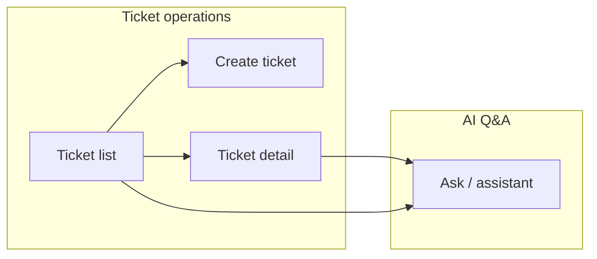
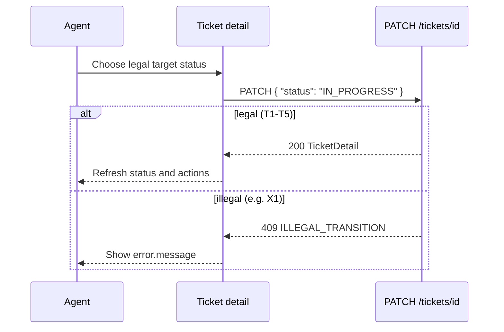
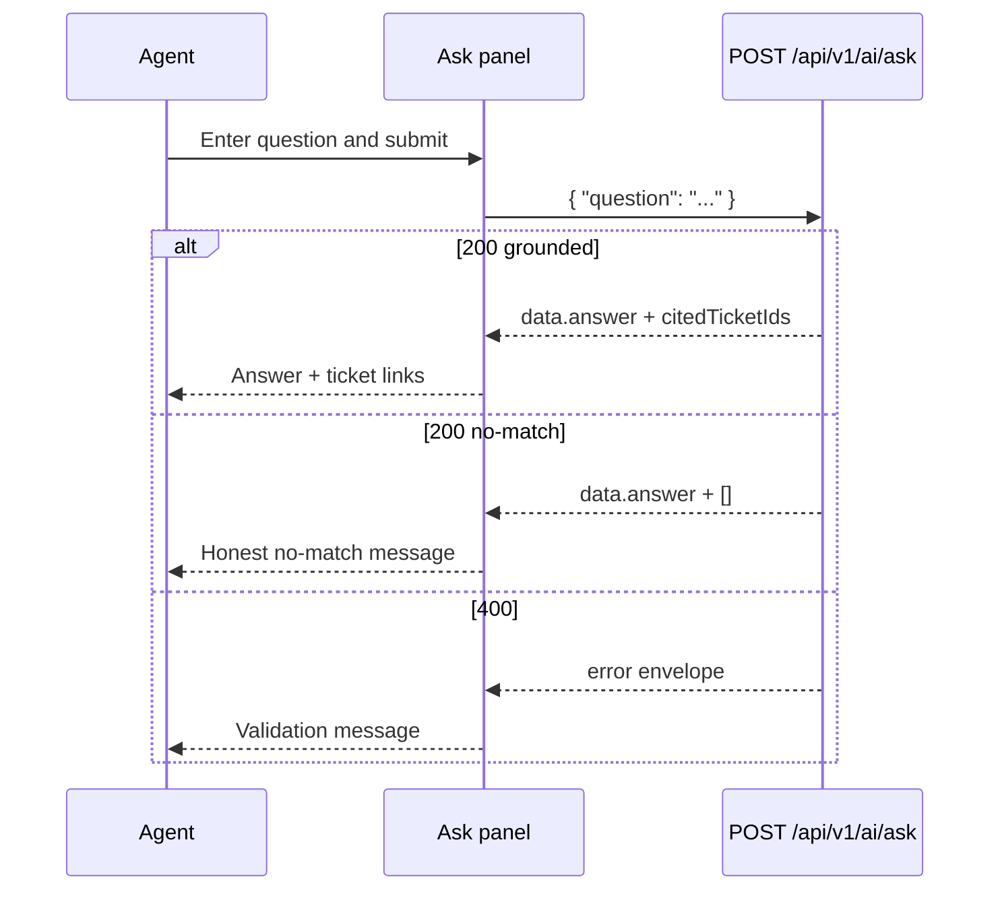

# UI flow — views, screens, and flows

> **Status:** agreed (2026-10-04) — product UI behaviour for ticket operations and grounded ask. This is the PDF-named [`ui-flow.md`](ui-flow.md) spec; [`architecture.md`](architecture.md) **§12** is the high-level frontend architecture summary. **DEC-06**, **DEC-11**, **DEC-15**.  
> **Primary source:** `docs/Assessments.docx` (restated in [`requirements.md`](requirements.md), [`docs/assessment-brief.md`](../docs/assessment-brief.md)).  
> **Related:** [`data-model.md`](data-model.md) (field catalogs), [`api-contract.md`](api-contract.md) (HTTP + ask `data`), [`state-machine.md`](state-machine.md) (transition matrix), [`evaluation-strategy.md`](evaluation-strategy.md) (ask demo questions), `rules/frontend.md`, `commands/review-frontend.md`.

**Label legend**

| Label | Meaning |
|-------|---------|
| **PDF** | Required or named in the assessment. |
| **Convention** | Project choice; not a PDF mandate. |
| **Agreed** | Recorded in [`requirements.md`](requirements.md) §10.2 (e.g. DEC-03…08, 13). |
| **Example** | Illustrative copy, labels, or routes — not mandated. |
| **Open** | Unresolved; do not implement as fixed without user confirmation. |

This file is the assignment’s **`ui-flow.md`**. UI architecture summary: [`architecture.md`](architecture.md) **§12**.

---

## Table of contents

1. [Problem and context](#1-problem-and-context)  
2. [Scope and non-goals](#2-scope-and-non-goals)  
3. [Actors and goals](#3-actors-and-goals)  
4. [Information architecture](#4-information-architecture)  
5. [Application structure (logical)](#5-application-structure-logical)  
6. [Global UI behaviour](#6-global-ui-behaviour)  
7. [Screen catalog](#7-screen-catalog)  
8. [CRUD and ticket operations (by capability)](#8-crud-and-ticket-operations-by-capability)  
9. [Status transitions (UI)](#9-status-transitions-ui)  
10. [RAG and AI Q&A surfaces](#10-rag-and-ai-qa-surfaces)  
11. [End-to-end flows A–E (UI mapping)](#11-end-to-end-flows-ae-ui-mapping)  
12. [Demo and grading UI checklist](#12-demo-and-grading-ui-checklist)  
13. [Acceptance criteria (**AC-UI-***)](#13-acceptance-criteria-ac-ui)  
14. [Open questions and decisions](#14-open-questions-and-decisions)  
15. [Revision history](#15-revision-history)  

---

## 0. Document guide

### 0.1 PDF coverage map (UI / ui-flow themes)

| **PDF** application requirement | UI section |
|---------------------------------|------------|
| Create, list, view, update tickets | §7–§8 |
| Assignee, comments | §8 |
| Search, status filter | §7 list screen |
| Meaningful errors | §6 |
| Valid/invalid status transitions (display only) | §9 |
| Natural-language Q&A; citations; no-match | §10 |
| Five example questions (demo) | §10, §12 |

### 0.2 Business, functional, and implementation requirements

**Business requirements** — agents complete ticket work and verify RAG answers **without** Postman; errors and citations are visible in the product.

**Functional requirements**

| ID | Requirement | AC |
|----|-------------|-----|
| FR-UI-01 | All **AC-CORE-01…11** capabilities reachable in UI | **AC-UI-01…08** |
| FR-UI-02 | Ask shows answer + cited ticket links/ids | **AC-UI-09** |
| FR-UI-03 | No-match copy visible (not blank) | **AC-UI-10** |

**Implementation requirements (**Agreed** — **DEC-15**: React + Vite + TypeScript; layout/ask placement are implementer choice)**

| ID | Requirement |
|----|-------------|
| IR-UI-01 | React + Vite + TypeScript; API client per `rules/frontend.md` |
| IR-UI-02 | No frontend automated tests this milestone |
| IR-UI-03 | Route map in §5; env `VITE_API_BASE_URL` for backend |

### 0.3 Independent reading units

| Unit | Section | Standalone? | Read first (this file) | Delivers | See also |
|------|---------|-------------|------------------------|----------|----------|
| **UI-A** | §4–§5 | Yes | — | Routes, IA, app shell (**Example**) | [`architecture.md`](architecture.md) §12 |
| **UI-B** | §6 Global errors | Yes | — | Meaningful API error display (**PDF**) | `rules/frontend.md` |
| **UI-C** | §7 List + filters | Yes | **UI-A** | List, search `q`, status filter | [`api-contract.md`](api-contract.md) **API-E** |
| **UI-D** | §8 CRUD/detail | Yes | **UI-A** | Create, edit fields, comments | **API-C**, **API-F** |
| **UI-E** | §9 Status UX | Yes | **UI-D** | Transition controls (**DEC-06** agreed) | [`state-machine.md`](state-machine.md) **SM-F** |
| **UI-F** | §10 Ask panel | Yes | **UI-A** | Question input, citations, no-match | [`rag-api-contract.md`](rag-api-contract.md) **ASK-*** |
| **UI-G** | §11 Flows A–E | Yes | **UI-C…F** | Hub journey → screens | [`requirements.md`](requirements.md) §4.1 |
| **UI-H** | §12–§13 Demo + AC-UI | Yes | **UI-G** | Grader checklist | [`requirements.md`](requirements.md) §8.7 |

---

## 1. Problem and context

The assessment requires a **web UI** for everyday support-ticket work **and** a way for agents to ask **natural-language questions** over ticket history. Answers must appear **grounded** in real tickets (with **ticket ID** citations) or **honestly** state that nothing relevant was found (**PDF**).

The UI is **not** the enforcement layer for business rules: the **backend** validates input, runs the **state machine**, and performs RAG retrieval. The UI must still make capabilities **discoverable**, surface **meaningful errors**, and display ask results so reviewers can verify **AC-CORE-01…11** and **AC-CORE-16…18** without reading server logs.

This document is the **detailed UI model**: views/screens, navigation, field-level forms, loading/empty/error states, and click-by-click flows. HTTP shapes and enums are **authoritative** in [`api-contract.md`](api-contract.md) and [`data-model.md`](data-model.md); this file describes **how agents experience** those contracts.

---

## 2. Scope and non-goals

### 2.1 In scope

| Area | This spec defines |
|------|-------------------|
| **Screens / views** | List, create, detail (read + update), comments, status actions, ask / assistant |
| **Navigation** | Logical routes and entry points between surfaces |
| **CRUD flows** | Create, read (list + detail), update (fields + status); **no delete** (see non-goals) |
| **Search and filter** | Keyword `q` and `status` on list |
| **Errors** | Validation, 404, 409 transition, network/5xx |
| **Ask / Q&A** | Question input, grounded answer, citations, no-match |
| **RAG (user-visible)** | Ask panel only — ingestion is backend-only |
| **Traceability** | Maps to **FEAT-01…11**, **FEAT-15…18**, Flows A–E, **AC-CORE-*** |

### 2.2 Non-goals

| Item | Rationale |
|------|-----------|
| **Delete ticket** | Not in **PDF** application requirements |
| **Auth / login / roles** | Assessment has no authentication |
| **Admin UI** for chunking, embeddings, vector index, top-K tuning | **PDF** expects config/docs/tests — not an operator console (**Example** demo step 12 may show config files or logs) |
| **Agentic actions** from ask | **PDF**: no create-ticket, notify, or tool chain from the question box |
| **Confidence scores / retrieval debug UI** | Not in **PDF** unless a future spec adds them |
| **Frontend test suite** | **Convention** — this milestone skips Vitest/Playwright (`rules/frontend.md`) |
| **Visual design system** | No mandated theme, CSS framework, or component library (implementer choice under **DEC-15**) |

---

## 3. Actors and goals

| Actor | Role in UI | Primary goals |
|-------|------------|---------------|
| **Support agent** | Default user | Create and progress tickets; search/filter; comment; transition status; ask historical questions |
| **Operator / assessor** | Demo or grading | Walk **§8.7** script; verify persistence after restart; observe errors and ask grounding |
| **Developer** | Implements UI | Map screens to [`api-contract.md`](api-contract.md) §2.11; follow `rules/frontend.md` |

No separate “admin” or “AI trainer” persona is required by the **PDF**.

---

## 4. Information architecture · unit **UI-A**

### 4.1 Primary navigation (logical)

Minimum **product** surfaces to satisfy the **PDF** checklist and [`requirements.md`](requirements.md) §8.7:



| Surface | Purpose | Typical entry |
|---------|---------|---------------|
| **Ticket list** | Read many tickets; search; filter; open detail or create | App home / “Tickets” nav |
| **Create ticket** | Create one ticket | “New ticket” from list |
| **Ticket detail** | Read one ticket; update fields; comments; status | Row click / link from list or citation |
| **Ask / assistant** | Natural-language Q&A over ticket corpus | Global nav item, list toolbar, or detail tab (placement — **DEC-15**) |

**Convention:** One SPA with client-side routes is sufficient; exact path strings are **Open** until agreed. **Example** routes:

| **Example** route | Screen |
|-------------------|--------|
| `/tickets` | Ticket list |
| `/tickets/new` | Create ticket |
| `/tickets/:id` | Ticket detail (`:id` = `TKT-{n}`) |
| `/ask` | Ask panel (full page) |

Ask may alternatively be a **persistent panel** on list and detail (drawer or split pane) instead of `/ask` (**DEC-15**).

### 4.2 What is not a product screen

| Artefact | Purpose |
|----------|---------|
| `.specstory/history/`, [`docs/prompt-history.md`](../docs/prompt-history.md) | Process evidence (**FEAT-23**, **AC-CORE-23**) — not in-app UI |
| `docs/ai-mistakes.md` | Documented AI mistake — file or doc viewer, not a ticket feature |
| Backend logs / eval harness | **FEAT-22** retrieval quality — see [`evaluation-strategy.md`](evaluation-strategy.md) |

---

## 5. Application structure (logical) · unit **UI-A**

Aligns with [`architecture.md`](architecture.md) §12.2 and `rules/frontend.md`.

| Module / layer | Responsibility | Must not |
|----------------|----------------|----------|
| **API client** | `fetch` (or thin wrapper); base URL from `VITE_API_BASE_URL`; parse `{ data, meta? }` / `{ error }` | Duplicate envelope parsing in every screen |
| **Ticket screens** | List, create, detail — forms and tables | Invent JSON fields not in [`api-contract.md`](api-contract.md) §3 |
| **Ask view** | Question form; result area; citation links | Invent ticket ids; call LLM directly from browser |
| **Shared presentation** | Buttons, inputs, alerts, loading spinners (**Open** component split) | Require a global store library unless user agrees |
| **Error mapper** | `error.message`, `error.details[]` → field-level or banner messages | Show stack traces, SQL, or raw JSON to users |

**Convention:** React + Vite + TypeScript; function components; types derived from API DTOs (`TicketSummary`, `TicketDetail`, `AskResponseData`).

**Suggested folder layout** (same as `rules/frontend.md` — not mandatory):

```text
frontend/src/
  api/           # client + types
  screens/       # route-level views
  components/    # reusable UI fragments
  App.tsx
```

---

## 6. Global UI behaviour · unit **UI-B**

### 6.1 API integration rules

| Rule | Source |
|------|--------|
| Ticket APIs use **`/api/v1`** prefix | **Convention** (`rules/api-standards.md`) |
| Updates use **`PATCH`**, not PUT | **Convention** |
| Ask uses **`POST /api/v1/ai/ask`** (preferred) or **`POST /api/ai/ask`** (**PDF** path) with body `{ "question": "..." }` | **PDF** + [`rag-api-contract.md`](rag-api-contract.md) |
| List uses query params `page`, `size`, `sort`, `q`, `status` | **Convention** + **PDF** search/filter |
| Empty list → **200** with empty `data` → show **empty state**, not error | **Convention** |
| No secrets or API keys in the frontend bundle | **PDF** NFR-06 |

### 6.2 Cross-cutting states

Every data-fetching screen (**list**, **detail**, **ask**) should handle:

| State | User-visible behaviour (**Example** patterns) |
|-------|-----------------------------------------------|
| **Loading** | Disable primary actions or show inline progress; avoid layout jump where practical |
| **Success** | Render authoritative `data` from API |
| **Empty** | List: “No tickets yet” + CTA to create; search: “No matches for …”; ask: only after **200** no-match (see §10) |
| **Client validation** | Optional hints before submit; **backend remains source of truth** (**PDF**) |
| **API error (4xx/5xx)** | Banner or inline message from `error.message`; map `details[].field` to inputs when present |
| **Network failure** | Clear failure message; preserve form input (**AC-FEAT-10-03**) |

### 6.3 Error display contract

| HTTP | Typical `error.code` | UI treatment |
|------|----------------------|--------------|
| **400** | `VALIDATION_ERROR` | Field messages from `details`; form stays populated |
| **404** | `NOT_FOUND` | “Ticket not found” on detail; link back to list |
| **409** | `ILLEGAL_TRANSITION` | Prominent message on status action — **Flow C**, **AC-CORE-11** |
| **5xx** | varies | Generic safe message; no internals |

### 6.4 Identifiers and links

| Item | Rule |
|------|------|
| Display id | **`TKT-{n}`** strings from API (**Agreed** DEC-04) |
| Detail navigation | Use same id in path or internal state — `GET /api/v1/tickets/{id}` |
| Ask citations | Each `citedTicketIds[]` entry links to **ticket detail** for that id |

### 6.5 Accessibility and usability (**PDF** implied + **Convention**)

- Semantic HTML; visible labels on inputs; keyboard-operable primary actions.
- Status and priority shown as text (badges optional — **Open**).
- Do not prescribe colour theme or branding.

---

## 7. Screen catalog · unit **UI-C**

### 7.1 Ticket list (read many)

**Purpose:** **FEAT-02**, **FEAT-06**, **FEAT-07** — list tickets, search by keyword, filter by status (**PDF**).

| Aspect | Specification |
|--------|----------------|
| **API** | `GET /api/v1/tickets` with `page`, `size`, `sort`, `q`, `status` |
| **Row content** | At minimum: `id`, `title`, `status`, `priority`, `assignee`, `updatedAt` (`TicketSummary` §3.1) |
| **Search** | Text input bound to `q`; submit or debounced refresh (**Open** interaction) |
| **Status filter** | Control for `TicketStatus` or “All”; maps to `status` query param |
| **Pagination** | When `meta` present, show page controls or “load more” (**Open** — must not silently drop pages if API paginates) |
| **Actions** | “New ticket” → create screen; row click → detail |
| **Empty** | No rows and no filters → encourage create; filtered/search empty → explain no matches |
| **AC** | **AC-CORE-02**, **07**, **08**; **AC-FEAT-02-***, **06-***, **07-*** |

### 7.2 Create ticket (create)

**Purpose:** **FEAT-01** — entry point for persistence, validation, default **OPEN** status, later RAG ingest (**PDF**).

| Field | Control | Required | Notes |
|-------|---------|----------|-------|
| `title` | Text | **Yes** | **Agreed** — non-blank (DEC-13 / validation) |
| `description` | Textarea | No | Default empty string allowed |
| `priority` | Select | No | `LOW` \| `MEDIUM` \| `HIGH` \| `URGENT` (**Agreed** DEC-13); default `MEDIUM` |
| `assignee` | Text / email input | No | Max 320; email format if present |
| `category` | Select | No | **Agreed** enum (DEC-03); optional |
| `status` | — | **Forbidden** | Must not appear on form — server sets **OPEN** (DEC-07) |

| Action | API | Success UI |
|--------|-----|------------|
| Submit | `POST /api/v1/tickets` | **201** — navigate to **detail** for new `data.id` or refresh list (**Open** preference) |
| Cancel | — | Return to list without submit |

| Failure | UI |
|---------|-----|
| **400** validation | Show `error.message` + field `details` (**AC-CORE-10**, **11**) |
| Demo step 8 | Empty title → readable error adjacent to title |

### 7.3 Ticket detail (read one + hub for update)

**Purpose:** **FEAT-03** view; **FEAT-04** update; **FEAT-05** comments; **FEAT-11** status (**PDF**).

**Read (initial load):**

| API | `GET /api/v1/tickets/{id}` |
| Display | `id`, `title`, `description`, `status`, `priority`, `assignee`, `category`, `resolutionNotes`, `comments[]`, `createdAt`, `updatedAt` |
| Comments order | `createdAt` ascending per [`api-contract.md`](api-contract.md) §3.2 (**Convention**) |

**Layout (logical regions — **Open** wireframe):**

```text
+--------------------------------------------------+
|  TKT-1001   [status badge]              [actions]|
|  Title (read or inline edit)                     |
|  Priority | Assignee | Category                  |
|  Description (read/edit)                         |
|  Resolution notes (read/edit)                    |
|  Status transitions (legal targets only)         |
+--------------------------------------------------+
|  Comments (list)                                 |
|  [ Add comment composer ]                        |
+--------------------------------------------------+
|  [ Optional: Ask about tickets — link/panel ]    |
+--------------------------------------------------+
```

### 7.4 Ticket field update (update metadata)

**Purpose:** **FEAT-04** — title, description, priority, assignee; **Agreed** optional `category`, `resolutionNotes` (DEC-03, DEC-05).

| Pattern | Specification |
|---------|----------------|
| **API** | `PATCH /api/v1/tickets/{id}` with **partial** JSON — only changed fields |
| **UX** | **Open**: single “Save” on detail vs per-field auto-save; must not send `status` accidentally when saving text fields |
| **Success** | Replace local view with response `data` or refetch GET |
| **Side effect** | Backend re-ingest for RAG (**FEAT-14**) — **no** progress UI required; freshness proven via ask (Flow D / demo step 13) |

### 7.5 Add comment (create on ticket)

**Purpose:** **FEAT-05** — timeline notes; comment text is RAG source (**PDF**).

| Field | Validation |
|-------|------------|
| `body` | Required non-blank; max 50_000 |

| Action | API | Success |
|--------|-----|---------|
| Submit comment | `POST /api/v1/tickets/{id}/comments` | **201** — append comment to list or refetch detail |

### 7.6 Delete

**Not applicable** — no **PDF** delete-ticket capability; UI must not expose delete unless a future spec adds it.

---

## 8. CRUD and ticket operations (by capability) · unit **UI-D**

Summary matrix for implementers and `commands/review-frontend.md`:

| Capability | UI surface | HTTP | PDF / AC |
|------------|----------|------|----------|
| **Create** | Create ticket form | `POST /api/v1/tickets` | **AC-CORE-01** |
| **Read (list)** | Ticket list | `GET /api/v1/tickets` | **AC-CORE-02**, **07**, **08** |
| **Read (detail)** | Ticket detail | `GET /api/v1/tickets/{id}` | **AC-CORE-03** |
| **Update (fields)** | Detail edit / save | `PATCH` (no `status`) | **AC-CORE-04**, **05** |
| **Update (status)** | Status actions | `PATCH` with `status` | **AC-CORE-12**, **13** |
| **Create (comment)** | Comment composer | `POST .../comments` | **AC-CORE-06** |
| **Delete** | — | — | Out of scope |

### 8.1 Create flow (step-by-step)

1. Agent on **list** chooses “New ticket”.
2. Agent fills **title** (required) and optional fields (§7.2).
3. UI `POST`s create body (flat JSON, not wrapped in `data`).
4. On **201**, show new ticket (**detail** recommended) with `status: OPEN`.
5. On **400**, show validation errors without clearing valid fields.

### 8.2 List + search + filter flow

1. Agent opens **list** → `GET` with default `page`/`size`.
2. Agent enters keyword → `GET` with `q=...` (may combine with status).
3. Agent selects status filter → `GET` with `status=RESOLVED` (**Example**).
4. UI renders only returned rows; empty result is explicit.

### 8.3 Detail read flow

1. Agent selects ticket from list (or citation link from ask).
2. UI `GET`s detail by `id`.
3. UI renders all **TicketDetail** fields and comment thread.
4. On **404**, show not-found and navigation to list.

### 8.4 Detail update flow

1. Agent edits allowed fields on **detail**.
2. UI sends `PATCH` with only modified properties.
3. On **200**, UI shows persisted values (survives reload — **AC-CORE-09** with restart demo).
4. On **400**, show field errors.

---

## 9. Status transitions (UI) · unit **UI-E**

**Authority:** [`state-machine.md`](state-machine.md) §5.1 (T1–T5), §5.2 (X1–X3). **Agreed API (**DEC-06**):** `PATCH` with target `status`; may include other valid fields on the same request ([`api-contract.md`](api-contract.md) §4.4).

### 9.1 Legal targets by current state (guidance)

UI **should** offer only these targets (buttons, dropdown, or stepper — **Open** control type):

| Current `status` | Offer transitions to |
|------------------|----------------------|
| `OPEN` | `IN_PROGRESS`, `CANCELLED` |
| `IN_PROGRESS` | `RESOLVED`, `CANCELLED` |
| `RESOLVED` | `CLOSED` |
| `CLOSED` | *(none — disable or hide actions)* |
| `CANCELLED` | *(none)* |

**PDF** happy path on detail: `OPEN` → `IN_PROGRESS` → `RESOLVED` → `CLOSED` (Flow A steps A5, A7).

### 9.2 UI must not be the only enforcement

- Disabled/hidden illegal actions are **guidance** only.
- If the user triggers an illegal transition (stale UI, tampered request, or deliberate **Flow C** test), **409** `ILLEGAL_TRANSITION` must display `error.message` (**AC-CORE-11**, **AC-FEAT-11-04**).
- **Example:** From `CLOSED`, if UI exposes “Reopen” for demo purposes, attempt must show readable rejection — not silent no-op.

### 9.3 Resolution notes and `RESOLVED`

**Agreed** (DEC-05): `resolutionNotes` are **optional** on detail and when moving to `RESOLVED` — UI must not require notes before T2 (**PDF** does not mandate a gate).

### 9.4 Status transition sequence (UI)



---

## 10. RAG and AI Q&A surfaces · unit **UI-F**

### 10.1 What the user sees vs backend pipeline

| Stage | Visible in UI? | Notes |
|-------|----------------|-------|
| Knowledge docs, chunk, embed, store | **No** | **FEAT-12…14** — backend only (Flow D) |
| Re-ingest on update/close | **No** | Proven indirectly via ask freshness (demo step 13) |
| User question | **Yes** | Ask panel |
| Similarity search + LLM | **No** | Server-side (**FEAT-16**) |
| Grounded answer + citations | **Yes** | **FEAT-17**, **AC-CORE-16**, **17** |
| No-match / out-of-scope | **Yes** | **FEAT-18**, **AC-CORE-18** |

There is **no** requirement for a “vector index browser” or “retrieved chunks” debug view in the **PDF**. Optional developer-only panels stay out of scope unless agreed.

### 10.2 Ask / assistant screen (AI Q&A)

**Purpose:** **FEAT-15…18** — single-question, single-response, **non-agentic** Q&A (**PDF**).

**Placement (implementer choice — **DEC-15**):** dedicated `/ask` page **or** embedded panel on list/detail; must be reachable in demo **Flow B** step B3 without calling curl only.

#### 10.2.1 Layout (logical)

```text
+------------------------------------------+
|  Ask about ticket history                |
|  +------------------------------------+  |
|  | Question (multiline or single line) |  |
|  +------------------------------------+  |
|  [ Ask ]                                 |
+------------------------------------------+
|  Result area (after submit)              |
|  - Answer text (assistant voice)         |
|  - Citations: TKT-1001, TKT-1004 (links) |
+------------------------------------------+
```

#### 10.2.2 Interaction rules

| Step | Behaviour |
|------|-----------|
| 1 | Agent enters natural-language question (**PDF** examples in [`requirements.md`](requirements.md) §4.2 FEAT-17, §4.3 corpus). |
| 2 | On submit, UI `POST`s `{ "question": "<trimmed text>" }` to `/api/v1/ai/ask`. |
| 3 | While waiting, show **loading**; prevent double-submit. |
| 4 | On **200**, parse `data.answer` and `data.citedTicketIds`. |
| 5 | Render **answer** in a region visually distinct from ticket description/comments (`rules/frontend.md`). |
| 6 | Render **citations** as links to ticket detail for each id in `citedTicketIds`. |
| 7 | On **400** (blank question), show validation error — not a fake “no-match” answer. |
| 8 | On **5xx** / network error, show safe error — distinguish from **200** no-match. |

#### 10.2.3 Grounded success vs no-match (both HTTP 200)

Per [`rag-api-contract.md`](rag-api-contract.md):

| Outcome | `citedTicketIds` | UI |
|---------|------------------|-----|
| **Grounded** | Non-empty (subset of real tickets) | Show answer + citation links; user can open each ticket |
| **No-match / out-of-scope** | `[]` | Show `data.answer` honestly (default phrase per **DEC-11**); **no** fabricated facts styled as verified |
| **HTTP error** | N/A | Error envelope — not mixed with success layout |

**PDF** example questions (for manual demo / eval — **Example** corpus in §4.3):

| Question | Expected UI shape |
|----------|-------------------|
| Have we seen payment failures before? | Narrative answer + one or more citation links |
| What was the resolution for ticket TKT-1001? | Answer referencing that ticket + cite `TKT-1001` |
| What are the common causes of shipment tracking issues? | Themed answer + ids |
| Show me similar resolved tickets. | Summary/list tone + ids |
| Which high-priority tickets are related to payment? | Subset narrative + ids |

#### 10.2.4 Guardrails the UI must respect

| Rule | UI implication |
|------|----------------|
| **No agent** (**PDF**) | No “Create ticket from this answer”, “Notify assignee”, or tool buttons on ask screen |
| **No client-side LLM** | All generation server-side; no API keys in browser |
| **Citations from API only** | Do not prettify or invent ids |
| **No confidence badges** | Unless a future spec adds them |

#### 10.2.5 Ask sequence diagram



### 10.3 RAG freshness (user-observable)

UI does **not** show ingest jobs. Agents verify **AC-CORE-20** by:

1. Editing ticket text on **detail** (or adding a comment).
2. Backend completes **synchronous** re-ingest after DB commit (**DEC-18**); on failure, retry via another ticket mutation or operator recovery per [`rag-ingestion.md`](rag-ingestion.md) §10.2.
3. Asking a question on **ask** that should reflect the new text.

Same after transition to **CLOSED** per **DEC-01** / **FEAT-14** (close triggers re-ingest per ingestion **PDF** p.5).

---

## 11. End-to-end flows A–E (UI mapping) · unit **UI-G**

Hub definitions: [`requirements.md`](requirements.md) §4.1. This table maps **agent-visible** steps to screens.

| Flow | UI screens involved | Key demo / AC |
|------|---------------------|---------------|
| **A** — Resolve ticket | List → Create → Detail → comments → status actions → field edits | **AC-CORE-01…06**, **12**; step A8 restart is outside UI |
| **B** — Search, filter, ask | List (`q`, `status`) → Ask | **AC-CORE-07**, **08**, **16**, **17** |
| **C** — Invalid reopen | Detail on terminal ticket → status action → error display | **AC-CORE-13**, **11** |
| **D** — Ingestion freshness | Detail edits / comment / close → Ask (no admin UI) | **AC-CORE-20**, **15** (backend-heavy) |
| **E** — No-match | Ask with empty corpus or off-topic question | **AC-CORE-18** |

---

## 12. Demo and grading UI checklist · unit **UI-H**

Aligned with [`requirements.md`](requirements.md) §8.7 (steps 1–10 are UI-heavy). Use **Example** labels; adjust to implemented navigation.

| Step | UI actions | Pass if |
|------|------------|---------|
| 1 | Create ticket from form | **AC-CORE-01** |
| 2 | List → open detail → add comment | **AC-CORE-02**, **03**, **06** |
| 3 | Change assignee and description on detail | **AC-CORE-04**, **05** |
| 4 | Legal transitions to `CLOSED` | **AC-CORE-12** |
| 5 | Attempt `CLOSED` → `OPEN` | **AC-CORE-13**, **11** |
| 6 | Search “payment”; filter by status | **AC-CORE-07**, **08** |
| 7 | Restart app; reload detail | **AC-CORE-09** |
| 8 | Invalid create (empty title) | **AC-CORE-10**, **11** |
| 9 | Five **PDF** illustrative questions via ask UI | **AC-CORE-16**, **17** |
| 10 | Ask with empty/unrelated corpus | **AC-CORE-18** |

Steps 11–18 are primarily docs, config, tests, or process artefacts — see §4.2.

**Review:** `commands/review-frontend.md` against this file + `rules/frontend.md`. **No** automated frontend tests — manual demo + backend substitutes per [`test-strategy.md`](test-strategy.md) §11.

---

## 13. Acceptance criteria (**AC-UI-**) · unit **UI-H**

Testable UI criteria for spec review (`commands/review-spec.md`) and frontend review. Backend-heavy items remain **AC-CORE-*** / **AC-API-***; these focus on **agent-visible** behaviour.

| ID | Criterion |
|----|-----------|
| **AC-UI-01** | Agent can complete ticket **create** from a dedicated form; success shows new `TKT-{n}` without manual DB steps (**AC-CORE-01**). |
| **AC-UI-02** | **List** shows persisted tickets with search (`q`) and status filter working together or independently (**AC-CORE-02**, **07**, **08**). |
| **AC-UI-03** | **Detail** shows title, description, priority, assignee, status, category, resolution notes, and comments (**AC-CORE-03**). |
| **AC-UI-04** | Agent can **PATCH** title, description, priority, assignee, category, resolution notes from detail; values survive reload (**AC-CORE-04**, **05**). |
| **AC-UI-05** | Agent can add a **comment** on detail; it appears in the thread after success (**AC-CORE-06**). |
| **AC-UI-06** | **Status** actions offer only legal targets for current state; **409** shows readable message on illegal attempt (**AC-CORE-11**, **12**, **13**). |
| **AC-UI-07** | **Validation** and transition errors display `error.message` / field details — no stack traces (**AC-CORE-10**, **11**). |
| **AC-UI-08** | **Ask** submits `{ "question" }`; loading and result states are visible (**FEAT-15**). |
| **AC-UI-09** | Grounded ask **200** shows `data.answer` and links for each `data.citedTicketIds` entry (**AC-CORE-16**, **17**). |
| **AC-UI-10** | No-match **200** shows honest `data.answer` with empty citations — visually distinct from errors (**AC-CORE-18**). |
| **AC-UI-11** | Ask UI provides **no** create-ticket, notify, or agent tool actions (**AC-FEAT-18-04**). |
| **AC-UI-12** | Assistant output is visually distinct from ticket fields and comments (`rules/frontend.md`). |

---

## 14. Open questions and decisions

| ID | Topic | Status | Notes |
|----|-------|--------|-------|
| **DEC-06** | Transition API shape | **Agreed 2026-10-04** | UI sends `PATCH` with `status` (± other fields) per [`state-machine.md`](state-machine.md) §6 |
| **DEC-11** | Ask no-match wording / extra fields | **Agreed 2026-10-04** | UI displays `data.answer` as returned — e.g. [`rag-api-contract.md`](rag-api-contract.md) §7.4 |
| **DEC-15** | Layout, router, ask placement, CSS kit | **Agreed** (stack); placement Open | React+Vite+TS; §4.1 **Example** routes; panel vs page |
| **DEC-02** | Skipped status hops | **Agreed 2026-10-04** | UI legal-target table follows §9.1 (**DEC-02 (A)**) |

Do not close **Open** items in implementation without updating [`requirements.md`](requirements.md) §10.2 and user confirmation.

---

## 15. Revision history

| Date | Note |
|------|------|
| 2026-10-04 | Initial UI model: screen catalog, CRUD flows, status UX, ask/RAG surfaces, flows A–E mapping, **AC-UI-01…12**. |
| 2026-10-04 | Cross-linked from `requirements.md`, `architecture.md` §12, `rules/frontend.md`, commands, `documentation.md`. |
| 2026-10-04 | `improve-from-assessment-pdf`: PDF `ui-flow.md` alias documented; traceability to p.3–4 UI + p.5–6 ask capabilities. |
| 2026-10-04 | §0 document guide: PDF ui-flow capability map; business/functional/implementation triad. |
| 2026-10-04 | §0.3 **UI-*** independent reading units (screens → flows → demo). |
| 2026-10-04 | Major `##` headings tagged with **UI-*** unit ids. |
| 2026-10-04 | Doc sync: **DEC-06** agreed; **DEC-18** sync re-ingest UX; **DEC-11** no-match wording. |
| 2026-10-04 | Promoted to **agreed** with ten-file spec set (user sign-off). |
| 2026-10-04 | Renamed from `ui-model.md` to PDF filename `ui-flow.md`. |
